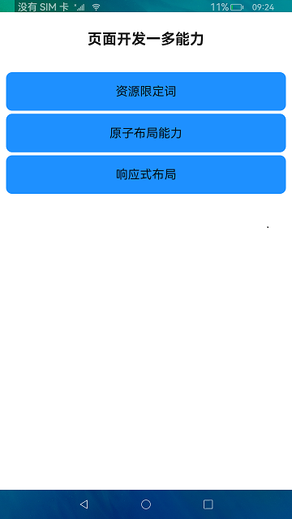
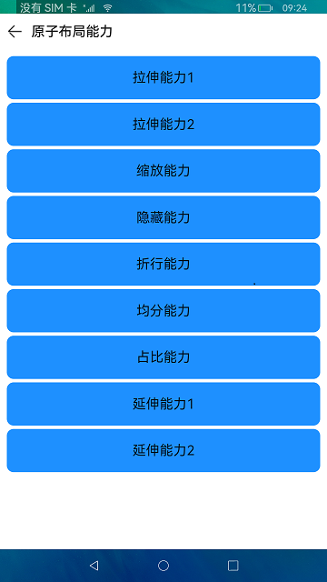

# 多设备自适应能力

### 介绍

此Demo展示在JS中的多设备自适应能力，包括资源限定词、原子布局和响应式布局。  


### 效果预览
| 首页                                   | 原子布局能力页面                                                 | 资源限定词页面                                      |
|--------------------------------------|----------------------------------------------------------|----------------------------------------------|
|  |  |  |

使用说明

1.本示例中的资源限定词和响应式布局针对常见设备类型做了适配，可以在预览器中开启"Multi-profile preview"进行多设备预览。

2.本示例中的原子布局提供了滑动条（slider），通过拖动滑动条更改父容器尺寸可以更直观的查看原子布局的效果。为了突出重点以及易于理解，此部分的代码做了一定精简，建议通过IDE预置的MatePadPro预览器查看此部分效果。

3.启动应用，首页展示了**资源限定词**、**原子布局**和**响应式布局**三个按钮。

4.点击**资源限定词**进入新界面，展示字符串和图片资源的使用。

5.点击**原子布局**进入新界面，分别展示原子布局的拉伸能力、缩放能力、隐藏能力、折行能力、均分能力、占比能力、延伸能力。

6.点击**响应式布局**进入新界面，展示媒体查询、栅格布局、典型场景三类响应式布局能力。

#### 相关概念

资源限定与访问：资源限定词可以由一个或多个表征应用场景或设备特征的限定词组合而成，包括屏幕密度等维度，限定词之间通过中划线（-）连接，开发者在**resources**目录下创建限定词文件。  
原子布局：在屏幕形态和规格不同等情况下，布局效果需要实现自适应，因此系统提供了面向不同屏幕尺寸界面自适应适配的布局能力，称为原子布局。  
响应式布局：通过使用响应式布局能力开发新应用或者改造已有应用，可以使应用在手机、平板、智慧屏等各种尺寸的设备都有良好的展示效果。

### 工程目录
```
code/SuperFeature/MultiDeviceAppDev/JsAdaptiveCapabilities
└─src
    └─main
        ├─js
        │  └─MainAbility
        │      ├─common                            //公共资源包
        │      ├─i18n                              //国际化语言包
        │      ├─pages
        │      │  ├─atomicLayoutCapability         //原子布局
        │      │  │  ├─equipartitionCapability     //均分能力
        │      │  │  ├─extensionCapability
        │      │  │  │  ├─extensionCapability1     //延伸能力1
        │      │  │  │  └─extensionCapability2     //延伸能力2
        │      │  │  ├─flexibleCapability         
        │      │  │  │  ├─flexibleCapability1      //拉伸能力1
        │      │  │  │  └─flexibleCapability2      //拉伸能力2
        │      │  │  ├─hiddenCapability            //隐藏能力
        │      │  │  ├─index                       //原子布局首页
        │      │  │  ├─proportionCapability        //均分能力
        │      │  │  ├─scaleCapability             //均分能力
        │      │  │  └─wrapCapability              //折行能力
        │      │  ├─index                          //主页
        │      │  └─resourceQualifier              //资源限定注入
        │      │      └─responsiveLayout           //响应式布局
        │      │          ├─gridContainer          //网格容器
        │      │          ├─index                  //响应布局首页
        │      │          ├─mediaQuery             //媒体查询
        │      │          └─typicalScene           //典型布局
        │      └─resources                         //限定词资源
        └─resources                                //公共资源                                   
```

### 具体实现
1、index下定义三个box，分别资源限定词resourceQualifier、原子布局atomicLayoutCapability、响应式布局responsiveLayout，并通过onclick路由到各自的组件。  
2、资源限定词组件： 在MainAbility.resource下定义需要访问的资源，在资源限定词resourceQualifier组件中，使用$r('')即可实现不同形态和规格访问到不同的资源。  
3、原子布局atomicLayoutCapability组件：该布局下，通过slide滑动控制样式的展示比率rate,例如下面这个样例，[源码参考](entry/src/main/js/MainAbility/pages/atomicLayoutCapability/extensionCapability/extensionCapability2/extensionCapability2.hml )。  
4、响应式布局responsiveLayout ：该布局下需要相对应的媒体资源，比如sm、md、lg，然后监听媒体的变化，从而对资源进行响应式的调整。 例如栅格布局，[源码参考](entry/src/main/js/MainAbility/pages/responsiveLayout/gridContainer/gridContainer.hml )。本案例定义了xs、sm、md、lg下的栅格宽度，根据系统的规格自动选择相应的属性。  
5、使用mediaQuery对规格进行监听，判断当前系统的横竖屏，从而加载相应的资源，[源码参考](entry/src/main/js/MainAbility/pages/responsiveLayout/mediaQuery/mediaQuery.hml )。  

### 相关权限

不涉及。

### 依赖

不涉及。

### 约束与限制

1.本示例仅支持标准系统上运行。

2.本示例为FA模型，已适配API version 9版本SDK，版本号：3.2.11.9。

3.本示例需要使用DevEco Studio 3.1 Canary1 (Build Version: 3.1.0.100)及以上版本才可编译运行。

4.本示例着重介绍了一多的自适应布局能力，未引入断点能力，建议查看相关能力在IDE提供的MatePadPro预览器中运行和查看效果。 

### 下载

如需单独下载本工程，执行如下命令：
```
git init
git config core.sparsecheckout true
echo code/SuperFeature/MultiDeviceAppDev/JsAdaptiveCapabilities/ > .git/info/sparse-checkout
git remote add origin https://gitee.com/openharmony/applications_app_samples.git
git pull origin master
```