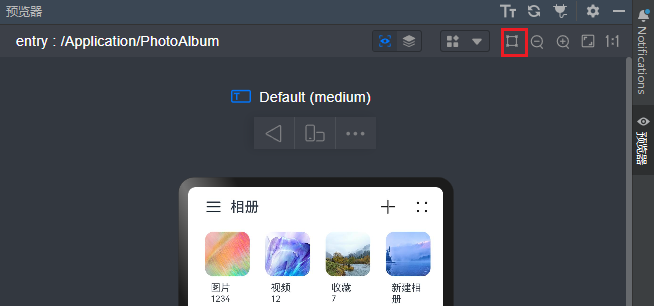

## 一多分栏控件

### 介绍

本示例分别展示了多场景下，一多分栏控件的响应式变化效果。

本示例分别用到了[SideBarContainer](https://gitee.com/openharmony/docs/blob/master/zh-cn/application-dev/reference/arkui-ts/ts-container-sidebarcontainer.md)组件与[Navigation](https://gitee.com/openharmony/docs/blob/master/zh-cn/application-dev/reference/arkui-ts/ts-basic-components-navigation.md)组件，对应使用场景如下：

* A+B+C：即SideBarContainer组件组合Navigation组件
* A+C：SideBarContainer组件
* B+C：Navigation组件


### 效果预览

本示例在预览器中的效果：

**A+B+C**:

| 360vp                               | 600vp                               | 840vp                               |
| ----------------------------------- | ----------------------------------- | ----------------------------------- |
|  |  |  |

**A+C**:

| 360vp                               | 600vp                               |
| ----------------------------------- | ----------------------------------- |
|  |  |


**B+C**:

| 360vp                                | 600vp                               |
| ------------------------------------ | ----------------------------------- |
|  |  |

使用说明：

1.在预览器中查看页面效果

2.在预览器中开启窗口拖拽模式，拖动窗口变化，可以查看组件的响应式变化，如下图所示：



### 工程目录

```
MultiNavBar/entry/src/main/ets/
|---model
|   |---dataType.ets                       // 侧边栏菜单数据类型
|---Application                                  
|   |---MailBox.ets                        // 邮箱
|   |---PhotoAlbum.ets                     // 图库
|   |---Settings.ets                       // 设置
|---pages                                  
|   |---Index.ets                          // 首页
|---common                                    
|   |---BreakpointSystem.ets               // 媒体查询
|   |---MailContent.ets                    // 邮箱详情
|   |---MailNavigation.ets                 // 邮箱导航
|   |---MailSideBar.ets                    // 邮箱侧边栏
|   |---PhotoContent.ets            	   // 图库详情
|   |---PhotoSideBar.ets             	   // 图库侧边栏     
|   |---SettingItem.ets             	   // setting设置项  
|   |---WlanItem.ets             	       // Wlan详情页
```


### 具体实现

* [SideBarContainer](https://gitee.com/openharmony/docs/blob/master/zh-cn/application-dev/reference/arkui-ts/ts-container-sidebarcontainer.md)组件，自动隐藏侧边栏的功能是由minContentWidth与minSideBarWidth属性实现的。当设置[SideBarContainer](https://gitee.com/openharmony/docs/blob/master/zh-cn/application-dev/reference/arkui-ts/ts-container-sidebarcontainer.md)组件组件的显示类型为SideBarContainerType.Embed,并且窗口宽度达到minContentWidth + minSideBarWidth的边界值时，侧边栏自动隐藏。

* [Navigation](https://gitee.com/openharmony/docs/blob/master/zh-cn/application-dev/reference/arkui-ts/ts-basic-components-navigation.md)组件，自动隐藏侧边栏的功能是由minContentWidth属性实现的。当[Navigation](https://gitee.com/openharmony/docs/blob/master/zh-cn/application-dev/reference/arkui-ts/ts-basic-components-navigation.md)的内容区域达到minContentWidth设置的值时，navBar自动隐藏。

  

**响应式规则** 

**场景一：A+B+C**

1. 预览器窗口宽度>840vp时，显示A、B、C三列，放大缩小时，优先变化C列
2. 预览器窗口宽度<=840vp并且>600vp时，显示B、C两列，放大缩小时，优先变化C列
3. 预览器窗口宽度<=600vp并且>360vp时，仅显示C列

**场景二：A+C**

1. 预览器窗口宽度>600vp时，显示A、C三列，放大缩小时，优先变化C列
2. 预览器窗口宽度<=600vp并且>360vp时，仅显示C三列


**场景三：B+C**

1. 预览器窗口宽度>600vp时，显示B、C三列，放大缩小时，优先变化C列

2. 预览器窗口宽度<=600并且>360vp时，仅显示C三列

   

### 相关权限

不涉及。

### 依赖

不涉及

### 约束与限制

1. 本示例仅支持标准系统上运行，支持设备：RK3568。

2. 本示例为Stage模型，支持API10版本SDK，SDK版本号(API Version 10 Release),镜像版本号(4.0 Release)

3. 本示例需要使用DevEco Studio 版本号(4.0 Release)及以上版本才可编译运行。

4. 本示例在真机设备上运行时，需要修改设备系统配置文件以使能应用小窗口能力。

```
# 将开发板文件系统的权限配置为可读写
hdc shell mount -o rw,remount /
# 取出原始配置文件
hdc file recv system/etc/window/resources/window_manager_config.xml C:\
# 将文件中<decor enable="false"></decor>改为<decor enable="true"></decor>
# 用修改后的文件替换系统中的原始文件
hdc file send C:\window_manager_config.xml system/etc/window/resources/window_manager_config.xml
# 重启后生效
hdc shell reboot
```

### 下载

如需单独下载本工程，执行如下命令：

```
git init
git config core.sparsecheckout true
echo code/SuperFeature/MultiDeviceAppDev/MultiColumns/ > .git/info/sparse-checkout
git remote add origin https://gitee.com/openharmony/applications_app_samples.git
git pull origin master
```