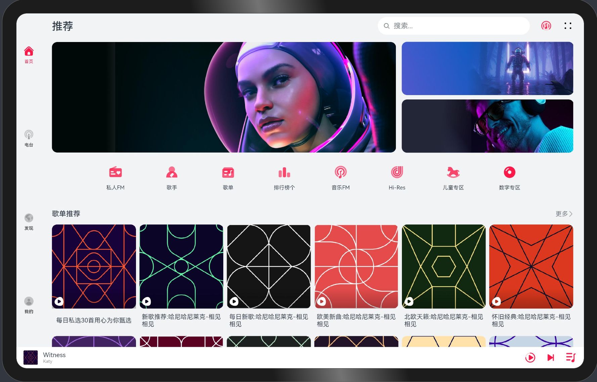
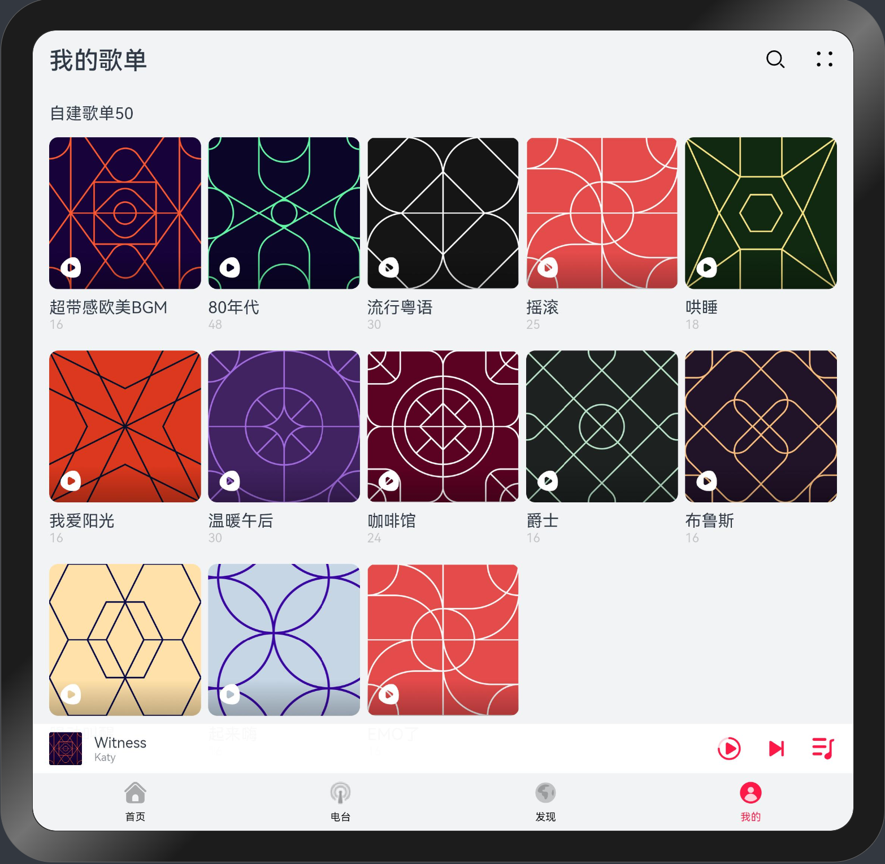
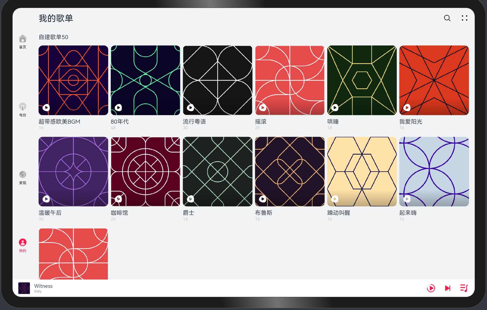
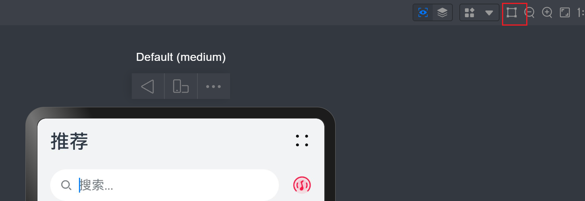

## 一多音乐典型场景

### 介绍

本示例展示了音乐"推荐"与"我的歌单" 两个Tab页签内容。

* 推荐：采用[栅格](https://gitee.com/openharmony/docs/blob/master/zh-cn/application-dev/reference/arkui-ts/ts-container-gridrow.md)组件、[List](https://gitee.com/openharmony/docs/blob/master/zh-cn/application-dev/reference/arkui-ts/ts-container-list.md)组件、[Grid](https://gitee.com/openharmony/docs/blob/master/zh-cn/application-dev/reference/arkui-ts/ts-container-grid.md)组件根据窗口断点进行自适应布局。
* 我的歌单：通过使用[Grid](https://gitee.com/openharmony/docs/blob/master/zh-cn/application-dev/reference/arkui-ts/ts-container-grid.md)组件实现网格布局与列表布局相互切换。

本示例使用[一次开发多端部署](https://gitee.com/openharmony/docs/tree/master/zh-cn/application-dev/key-features/multi-device-app-dev)中介绍的自适应布局能力和响应式布局能力进行多设备（或多窗口尺寸）适配，主要通过组件提供窗口断点事件，保证应用在不同设备或不同窗口尺寸下可以正常显示。

### 预览效果

本示例在预览器中的效果：	

* 推荐页

| sm设备                              | md设备                              | lg设备                              |
| ----------------------------------- | ----------------------------------- | ----------------------------------- |
|  |  |  |

* 我的歌单

| sm设备                              | md设备                              | lg设备                              |
| ----------------------------------- | ----------------------------------- | ----------------------------------- |
|  |  |  |

使用说明：

1. 打开首页，在IDE编辑器中打开预览器查看预览效果。
2. 在预览器中开启窗口拖拽模式，拖动窗口变化，可以查看组件的响应式变化，如下图所示：

3. 手动自由拖拽窗口，将应用窗口在sm/md/lg三种设备形态下进行切换并查看预览效果。

### 工程目录

```
MultiMusic/entry/src/main/ets/
|---model
|   |---DataSummary.ets                    // 数据集合
|   |---DataType.ets                       // 数据类型
|---pages                                  
|   |---Index.ets                          // 首页
|---common                                    
|   |---BreakpointSystem.ets               // 媒体查询
|   |---RecommendPage.ets                  // 推荐页
|   |---TitleBar.ets                 	   // 标题栏
|   |---UserSongList.ets                   // 歌单列表                              
```

### 具体实现

**标题栏**

不同容器尺寸下，元素位置不固定，采用[GridRow](https://gitee.com/openharmony/docs/blob/master/zh-cn/application-dev/reference/arkui-ts/ts-container-gridrow.md)组件进行栅格布局，在sm/md断点下，标题栏所有元素占两行，在lg断点下，所有元素只占一行。

**轮播图**

使用[Swiper](https://gitee.com/openharmony/docs/blob/master/zh-cn/application-dev/reference/arkui-ts/ts-container-swiper.md)组件，通过动态设置[displaycount](https://gitee.com/openharmony/docs/blob/master/zh-cn/application-dev/reference/arkui-ts/ts-container-swiper.md#%E5%B1%9E%E6%80%A7)属性，显示图片数量根据[窗口断点](https://gitee.com/openharmony/docs/blob/master/zh-cn/application-dev/reference/arkui-ts/ts-container-gridrow.md#gridrowdirection%E6%9E%9A%E4%B8%BE%E7%B1%BB%E5%9E%8B)进行自适应变化，在sm断点下显示一张图片，在md断点下显示两张图片，lg断点下通过if关键字切换成[Row](https://gitee.com/openharmony/docs/blob/master/zh-cn/application-dev/reference/arkui-ts/ts-container-row.md)容器进行布局。

**音乐分类**

使用List组件的自带延伸布局能力，元素随容器组件尺寸变化显示或隐藏。

**歌单列表/我的歌单**

使用[Grid](https://gitee.com/openharmony/docs/blob/master/zh-cn/application-dev/reference/arkui-ts/ts-container-grid.md)组件进行响应式布局，元素数量根据[窗口断点](https://gitee.com/openharmony/docs/blob/master/zh-cn/application-dev/reference/arkui-ts/ts-container-gridrow.md#gridrowdirection%E6%9E%9A%E4%B8%BE%E7%B1%BB%E5%9E%8B)进行自适应变化。

### 相关权限

不涉及。

### 依赖

不涉及

### 约束与限制

1. 本示例仅支持在标准系统上运行。
2. 本示例已适配API version 10版本的SDK(4.0.10.10)，镜像版本号：OpenHarmony 4.0.10.10。
3. 本示例需要使用DevEco Studio 4.0 Beta2 (构建版本：4.0.0.400，构建 2023年8月2日)及以上版本才可编译运行。

### 下载

如需单独下载本工程，执行如下命令：

```
git init
git config core.sparsecheckout true
echo code/SuperFeature/MultiDeviceAppDev/MultiMusic/ > .git/info/sparse-checkout
git remote add origin https://gitee.com/openharmony/applications_app_samples.git
git pull origin master
```