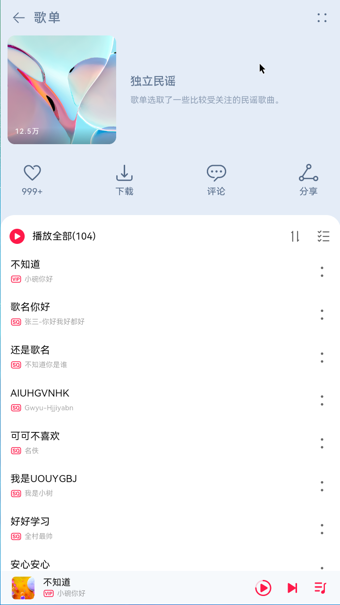
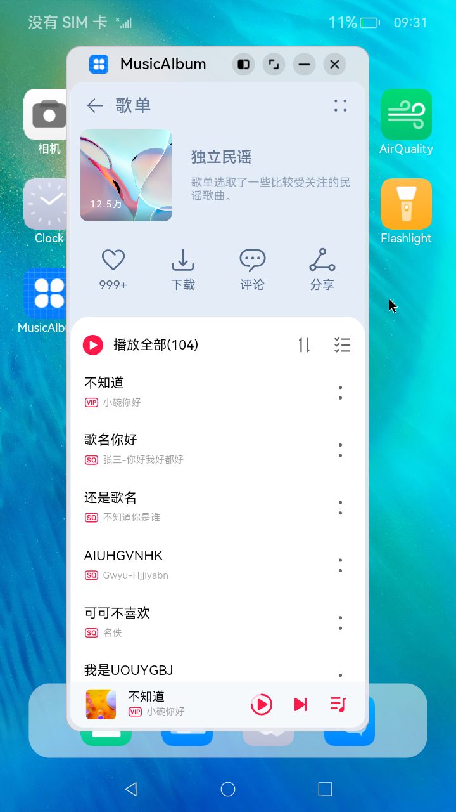

# 一多音乐专辑主页

### 介绍

本示例展示了音乐专辑主页。

* 头部返回栏: 因元素单一、位置固定在顶部，因此适合采用自适应拉伸，充分利用顶部区域。

* 专辑封面: 使用栅格组件控制占比，在小尺寸屏幕下封面图与歌单描述在同一行。

* 歌曲列表: 使用栅格组件控制宽度，在小尺寸屏幕下宽度为屏幕的100%，中尺寸屏幕下宽度为屏幕的50%，大尺寸屏幕下宽度为屏幕的75%。

* 播放器: 采用自适应拉伸，充分使用底部区域。

本示例使用[一次开发多端部署](https://gitee.com/openharmony/docs/tree/master/zh-cn/application-dev/key-features/multi-device-app-dev)中介绍的自适应布局能力和响应式布局能力进行多设备（或多窗口尺寸）适配，保证应用在不同设备或不同窗口尺寸下可以正常显示。  

用到了媒体查询接口[@ohos.mediaquery](https://gitee.com/openharmony/docs/blob/master/zh-cn/application-dev/reference/apis/js-apis-mediaquery.md)。  

### 效果预览

本示例在预览器中的效果：


本示例在开发板上运行的效果：

|全屏展示               |窗口操作按钮          |悬浮窗口显示          |
|---------------------|--------------------|--------------------|
||||

使用说明：

1.启动应用，查看本应用在全屏状态下的效果。

2.在应用顶部，下滑出现窗口操作按钮。（建议通过外接鼠标操作，接入鼠标只需要将鼠标移动至顶部即可出现窗口）

3.点击悬浮图标，将应用悬浮在其他界面上显示。

4.拖动应用悬浮窗口的四个顶角，改变窗口尺寸，触发应用显示刷新。改变窗口尺寸的过程中，窗口尺寸可能超出屏幕尺寸，此时在屏幕中只能看到应用部分区域的显示。可以通过移动窗口位置，查看应用其它区域的显示。

### 工程目录
```
AppMarket/entry/src/main/ets/
|---model
|   |---MediaData.ets                      // 主页用到的图片资源
|   |---SongList.ets                       // 歌曲数据
|   |---SongModule.ets                     // 事件监听函数模块
|---pages                                  
|   |---index.ets                          // 首页
|---common                                    
|   |---Content.ets                        // 内容组件
|   |---Header.ets                         // 标题栏
|   |---Player.ets                         // app模块(包含安装，展示图片，更多功能)
|   |---PlayList.ets                       // 歌单列表
|   |---PlayListCover.ets                  // 歌单封面                                          
```

### 具体实现
本示例介绍如何使用自适应布局能力和响应式布局能力适配不同尺寸窗口，将页面分拆为4个部分。
#### 标题栏
由于在不同断点下，标题栏始终只显示“返回按钮”、“歌单”以及“更多按钮”，但“歌单”与“更多按钮”之间的间距不同。  
通过栅格实现：将标题栏划分为“返回按钮及歌单”和“更多按钮”两部分，这两部分在不同断点下占据的列数不同。
#### 歌单封面
通过栅格实现歌单封面，它由封面图片、歌单介绍及常用操作三部分组成这三部分的布局在md和lg断点下完全相同，但在sm断点下有较大差异，[源码参考](entry/src/main/ets/common/PlayListCover.ets )。  
1、在sm断点下，封面图片和歌单介绍占满12列，常用操作此时会自动换行显示。  
2、在lg和md断点下，封面图片，歌单和常用操作各占一行中显示。
#### 歌单列表
通过List组件的lanes属性实现：在不同断点下，歌单列表的样式一致，但sm和md断点下是歌单列表是单列显示，lg断点下是双列显示，[源码参考](entry/src/main/ets/common/PlayList.ets )。  
#### 播放控制栏
通过Blank组件实现拉伸能力：在不同断点下，播放控制栏显示的内容完全一致，唯一的区别是歌曲信息与播放控制按钮之间的间距有差异。
#### 总体运行效果
通过在首页Column()中引用上述各组件后，可实现首页的组件整合渲染，即可完成整体页面开发，[源码参考](entry/src/main/ets/common/PlayList.ets )。

### 相关权限

不涉及。

### 依赖

不涉及。

### 约束与限制

1. 本示例仅支持在标准系统上运行。

2. 本示例已适配API version 9版本SDK，版本号：3.2.11.9。

3. 本示例需要使用DevEco Studio 3.1 Beta2 (Build Version: 3.1.0.400, built on April 7, 2023)及以上版本才可编译运行。

4. 本示例在开发板上运行时，需要修改开发板系统配置文件以使能应用窗口能力。

```shell
# 将开发板文件系统的权限配置为可读写
hdc shell mount -o rw,remount /
# 取出原始配置文件
hdc file recv system/etc/window/resources/window_manager_config.xml C:\
# 将文件中<decor enable="false"></decor>改为<decor enable="true"></decor>
# 用修改后的文件替换系统中的原始文件
hdc file send C:\window_manager_config.xml system/etc/window/resources/window_manager_config.xml
# 重启后生效
hdc shell reboot
```

### 下载

如需单独下载本工程，执行如下命令：
```
git init
git config core.sparsecheckout true
echo code/SuperFeature/MultiDeviceAppDev/MusicAlbum/ > .git/info/sparse-checkout
git remote add origin https://gitee.com/openharmony/applications_app_samples.git
git pull origin master
```