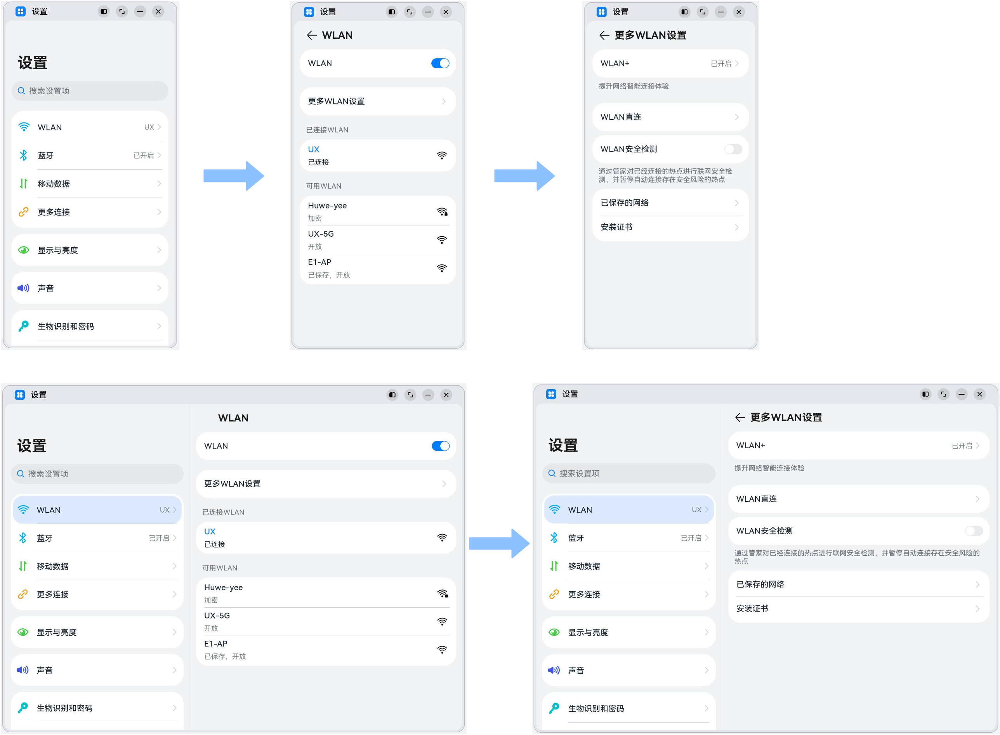
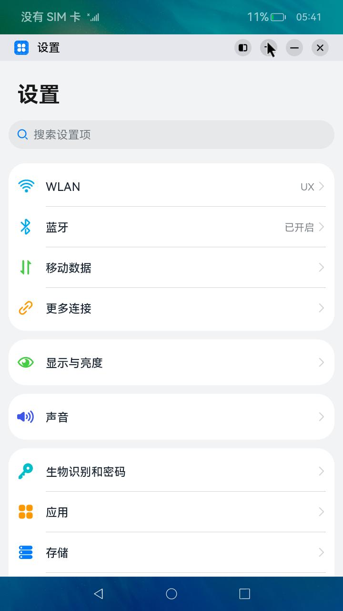
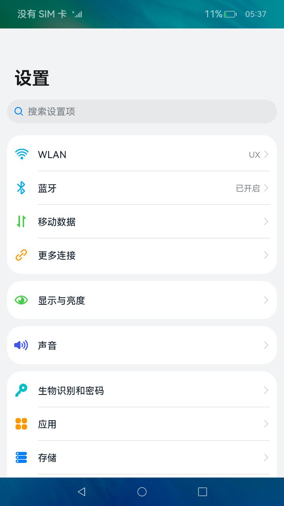
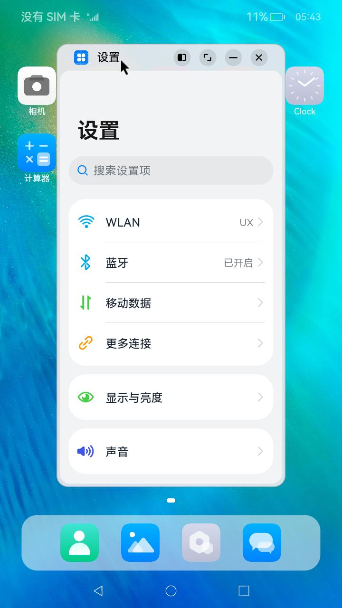

# 一多设置典型页面

### 介绍

本示例展示了设置应用的典型页面，其在小窗口和大窗口有不同的显示效果，体现一次开发、多端部署的能力。  

1. 本示例使用[一次开发多端部署](https://gitee.com/openharmony/docs/tree/master/zh-cn/application-dev/key-features/multi-device-app-dev)中介绍的自适应布局能力和响应式布局能力进行多设备（或多窗口尺寸）适配，保证应用在不同设备或不同窗口尺寸下可以正常显示。
2. 本示例使用[Navigation组件](https://gitee.com/openharmony/docs/blob/master/zh-cn/application-dev/reference/arkui-ts/ts-basic-components-navigation.md)，实现小窗口单栏显示、大窗口双栏显示的效果。

### 效果预览

本示例在不同窗口尺寸下的显示效果。



本示例在开发板上的运行效果。

| 全屏显示                           | 窗口操作按钮                       | 悬浮显示                           |
| ---------------------------------- | ---------------------------------- | ---------------------------------- |
|  |  |  |


使用说明：

1. 启动应用，查看应用在全屏状态下的显示效果。
2. 依次点击`WLAN` -> `更多WLAN设置`，查看应用的显示效果。
3. 依次点击`更多连接`->`NFC`，查看应用的显示效果。
4. 在应用顶部，下滑出现窗口操作按钮。（建议通过外接鼠标操作，接入鼠标只需要将鼠标移动至顶部即可出现窗口）
5. 点击悬浮图标，将应用悬浮在桌面上显示。
6. 拖动应用悬浮窗口改变窗口尺寸，触发应用显示刷新。改变窗口尺寸的过程中，窗口尺寸可能超出屏幕尺寸，此时在屏幕中只能看到应用部分区域的显示。可以通过移动窗口位置，查看应用其它区域的显示。
7. 重复步骤2和3，查看应用在不同窗口尺寸下的显示效果。

### 工程目录
```
features/settingitems/src/main/ets/
|---settingList
|   |---settingList.ets                    // 设置页面
|---moreconnections                                  
|   |---MoreConnectionsItem.ets            // 更多连接模块
|   |---Nfc.ets                            // nfc对象操作类
|---wlan                                    
|   |---WlanMoreSetting.ets                // 更多网络设置模块
|   |---WlanSettingItem.ets                // 网络设置模块
|---components                                    
|   |---ItemDescription.ets                // 每个单元组模块前的标题描述模块
|   |---ItemGroup.ets                      // 单元组模块
|   |---MainItem.ets                       // 主体框架模块
|   |---SearchBox.ets                      // 搜索框模块
|   |---SubItemArrow.ets                   // 下一步模块(箭头跳转组件)
|   |---SubItemToggle.ets                  // 状态按钮组件
|   |---SubItemWifi.ets                    // 子网络列表模块   
|---products/default/src/main/ets/pages/
|   |---Index.ets                          // 首页                                               
```

### 具体实现
本示例介绍如何实现不同断点下存在单栏和双栏设计的场景，主要有以下三方面：
#### 实现单/双栏的显示效果
通过Navigation组件实现单/双栏展示，由Navbar(设置主页面)和Content(跳转子页面)两部分区域组成，Navigation组件支持Stack、Split以及Auto三种模式。    
1、stack模式：导航栏与内容区独立显示，相当于多个页面。展示效果：从Navbar(设置主页面)跳转到Content1(WLAN页面)跳转到Content2(更多WLAN模式)。  
2、Split模式：导航栏与内容区分两栏显示。展示效果：Navbar+Content1。  
3、auto模式：Navigation组件可以根据应用窗口尺寸，自动选择合适的模式：窗口宽度小于520vp时，采用Stack模式显示；窗口宽度大于等于520vp时，采用Split模式显示。当窗口尺寸发生改变时，Navigation组件也会自动在Stack模式和Split模式之间切换。[源码参考](products/default/src/main/ets/pages/Index.ets )。

#### 实现点击跳转或刷新
Navigation组件通常搭配NavRouter组件以及NavDestination组件一起使用：
* NavRouter组件用于控制Navigation组件Content区域的显示和刷新逻辑：其必须包含两个孩子节点。  
1、容器类组件-直接控制NavRouter的显示效果。  
2、NavDestination组件：刷新Navigation组件Content区域的显示。  
3、NavRouter组件通过onStateChange回调事件，用于通知开发者NavRouter的状态：用户点击NavRouter，激活NavRouter并加载对应的NavDestination子组件时，回调onStateChange(true)；  
4、NavRouter对应的NavDestination子组件不再显示时，回调onStateChange(false)。
* NavDestination组件用于实际刷新Navigation组件Content区域的显示。
* 例如：在本示例中wlan功能项为NavRouter的第一个孩子节点，跳转的子页面WLAN为NavRouter的第二个孩子节点，[源码参考](features/settingitems/src/main/ets/wlan/WlanSettingItem.ets )。
#### 实现多级跳转
Navigation组件支持自动切换单栏和双栏的显示效果，同时可以根据当前状态自动添加返回键及响应系统的返回键事件。[源码参考](features/settingitems/src/main/ets/wlan/WlanMoreSetting.ets )。  
1、通过激活SettingList中的WLANSettingItem，可以加载及显示WlanSetting。  
2、激活WlanSetting中的WlanMoreSettingItem，可以加载及显示WlanMoreSetting。

### 相关权限

不涉及。

### 依赖

不涉及。

### 约束与限制

1. 本示例仅支持标准系统上运行，支持设备：RK3568。

2. 本示例为Stage模型，支持API10版本SDK，SDK版本号(API Version 10 Release),镜像版本号(4.0 Release)

3. 本示例需要使用DevEco Studio 版本号(4.0 Release)及以上版本才可编译运行。

4. 本示例需要使用[新框架](https://gitee.com/yan-shuifeng/arkui_docs/blob/master/%E6%96%B0%E6%A1%86%E6%9E%B6%E5%88%87%E6%8D%A2/acenewpipe.md)，才可以正常安装运行。

5. 本示例在开发板上运行时，可以[修改开发板系统配置文件以使能系统窗口能力](https://gitee.com/openharmony/docs/blob/master/zh-cn/application-dev/key-features/multi-device-app-dev/faq.md#%E5%A6%82%E4%BD%95%E5%BC%80%E5%90%AF%E8%87%AA%E7%94%B1%E7%AA%97%E5%8F%A3)。

### 下载

如需单独下载本工程，执行如下命令：
```
git init
git config core.sparsecheckout true
echo code/SuperFeature/MultiDeviceAppDev/Settings/ > .git/info/sparse-checkout
git remote add origin https://gitee.com/openharmony/applications_app_samples.git
git pull origin master
```