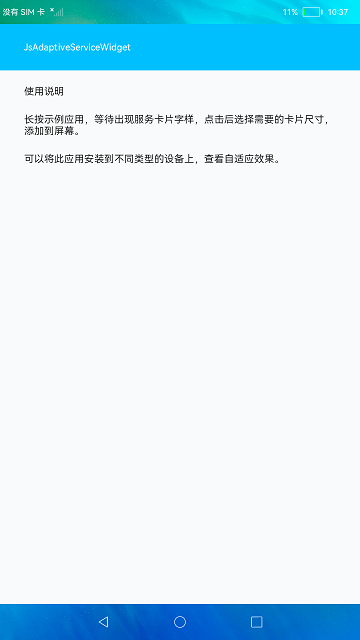
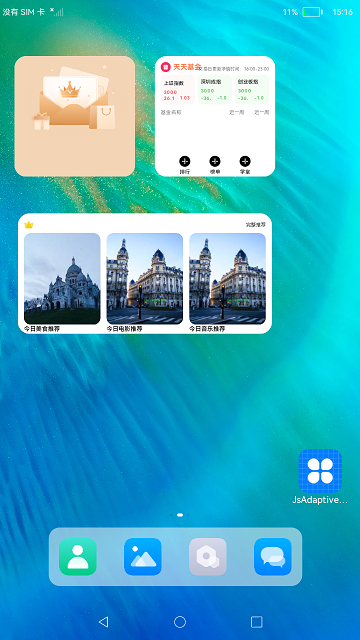

#  多设备自适应服务卡片

### 介绍

本示例展示Js工程中服务卡片的布局和使用，其中卡片内容显示使用了一次开发，多端部署的能力实现多设备自适应。

使用说明

长按示例应用，等待出现服务卡片字样，点击后可左右滑动选择需要的卡片尺寸，添加到屏幕。

### 效果预览

|主页|卡片|
|-------|-------|
|||

### 相关权限

不涉及。

### 依赖

不涉及。

### 约束与限制

1.本示例支持在标准系统上运行。

2.本示例需要使用DevEco Studio 3.1 Canary1 (Build Version: 3.1.0.100)及以上版本才可编译运行。

3.本示例已适配API10版本SDK，版本号：4.0.5.1。