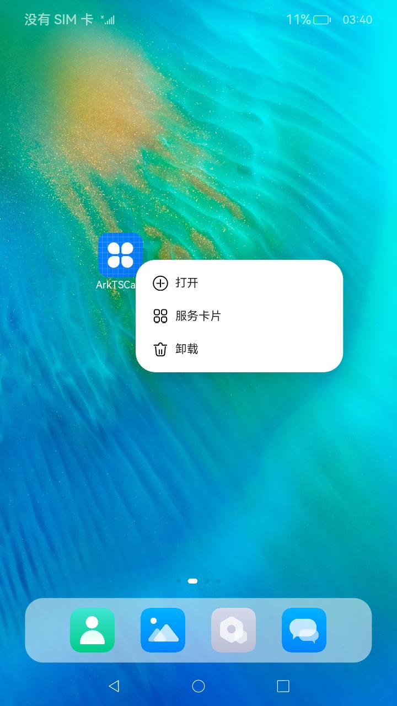
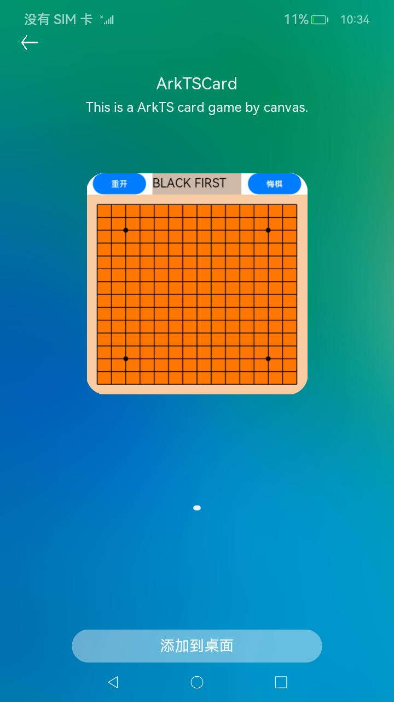
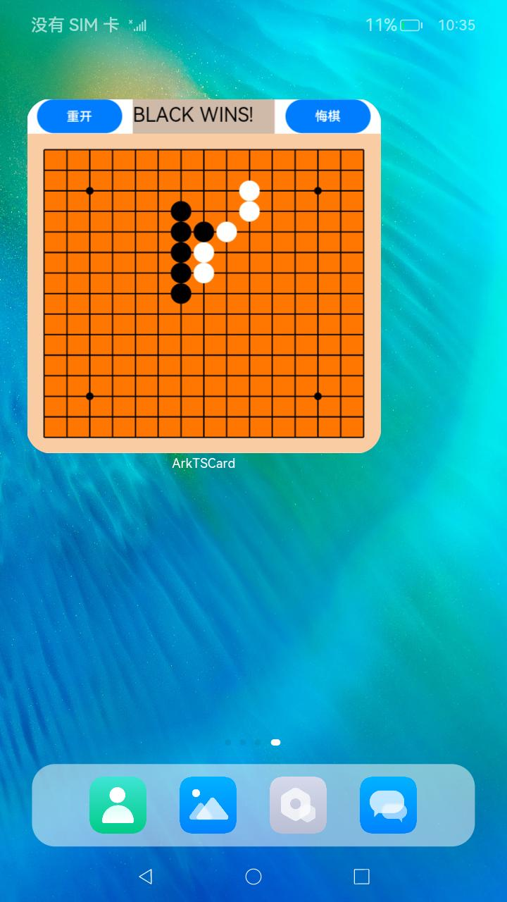

# ArkTS卡片Canvas小游戏

### 介绍

本示例展示了如何通过ArkTS卡片的Canvas自定义绘制能力实现一个简单的五子棋游戏卡片。

- 使用Canvas绘制棋盘和黑白棋子的落子。
- 通过卡片支持的[点击事件](https://gitee.com/openharmony/docs/blob/master/zh-cn/application-dev/reference/arkui-ts/ts-universal-events-click.md)进行交互，让用户在棋盘上进行黑白棋子的对局。
- 通过TS的逻辑代码实现五子棋输赢判定、回退等逻辑计算，整个游戏过程无需拉起FormExtensionAbility。

### 效果预览

| 添加卡片                                         | 卡片预览                                                 | 操作卡片                                           |
| ------------------------------------------------ | -------------------------------------------------------- | -------------------------------------------------- |
|  |  |  |

使用说明：

1.部分设备的桌面不支持卡片，可以通过自己开发的卡片使用方，进行卡片的创建、更新和删除等操作。具体参考：[卡片使用方说明](../FormLauncher/README_zh.md)。

2.安装应用，并在桌面上长按本应用的桌面图标，长按后弹出选项列表。

3.点击弹出列表中的**服务卡片**选项进入卡片预览界面。

4.点击正下方的**添加到桌面**按钮，卡片就会出现在桌面上。

5.卡片添加到桌面后就可以在桌面进行五子棋游戏，包含黑白棋子的落子、重新开始、悔棋等操作。

### 工程目录

```
entry/src/main/
├── ets
│   ├── entryformability
│   │   └── EntryFormAbility.ts   // FormExtensionAbility生命周期调度入口
│   ├── entryability
│   │   └── EntryAbility.ts       // UIAbility生命周期调度入口
│   ├── model
│   │   └── Logger.ts             // 日志打印工具类
│   ├── pages
│   │   └── Index.ets             // 入口页面
│   └── game
│       └── pages
│           └── GameCard.ets      // 卡片页面，使用Canvas实现了一个简单的五子棋小游戏
├── module.json5
└── resources
    └── base
        ├── element
        │   ├── color.json       // 配置文件中$color对于的资源文件
        │   └── string.json      // 配置文件中$string对于的资源文件
        ├── media
        │   └── icon.png         // 桌面安装图标
        └── profile
            ├── form_config.json // 卡片配置文件
            └── main_pages.json  // 页面配置文件
```

### 具体实现

- 界面绘制：通过Canvas画布组件进行绘制，在Canvas组件收到onReady回调时取出context的width和height作为画布的大小。
- 逻辑处理：通过注册Canvas画布onClick点击事件，并取出回调中的ClickEvent入参，这个对象中包含了点击的x轴和y轴坐标，通过坐标信息进行点击位子匹配就可以实现黑白棋子的落子。

### 相关权限

不涉及。

### 依赖

不涉及。

### 约束与限制

1.本示例仅支持标准系统上运行。

2.本示例为Stage模型的ArkTS卡片，从API version 9开始支持。

3.本示例需要使用DevEco Studio 3.1 Release (Build Version: 3.1.0.400, built on March 29, 2023)才可编译运行。

### 下载

如需单独下载本工程，执行如下命令：

```shell
git init
git config core.sparsecheckout true
echo ability/ArkTSCard/CanvasGame/ > .git/info/sparse-checkout
git remote add origin https://gitee.com/openharmony/applications_app_samples.git
git pull origin master
```