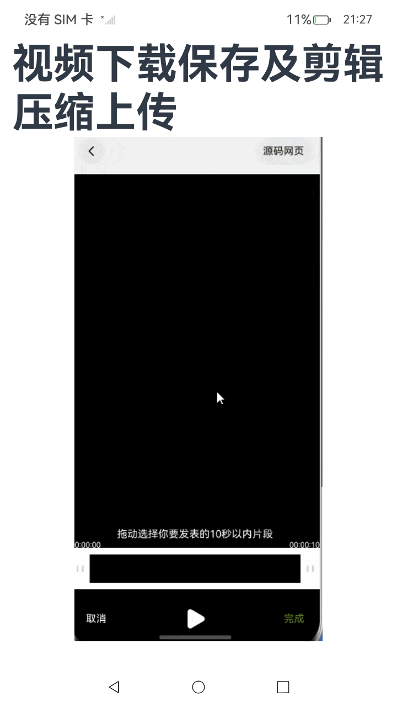

# 桌面卡片进入案例

### 介绍

桌面卡片是比较常见的功能，本案例详细列举了卡片开发的大部分功能，如使用postCardAction接口快速拉起卡片提供方应用的指定UIAbility，通过message事件刷新卡片内容等，为开发者提供了卡片功能的展示。

### 效果预览

| 卡片    | 案例|
|--------|-----------|
|  | |

### 使用说明

1. 长按应用，添加卡片到桌面。
2. 卡片内可滑动选择案例，点击可进入案例详情。

### 实现思路

1. 新建卡片
2. 配置formconfig
3. 编写卡片UI代码
4. 触发刷新事件
5. 触发点击事件

### 实现步骤

本例涉及的关键特性和实现方案如下：

1. 新建卡片。右键点击entry目录，选择新建->Service Widget->Dynamic Widget，其中Dynamic Widget为动态卡片，Static Widget为静态卡片。此时会生成几个文件：配置文件[```form_config.json```](entry/src/main/resources/base/profile/form_config.json)；卡片Ability[```EntryFormAbility.ets```](entry/src/main/ets/entryformability/EntryFormAbility.ets)；卡片组件[```CasesSwiperCard.ets```](entry/src/main/ets/widget/pages/CasesSwiperCard.ets)。

2. 新建卡片后，根据需要（如卡片大小，刷新时间，动态静态卡片设置）配置```form_config.json```。

```json5
{
  "forms": [
    {
      "name": "widget", // 卡片的名称。
      "displayName": "$string:widget_display_name", // 卡片的显示名称。
      "description": "$string:widget_desc", // 卡片的描述。 
      "src": "./ets/widget/pages/CasesSwiperCard.ets", // 卡片对应的UI代码的完整路径。
      "uiSyntax": "arkts", // 卡片的类型
      "window": { // 用于定义与显示窗口相关的配置。
        "designWidth": 720,
        "autoDesignWidth": true
      },
      "colorMode": "auto", // 卡片的主题样式。
      "isDynamic": true, // 卡片是否为动态卡片。
      "isDefault": true, // 卡片是否为默认卡片。
      "updateEnabled": true, // 卡片是否支持周期性刷新。
      "scheduledUpdateTime": "10:30", // 卡片的定点刷新的时刻。
      "updateDuration": 1, // 卡片定时刷新的更新周期，单位为30分钟，取值为自然数。
      "defaultDimension": "6*4", // 卡片的默认外观规格。
      "supportDimensions": [ // 卡片支持的外观规格，取值范围。
        "6*4"
      ]
    }
  ]
}
```

3. 编写卡片UI代码。在主文件```CasesSwiperCard.ets```中添加UI组件，需要注意的是：ArkTS卡片存在较多约束（如不支持导入共享包），较多逻辑不可在卡片中使用，在使用时需要根据文档进行操作。

4. 编写跳转事件：当应用未被拉起时，点击某个卡片时跳转到具体的案例页面。在```EntryAbility.ets```中补充逻辑：onCreate生命周期内获取want.parameters.params判断卡片内容的跳转。

```typescript
// EntryAbility.ets
export default class EntryAbility extends UIAbility {
  onCreate(want: Want, launchParam: AbilityConstant.LaunchParam): void {
    // ...
    // 桌面卡片判断跳转内容
    if (want?.parameters?.params) {
      // want.parameters.params 对应 postCardAction() 中 params 内容
      let params: Record<string, Object> = JSON.parse(want.parameters.params as string);
      this.selectPage = params.targetPage as string;
    }
    // ...
  }
}
```

5. 编写跳转事件：当应用在后台时，点击某个卡片时跳转到具体的案例页面。可从onNewWant生命周期获取want.parameters.params判断卡片内容的跳转。

```typescript
// EntryAbility.ets
export default class EntryAbility extends UIAbility {
  // 如果UIAbility已在后台运行，在收到Router事件后会触发onNewWant生命周期回调
  onNewWant(want: Want, launchParam: AbilityConstant.LaunchParam): void {
    if (want.parameters!['ability.params.stream'] !== undefined) {
      AppStorage.setOrCreate('imageUri', want.parameters!["ability.params.stream"].toString());
      return;
    }
    if (want?.parameters?.params) {
      // want.parameters.params 对应 postCardAction() 中 params 内容
      let params: Record<string, Object> = JSON.parse(want.parameters.params as string);
      this.selectPage = params.targetPage as string;
      if (this.currentWindowStage !== null) {
        //  存在窗口时点击卡片后进行页面跳转
        this.currentWindowStage.loadContent(`pages/${this.selectPage}`, (err) => {
          if (err.code) {
            hilog.error(0x0000, 'testTagSelectPage', 'Failed to load the content. Cause: %{public}s', JSON.stringify(err) ?? '');
            return;
          }
          hilog.info(0x0000, 'testTagSelectPage', 'Succeeded in loading the content.');
        });
        this.selectPage = '';
      }
    } else {
      this.selectPage = '';
    }
  }
}
```

6. 具体跳转逻辑编写。在onWindowStageCreate生命周期内进行具体的跳转逻辑。

```typescript
// EntryAbility.ets
export default class EntryAbility extends UIAbility {
  onWindowStageCreate(windowStage: window.WindowStage): void {
    // Main window is created, set main page for this ability
    hilog.info(0x0000, 'testTag', '%{public}s', 'Ability onWindowStageCreate');
    // 判断是否存在窗口可进行页面跳转
    if (this.currentWindowStage === null) {
      this.currentWindowStage = windowStage;
    }
    //  点击卡片后进行页面跳转
    if (this.selectPage) {
      windowStage.loadContent(`pages/${this.selectPage}`, (err) => {
        if (err.code) {
          hilog.error(0x0000, 'testTag', 'Failed to load the content. Cause: %{public}s', JSON.stringify(err) ?? '');
          return;
        }
        hilog.info(0x0000, 'testTag', 'Succeeded in loading the content.');
      });
    } else {
      windowStage.loadContent('pages/Index', (err) => {
        if (err.code) {
          hilog.error(0x0000, 'testTag', 'Failed to load the content. Cause: %{public}s', JSON.stringify(err) ?? '');
          return;
        }
        hilog.info(0x0000, 'testTag', 'Succeeded in loading the content.');
      });
    }
  }
}
```

7. 编写刷新事件：当定时更新或定点更新触发时，需要更新卡片内容。onUpdateForm生命周期发生在定时更新/定点更新/卡片使用方主动请求更新时，在方法内增加获取案例数据的功能。

```typescript
// EntryFormAbility.ets
export default class EntryFormAbility extends FormExtensionAbility {
   // 获取数据并利用formProvider.updateForm更新到卡片
  async getData(formId: string) {
    let detail: CASES[] = [];
    let message = '';
    try {
      let value = await this.context.resourceManager.getRawFileContent('CasesData.txt');
      console.log('decodeToStringdecodeToString')
      message = util.TextDecoder.create().decodeToString(value);
      detail = CaseCardUtils.formatData(message);
      hilog.info(DOMAIN_NUMBER, TAG, '[EntryFormAbility] onFormEvent' + 'result:' + message);
      hilog.info(DOMAIN_NUMBER, TAG, '[EntryFormAbility] getData' + 'detail:' + JSON.stringify(detail));
      class FormDataClass {
        public detail: CASES[] = detail;
      }
      let formData = new FormDataClass();
      let formInfo = formBindingData.createFormBindingData(formData);
      await formProvider.updateForm(formId, formInfo);
    } catch (error) {
      hilog.error(DOMAIN_NUMBER, TAG, `FormAbility updateForm failed: ${JSON.stringify(error)}`);
    }
  }

   async onUpdateForm(formId: string): Promise<void> {
      // 若卡片支持定时更新/定点更新/卡片使用方主动请求更新功能，则提供方需要重写该方法以支持数据更新
      hilog.info(DOMAIN_NUMBER, TAG, '[EntryFormAbility] onUpdateForm');
      this.getData(formId);
   }
}
```

8. 编写刷新事件：参数传到卡片组件内，组件接收参数。处理```CasesSwiperCard.ets```卡片内逻辑。卡片页面中使用LocalStorageProp装饰需要刷新的卡片数据。

```ts
let casesCardInfo = new LocalStorage();
@Entry(casesCardInfo)
@Component
struct Widget_DynamicCard {
  @LocalStorageProp('detail') detail: CASES[] = []; // 卡片对象集合
  private swiperController: SwiperController = new SwiperController();

  build() {
    // ...
  }
}
```

### 工程结构&模块类型

```
CardInteractionCase                                    // har
|---entryability                                       
|   |---EntryAbility.ets                          // EntryAbility  
|---entryformability                                           
|   |---EntryFormAbility.ets                      //EntryFormAbility       
|---pages                                           
|   |---DealStrideSolution.ets                    // 解决相机预览花屏案例页面    
|   |---EncapsulationDialog.ets                   // 弹窗封装案例页面     
|   |---Index.ets                                 // 首页页面        
|   |---ShareButton.ets                           // 分享二维码按钮案例页面    
|   |---SmartFill.ets                             // 智能填充案例页面      
|   |---VideoTrimmer.ets                          // 视频下载保存及剪辑压缩上传案例页面      
|---widget                                            
|   |---pages                                             
|       |---CasesSwiperCard.ets                   // 卡片页面    
|   |---utils                                           
|       |---CaseCardUtils.ets                     // 卡片公共方法页面      
```

### 参考资料

[创建一个ArkTS卡片](https://docs.openharmony.cn/pages/v5.0/zh-cn/application-dev/form/arkts-ui-widget-creation.md)

[配置卡片的配置文件](https://docs.openharmony.cn/pages/v5.0/zh-cn/application-dev/form/arkts-ui-widget-configuration.md)

[使用router事件跳转到指定UIAbility](https://docs.openharmony.cn/pages/v5.0/zh-cn/application-dev/form/arkts-ui-widget-event-router.md)

[通过message事件刷新卡片内容](https://docs.openharmony.cn/pages/v5.0/zh-cn/application-dev/form/arkts-ui-widget-event-formextensionability.md)

### 依赖

不涉及。

### 约束与限制

1.本示例仅支持标准系统上运行。

2.本示例已适配API version 12版本SDK。

3.本示例需要使用DevEco Studio 5.0.0 Release及以上版本才可编译运行。

### 下载

如需单独下载本工程，执行如下命令：

```
git init
git config core.sparsecheckout true
echo code/SuperFeature/Widget/ArkTSCard/CardInteractionCase/ > .git/info/sparse-checkout
git remote add origin https://gitee.com/openharmony/applications_app_samples.git
git pull origin master
```
