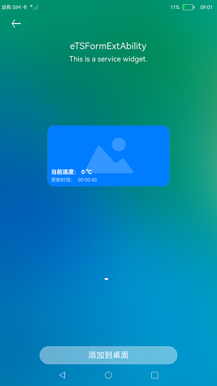

# Stage模型卡片

### 介绍

本示例展示了Stage模型卡片提供方的创建与使用。  

用到了卡片扩展模块接口，[@ohos.app.form.FormExtensionAbility](https://gitee.com/openharmony/docs/blob/master/zh-cn/application-dev/reference/apis/js-apis-app-form-formExtensionAbility.md) 。  

卡片信息和状态等相关类型和枚举接口，[@ohos.app.form.formInfo](https://gitee.com/openharmony/docs/blob/master/zh-cn/application-dev/reference/apis/js-apis-app-form-formInfo.md) 。

卡片提供方相关接口的能力接口，[@ohos.app.form.formProvider](https://gitee.com/openharmony/docs/blob/master/zh-cn/application-dev/reference/apis/js-apis-app-form-formProvider.md) 。

应用组件间的信息传递接口，[@ohos.app.ability.Want](https://gitee.com/openharmony/docs/blob/master/zh-cn/application-dev/reference/apis/js-apis-app-ability-want.md) 。

### 效果预览

| 添加卡片                                    | 
| ------------------------------------------- |
||

使用说明

1.部分设备的桌面不支持卡片，可以通过自己的开发卡片使用方，进行卡片的创建、更新和删除等操作。

2.卡片的样式如下图所示。当卡片更新时，卡片上的温度和时间会产生变化。


### 工程目录
```
entry/src/main
|---module.json5                           // 添加卡片拓展能力
|---/ets/pages
|   |---index.ets                          // 首页
|   |---second.ets                         // 第二跳转页
|---/ets/FormAbility                                 
|   |---FormAbility.ts                     // 定义卡片对象首次被创建时需要做的操作
|---js/widget/index                        // 定义卡片内容                 
|   |---index.hml                                                    
|   |---index.css                          
|   |---index.json                         
|---resources/base/profile                                  
|   |---form_config.json                   // 配置卡片（卡片名称，引入js卡片，卡片窗口大小等）                          
```
#### 相关概念

Ability：Ability是应用所具备能力的抽象，也是应用程序的重要组成部分。Ability是系统调度应用的最小单元，是能够完成一个独立功能的组件。

### 具体实现

1、在module.json5文件添加拓展能力，类型为卡片，并设置卡片入口srcEntrance和卡片元数据metadata。[源码参考](https://gitee.com/openharmony/applications_app_samples/blob/master/code/SuperFeature/Widget/FormExtAbility/entry/src/main/module.json5) 例如："metadata": [
{
"name": "ohos.extension.form",
"resource": "$profile:form_config"
}。  
2、初始化卡片：通过实现@ohos.app.form.FormExtensionAbility卡片操作类，在卡片对象首次被创建时，初始化卡片绑定数据为空，并将卡片状态设置为就绪状态READY。 例如：onCreate(){
formBindingData.createFormBindingData({}) onAcquireFormState(want) {
return formInfo.FormState.READY }。   
3、配置卡片：用js编写相应的卡片，将卡片配置到resources/base/profile/form_config, [源码参考](https://gitee.com/openharmony/applications_app_samples/blob/master/code/SuperFeature/Widget/FormExtAbility/entry/src/main/resources/base/profile/form_config.json) 。

### 相关权限

不涉及。

### 依赖

不涉及。

### 约束与限制

1.本示例仅支持标准系统上运行。

2.本示例为Stage模型，已适配API version 9，版本号：3.2.11.9。

3.本示例需要使用DevEco Studio 3.1 Beta2 (Build Version: 3.1.0.400, built on April 7, 2023)才可编译运行。

### 下载

如需单独下载本工程，执行如下命令：
```
git init
git config core.sparsecheckout true
echo code/SuperFeature/Widget/FormExtAbility/ > .git/info/sparse-checkout
git remote add origin https://gitee.com/openharmony/applications_app_samples.git
git pull origin master
```