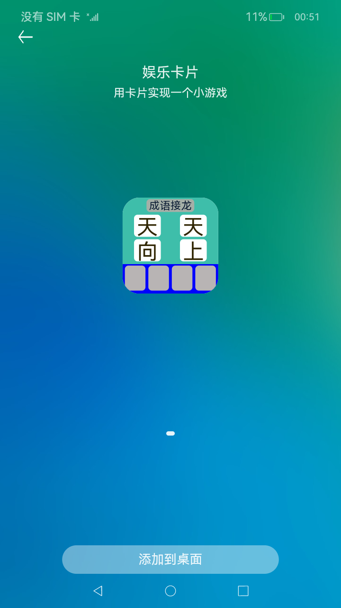

# Stage模型卡片小游戏

### 介绍

本示例展示了如何通过Stage模型实现一个简单的游戏卡片。

- 通过卡片支持的[点击事件](https://gitee.com/openharmony/docs/blob/master/zh-cn/application-dev/reference/js-service-widget-ui/js-service-widget-common-events.md)进行交互，让用户通过点击的先后顺序把一个乱序的成语排列成正确的成语。

- 使用了C++和TS的混合编程方式，将获取随机数的能力下沉到C++实现，并通过[NAPI](https://gitee.com/openharmony/docs/blob/master/zh-cn/application-dev/napi/napi-guidelines.md)的能力将C++实现的能力暴露到TS中。

- 用到了卡片扩展模块接口，[@ohos.app.form.FormExtensionAbility](https://gitee.com/openharmony/docs/blob/master/zh-cn/application-dev/reference/apis/js-apis-app-form-formExtensionAbility.md) 。


### 效果预览

| 添加卡片                                    | 操作卡片                                     |
| ------------------------------------------- | -------------------------------------------- |
|  |  |

使用说明：

1.部分设备的桌面不支持卡片，可以通过自己的开发卡片使用方，进行卡片的创建、更新和删除等操作。

2.安装应用，并在桌面上长按本应用的桌面图标，长按后弹出选项列表。

3.点击弹出列表中的**服务卡片**选项进入卡片添加界面。

4.点击正下方的**添加到桌面**按钮，卡片就会出现在桌面上。

### 工程目录
```
entry/src/main
|---module.json5                           // 添加卡片拓展能力
|---/cpp/types/libinfoutil
|   |---index.d.ts                         // native侧暴露给ArkTS侧接口的声明
|---/cpp/types
|   ---native_module.cpp                   // native侧逻辑
|   ---napi_info_util.cpp                  // native侧逻辑
|---/ets/pages
|   |---index.ets                          // 首页,包含ArkTS侧逻辑
|---/ets/FormAbility                                 
|   |---FormAbility.ts                     // 定义卡片对象首次被创建时需要做的操作
|---js/widget/index                        // 定义卡片内容                 
|   |---index.hml                                                    
|   |---index.css                          
|   |---index.json                         
|---resources/base/profile                                  
|   |---form_config.json                   // 配置卡片（卡片名称，引入js卡片，卡片窗口大小等                          
```

### 具体实现

1、在module.json5文件添加拓展能力，类型为卡片，并设置卡片入口srcEntrance和卡片元数据metadata，[源码参考](entry/src/main/module.json5 )。 
2、配置卡片：用js编写相应的卡片，将卡片配置到resources/base/profile/form_config。  
3、定义小游戏逻辑：实现FormExtensionAbility中addform时初始化数据（本sample中使用的是mock数据)，并将数据存储到dataStore，通过调用c++随机数，将成语顺序打乱显示，
4、监听卡片变化：通过onformEvent()监听卡片事件，更新已选择的成语数据，并随机替换成语待选列表的已被选掉的word，[源码参考](entry/src/main/ets/FormAbility/FormAbility.ts )。

### 相关权限

不涉及。

### 依赖

不涉及。

### 约束与限制

1.本示例仅支持标准系统上运行。

2.本示例支持API10版本SDK，SDK版本号(API Version 10 Release),镜像版本号(4.0 Release)。

3.本示例需要使用DevEco Studio 版本号(4.0 Release)及以上版本才可编译运行。

### 下载

如需单独下载本工程，执行如下命令：
```
git init
git config core.sparsecheckout true
echo code/SuperFeature/Widget/FormGame/ > .git/info/sparse-checkout
git remote add origin https://gitee.com/openharmony/applications_app_samples.git
git pull origin master
```