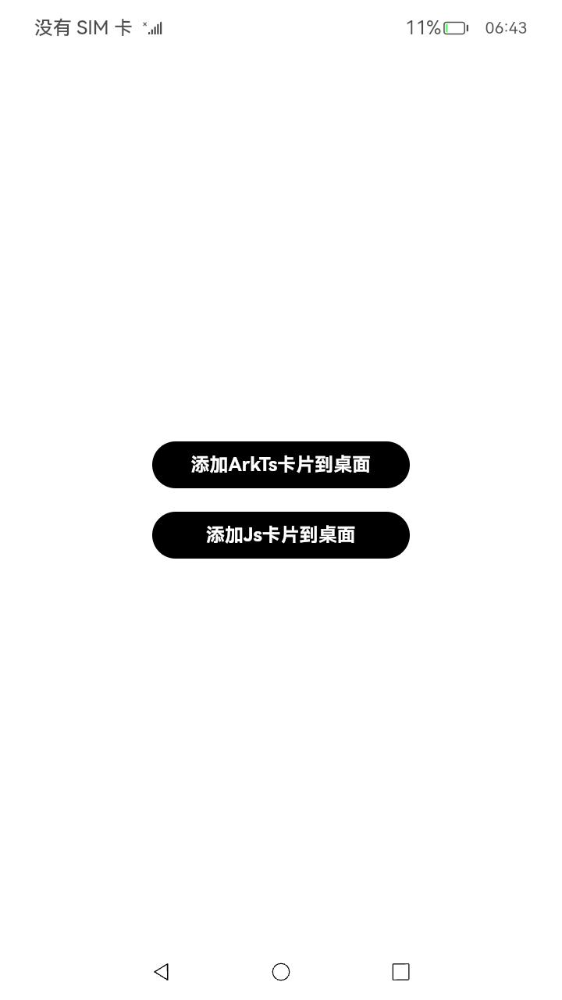

# 应用主动添加数据代理卡片到桌面

### 介绍

本示例主要展示了使用[@ohos.app.form.formBindingData](https://gitee.com/openharmony/docs/blob/master/zh-cn/application-dev/reference/apis/js-apis-app-form-formBindingData.md)、[@ohos.app.form.formProvider](https://gitee.com/openharmony/docs/blob/master/zh-cn/application-dev/reference/apis/js-apis-app-form-formProvider.md)等接口，实现了在com.ohos.hag.famanager应用上，主动添加数据代理卡片到桌面的功能。

### 效果预览

| 应用主页面                          | 添加Js与ArkTs数据代理卡片到桌面        |
| ------- | ------- |
|  |  |

使用说明

1. 点击桌面上AppStore应用图标，打开com.ohos.hag.famanager应用。

2. 点击按钮<添加ArkTs卡片到桌面>或<添加Js卡片到桌面>按钮，AppStore应用自动切到后台并且开始将数据代理卡片添加到桌面。

3. 桌面切到前台显示后，刷新组件并将添加的数据代理卡片显示到页面上。

### 工程目录

```
entry/src/main/
├──ets
|  ├──entryability
|  |  └──EntryAbility.ts
|  ├──entryformability
|  |  └──EntryFormAbility.ts                         
|  ├──logger                   
|  |  └──Logger.ts
|  ├──pages
|  |  └──Index.ets                             // EntryAbilit页面
|  └──widget
|     └──pages
|        └──WidgetCard.ets                     // ArkTS卡片
├──js
|  ├──common
|  ├──i18n
|  └──jswidget
|     └──pages
|        └──index
|           ├──index.css                       // JS卡片样式
|           ├──index.hml                       // JS卡片
|           └──index.json                      // JS卡片默认值
└──resources                                   // 资源信息
```

### 具体实现

- 发布ArkTs数据代理卡片到桌面
  - 使用requestPublishForm接口，将应用内的ArkTs数据代理卡片主动添加到桌面上，接口参考：[@ohos.app.form.formProvider](https://gitee.com/openharmony/docs/blob/master/zh-cn/application-dev/reference/apis/js-apis-app-form-formProvider.md)
- 发布Js数据代理卡片到桌面
  - 使用requestPublishForm接口，将应用内的Js数据代理卡片主动添加到桌面上，接口参考：[@ohos.app.form.formProvider](https://gitee.com/openharmony/docs/blob/master/zh-cn/application-dev/reference/apis/js-apis-app-form-formProvider.md)

### 相关权限

[ohos.permission.GET_BUNDLE_INFO_PRIVILEGED](https://gitee.com/openharmony/docs/blob/eb73c9e9dcdd421131f33bb8ed6ddc030881d06f/zh-cn/application-dev/security/permission-list.md)

[ohos.permission.REQUIRE_FORM](https://gitee.com/openharmony/docs/blob/eb73c9e9dcdd421131f33bb8ed6ddc030881d06f/zh-cn/application-dev/security/permission-list.md)

### 依赖

不涉及

### 约束与限制

1.本示例仅支持标准系统上运行，支持设备：RK3568。

2.本示例为Stage模型，支持API10版本SDK，SDK版本号(API Version 10 Release),镜像版本号(4.0 Release)。

3.本示例需要使用DevEco Studio 版本号(4.0 Release)及以上版本才可编译运行。

4.本示例需要使用Full SDK编译。使用Full SDK时需要手动从镜像站点获取，并在DevEco Studio中替换，具体操作可参考[替换指南]( https://docs.openharmony.cn/pages/v3.2/zh-cn/application-dev/quick-start/full-sdk-switch-guide.md/ )。

5.本示例所配置的权限为system_basic级别(相关权限级别可通过[权限定义列表]( https://gitee.com/openharmony/docs/blob/master/zh-cn/application-dev/security/permission-list.md )查看)，需要手动配置对应级别的权限签名(具体操作可查看[自动化签名方案](https://docs.openharmony.cn/pages/v3.2/zh-cn/application-dev/security/hapsigntool-overview.md/))

6.本示例类型为系统应用，需要手动配置对应级别的应用类型("app-feature": "hos_system_app")。具体可参考profile配置文件[bundle-info对象内部结构](https://gitee.com/openharmony/docs/blob/eb73c9e9dcdd421131f33bb8ed6ddc030881d06f/zh-cn/application-dev/security/app-provision-structure.md#bundle-info%E5%AF%B9%E8%B1%A1%E5%86%85%E9%83%A8%E7%BB%93%E6%9E%84)

### 下载

如需单独下载本工程，执行如下命令：
```
git init
git config core.sparsecheckout true
echo code/SystemFeature/ApplicationModels/RequestAddForm/ > .git/info/sparse-checkout
git remote add origin https://gitee.com/openharmony/applications_app_samples.git
git pull origin master
```