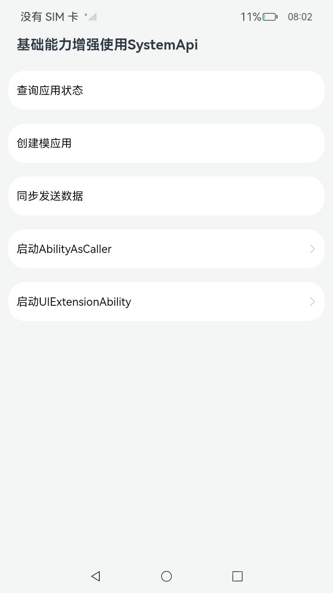
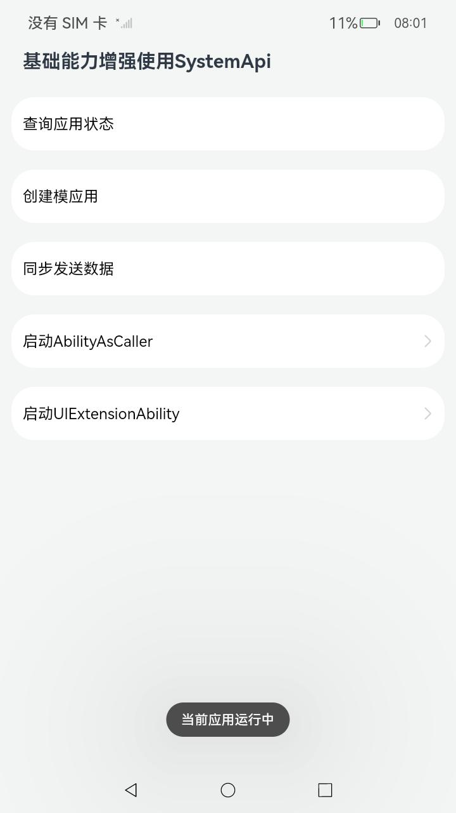
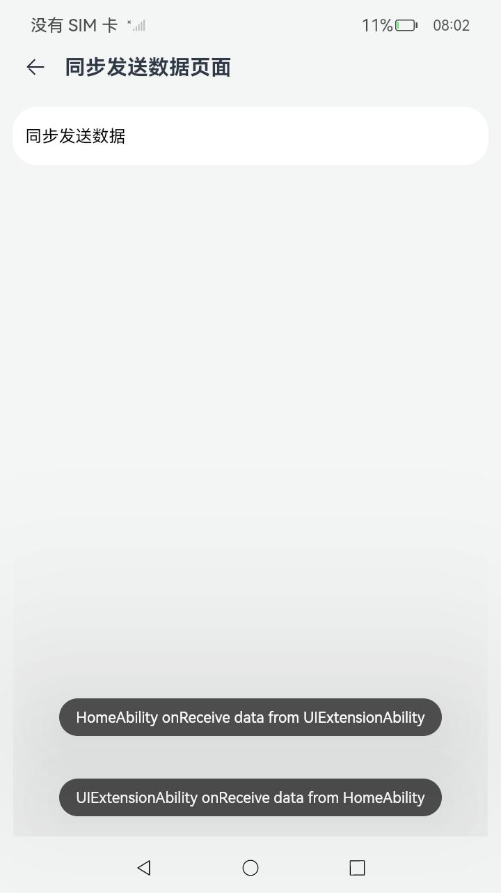
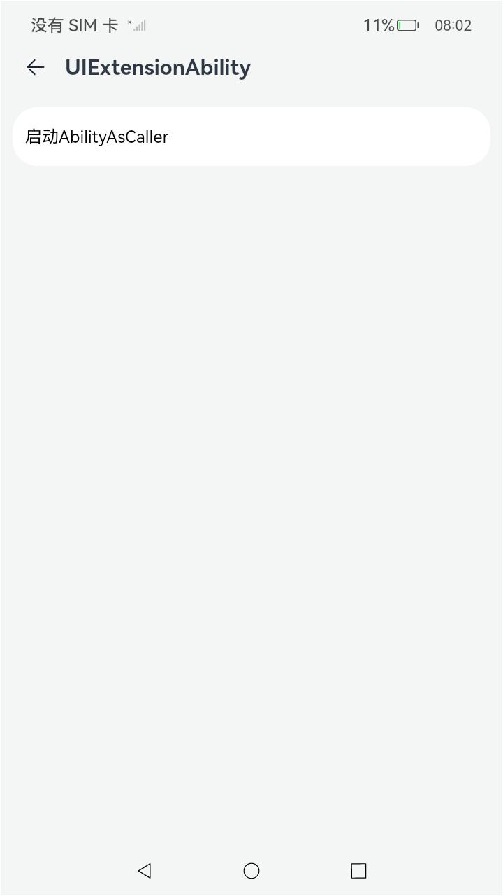

# 基础能力增强

### 介绍

本示例使用  [ohos.app.ability.appManager](https://gitee.com/openharmony/docs/blob/master/zh-cn/application-dev/reference/apis-ability-kit/js-apis-app-ability-appManager-sys.md), [UIAbilityContext](https://gitee.com/openharmony/docs/blob/master/zh-cn/application-dev/reference/apis-ability-kit/js-apis-inner-application-uiAbilityContext-sys.md) , [UIExtensionContentSession](https://gitee.com/openharmony/docs/blob/master/zh-cn/application-dev/reference/apis-ability-kit/js-apis-app-ability-uiExtensionContentSession-sys.md) 等接口实现了以下功能：

1. 提供查询单个应用是否正在运行接口；

2. 新增系统接口请求创建模系统或模应用的UIExtension；

3. UIExtension支持同步返回数据的能力；

4. UIExtension提供StartAsCaller接口。

### 效果预览

|                       主页面                        |                       弹出状态Toast                       |                        同步数据页面                        |                     UIExtension启动页                     |
|:------------------------------------------------:|:-----------------------------------------------------:|:----------------------------------------------------:|:------------------------------------------------------:|
|  |  |  |  |

使用说明

1.应用查询单个应用是否正在运行的能力

点击'查询应用状态'的ListItem，弹出Toast提示'当前应用运行中'

2.UIExtension创建模系统或模应用

点击'创建模系统'的ListItem,弹出UIExtension的页面弹窗

3.UIExtension支持同步返回数据的能力

点击'同步发送数据'的ListItem,进入到新页面再次点击'同步发送数据'的ListItem，UIAbility部分弹出Toast提示'HomeAbility
onReceive data from UIExtensionAbility'，UIExtensionAbility 部分弹出Toast提示'UIExtensionAbility onReceive data from
HomeAbility'

4.UIExtension提供startAbilityAsCaller的能力

点击启动'启动UIExtensionAbility'的ListItem，进入到新页面，在新页面点击'启动AbilityAsCaller'的ListItem，应用启动NewAbility

### 工程目录

```
entry/src/main/ets/
|---entryability
|   |---EntryAbility.ets				// 首页的Ability
|---pages
|   |---Index.ets						// 首页
|   |---Ext.ets							// UIExtensionAbility的展示页
|   |---NewExt.ets						// 被启动的UIExtensionAbility的页面
|   |---New.ets							// 被启动UIAbility的展示页
|   |---Transit.ets						// UIExtensionComponent加载NewUIExtAbility的页面
|   |---SendSync.ets					// UIExtensionComponent加载SendSyncExtAbility的页面
|   |---SendSyncExt.ets					// 同步数据UIExtensionAbility的展示页
|---uiextability						
|   |---UIExtAbility.ets				// UIExtensionAbility(用于验证新接口使用)
|---sendsyncextability						
|   |---SendSyncExtAbility.ets			// UIExtensionAbility(用于验证新接口使用)
|---newuiextability						
|   |---NewUIExtAbility.ets				// UIExtensionAbility(用于验证新接口使用)
|---newability
|   |---NewAbility.ets					// 被启动的UIAbility(验证新接口启动使用)
|---utils								// 工具
|   |---Logger.ets						// 日志工具
```

### 具体实现

- 应用查询单个应用是否正在运行的能力,通过appManager调用isApplicationRunning(bundleName: string, callback:
  AsyncCallback<boolean>): void方法查询应用状态， 源码参考：[Index.ets](entry/src/main/ets/pages/Index.ets)
- UIExtension创建模系统或模应用,通过UIAbilityContext调用requestModalUIExtension(pickerWant: Want, callback:
  AsyncCallback<void>): void方法拉起UIExtensionAbility， 源码参考：[Index.ets](entry/src/main/ets/pages/Index.ets)
- UIExtension支持同步返回数据的能力，通过UIExtensionProxy调用sendSync(data: { [key: string]: Object }): { [key: string]:
  Object }接口实现，源码参考：[SendSync.ets](entry/src/main/ets/pages/SendSync.ets)
- UIExtension提供startAbilityAsCaller的能力,通过UIExtensionContentSession调用startAbilityAsCaller(want: Want, callback:
  AsyncCallback<void>): void接口实现，源码参考：[Ext.ets](entry/src/main/ets/pages/Ext.ets)

### 相关权限

[ohos.permission.GET_RUNNING_INFO](https://gitee.com/openharmony/docs/blob/master/zh-cn/application-dev/security/AccessToken/permissions-for-system-apps.md#ohospermissionget_running_info)

### 依赖

不涉及。

### 约束与限制

1.本示例仅支持标准系统上运行，支持设备：RK3568。

2.本示例为Stage模型，支持API11版本SDK，版本号：4.1.5.1；

3.本示例涉及使用系统接口：appManager.isApplicationRunning ，UIAbilityContext.requestModalUIExtension,
UIAbilityContext.startAbilityAsCaller,UIExtensionContentSession.startAbilityAsCaller,UIExtensionProxy.sendSync
需要手动替换Full SDK才能编译通过；

4.本示例需要使用DevEco Studio 3.1.1 Release (Build Version: 3.1.0.501, built on June 20, 2023)才可编译运行；

5.本示例涉及[ohos.permission.GET_RUNNING_INFO](https://gitee.com/openharmony/docs/blob/master/zh-cn/application-dev/security/AccessToken/permissions-for-system-apps.md#ohospermissionget_running_info)权限为 system_basic级别，需要配置高权限签名；

### 下载

```shell
git init
git config core.sparsecheckout true
echo code/SystemFeature/Ability/AbilityFeatureSystem/ > .git/info/sparse-checkout
git remote add origin https://gitee.com/openharmony/applications_app_samples.git
git pull origin master
```

