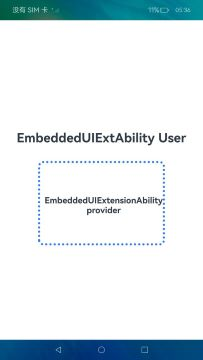

# EmbeddedUIExtensionAbility

### 介绍

本示例主要展示了[EmbeddedUIExtensionAbility](https://gitee.com/openharmony/docs/blob/master/zh-cn/application-dev/reference/apis-ability-kit/js-apis-app-ability-embeddedUIExtensionAbility.md)的提供方与拉起方的创建与使用。开发者可以在UIAbility的页面中通过EmbeddedComponent嵌入本应用的EmbeddedUIExtensionAbility提供的UI。EmbeddedUIExtensionAbility会在独立于UIAbility的进程中运行，完成其页面的布局和渲染。通常用于有进程隔离诉求的模块化开发场景。

### 效果预览

| 主页                             |
| ------------------------------- |
|  |

### 使用说明：

1. 当前EmbeddedUIExtensionAbility和EmbeddedComponent仅支持在拥有多进程配置的设备上使用。
2. EmbeddedComponent只能在UIAbility中使用，且被拉起的EmbeddedUIExtensionAbility需与UIAbility属于同一应用。
3. EmbeddedUIExtensionAbility通过UIExtensionContext和UIExtensionContentSession提供相关能力。本文描述中称被启动的EmbeddedUIExtensionAbility为提供方，称启动EmbeddedUIExtensionAbility的EmbeddedComponent组件为使用方。

### 工程目录

```
entry/src/main/ets/
|---entryability
|   |---EntryAbility.ts
|---pages
|   |---Index.ets // 首页
|   |---Extension.ets // EmbeddedUIExtensionComponent页面
|---model
|   |---Logger.ts // 封装的日志类
|---embeddeduiextability
|   |---EmbeddedUIExtAbility.ets

entry/src/main/resources
|---base
|   |---element
|   |---media
|   |---profile
|   |   |---main_pages.json // 页面配置文件
|---en_US
|---rewfile
|---zh_CN
|---module.json5 // 配置文件
```

### 具体实现

* 使用方在主页面[Index.ets](entry/src/main/ets/pages/Index.ets)中通过EmbeddedUIExtensionComponent页面嵌入提供方应用的EmbeddedUIExtensionAbility提供的UI。

* 源码链接： [Index.ets](entry/src/main/ets/pages/Index.ets)

* 接口参考： [EmbeddedUIExtensionAbility](https://gitee.com/openharmony/docs/blob/master/zh-cn/application-dev/reference/apis-ability-kit/js-apis-app-ability-embeddedUIExtensionAbility.md)

* 提供方UIExtensionAbility页面在[Extension.ets](entry/src/main/ets/pages/extension.ets)中实现，在页面中需要导入EmbeddedUIExtensionAbility的依赖包，自定义类继承EmbeddedUIExtensionAbility并实现onCreate、onSessionCreate、onSessionDestroy、onForeground、onBackground和onDestroy生命周期回调。

* 源码链接：[Extension.ets](entry/src/main/ets/pages/extension.ets)

* 接口参考：[EmbeddedUIExtensionAbility](https://gitee.com/openharmony/docs/blob/master/zh-cn/application-dev/reference/apis-ability-kit/js-apis-app-ability-embeddedUIExtensionAbility.md)

* 主页面[Index.ets](entry/src/main/ets/pages/Index.ets)和提供方EmbeddedUIExtensionAbility页面在[Extension.ets](entry/src/main/ets/pages/Index.ets)需要在[main_pages.json](entry\src\main\resources\base\profile\main_pages.json)中配置。

* 源码链接：[main_pages.json](entry/src/main/resources/base/profile/main_pages.json)

* 接口参考：[EmbeddedUIExtensionAbility](https://gitee.com/openharmony/docs/blob/master/zh-cn/application-dev/reference/apis-ability-kit/js-apis-app-ability-embeddedUIExtensionAbility.md)

* 在工程Module对应的[module.json5配置文件](entry/src/main/module.json5)中注册EmbeddedUIExtensionAbility。type标签需要设置为“embeddedUI”, srcEntry字段表示当前UIExtensionAbility组件所对应的代码路径。

* 源码链接：[module.json5](entry/src/main/module.json5)

* 接口参考：[EmbeddedUIExtensionAbility](https://gitee.com/openharmony/docs/blob/master/zh-cn/application-dev/reference/apis-ability-kit/js-apis-app-ability-embeddedUIExtensionAbility.md)
### 相关权限

不涉及

### 依赖

不涉及

### 约束与限制

1. 本当前EmbeddedUIExtensionAbility和EmbeddedComponent仅支持在拥有多进程配置的设备上使用。
   
2. 本示例需要使用DevEco Studio 4.0 Beta2 (Build Version: 4.0.0.400 构建 2023年8月2日)及以上版本才可编译运行。

3. 若单进程设备想尝试使用EmbeddedUIExtensionAbility，可以通过如下命令行将单进程设备配置为多进程设备。

```
hdc shell
param set persist.sys.abilityms.multi_process_model true // 将persist.sys.abilityms.multi_process_model参数配置为true
param save // 保存修改
param get persist.sys.abilityms.multi_process_model // 查询修改结果
reboot // 修改成功后重启生效
```

### 下载

如需单独下载本工程，执行如下命令：

```
git init
git config core.sparsecheckout true
echo code/SystemFeature/ApplicationModels/EmbeddedUIExtensionAbility/ > .git/info/sparse-checkout
git remote add origin https://gitee.com/openharmony/applications_app_samples.git
git pull origin master
```