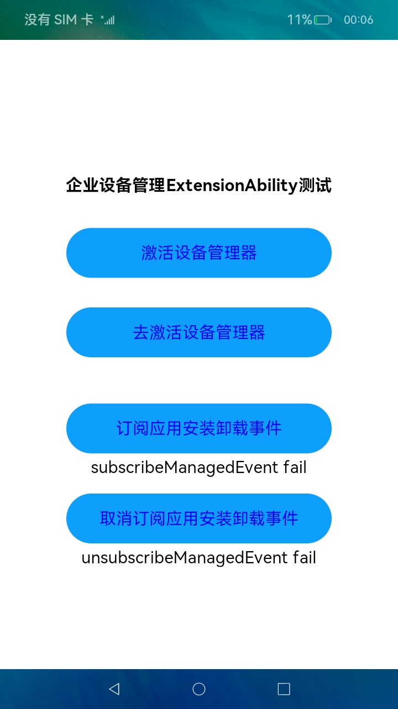

# EnterpriseAdminExtensionAbility的创建与使用（仅对系统应用开放）

### 介绍

企业设备管理扩展能力，是MDM应用必备组件。当开发者为企业开发MDM（Mobile Device Management）应用时，需继承EnterpriseAdminExtensionAbility，在EnterpriseAdminExtensionAbility实例中实现MDM业务逻辑，EnterpriseAdminExtensionAbility实现了系统管理状态变化通知功能，并定义了管理应用激活、去激活、应用安装、卸载事件等回调接口。

### 效果预览

| 未激活                                                 | 订阅应用安装事件失败                                    | 已激活                                                 | 订阅应用安装卸载事件成功                                |
| ------------------------------------------------------ | ------------------------------------------------------- | ------------------------------------------------------ | ------------------------------------------------------- |
|  |  |  |  |

使用说明

1.启动应用后，点击激活设备管理器，会显示激活成功。由企业管理员或者员工部署MDM应用，激活设备管理器，系统通知MDM应用已激活DeviceAdmin权限。MDM应用可在onAdminEnable回调函数中进行初始化策略设置。

2.点击去激活设备管理器，会显示去激活成功。系统或者员工去激活设备管理器，应用可以通知企业管理员设备已脱管。

3.点击订阅应用安装卸载事件，会显示订阅成功。企业应用管理场景下，企业管理员订阅应用安装卸载事件，端侧应用安装和卸载事件通知MDM应用，MDM应用可以在回调函数中进行事件上报，通知企业管理员。

4.点击取消订阅应用安装卸载事件，会显示取消订阅成功。企业应用管理场景下，企业管理员取消订阅应用安装卸载事件。

### 工程目录
```
entry/src/main/ets/
|---common
|   |---Logger.ts                      // 日志工具
|---enterpriseextability
|   |---EnterpriseAdminAbility.ts      // 数据类型
|---entryAbility
|   |---EntryAbility.ts                
|---pages
|   |---Index.ets                      // 首页
```
### 具体实现

* 该示例通过EnterpriseAdminExtensionAbility接口实现了系统管理状态变化通知功能，adminManager接口中enableAdmin方法去激活当前用户下的指定设备管理员应用，disableSuperAdmin方法去根据bundleName将管理员用户下的超级管理员应用去激活，subscribeManagedEvent方法去指定设备管理员应用订阅系统管理事件，unsubscribeManagedEvent方法去指定设备管理员应用取消订阅系统管理事件来实现应用激活、去激活、应用安装、卸载事件。
* 源码链接：[EnterpriseAdminAbility.ts](entry/src/main/ets/enterpriseextability/EnterpriseAdminAbility.ts)，[Index.ets](entry/src/main/ets/pages/Index.ets)
* 接口参考：[@ohos.enterprise.EnterpriseAdminExtensionAbility](https://gitee.com/openharmony/docs/blob/master/zh-cn/application-dev/reference/apis/js-apis-EnterpriseAdminExtensionAbility.md)，[@ohos.enterprise.adminManager](https://gitee.com/openharmony/docs/blob/master/zh-cn/application-dev/reference/apis/js-apis-enterprise-adminManager.md)，[@ohos.app.ability.Want](https://gitee.com/openharmony/docs/blob/master/zh-cn/application-dev/reference/apis/js-apis-app-ability-want.md)

### 相关权限

1.允许应用激活设备管理员应用权限：[ohos.permission.MANAGE_ENTERPRISE_DEVICE_ADMIN](https://gitee.com/openharmony/docs/blob/master/zh-cn/application-dev/security/permission-list.md#ohospermissionmanage_enterprise_device_admin)

2.允许设备管理员应用订阅管理事件权限：[ohos.permission.ENTERPRISE_SUBSCRIBE_MANAGED_EVENT](https://gitee.com/openharmony/docs/blob/master/zh-cn/application-dev/security/permission-list.md#ohospermissionenterprise_subscribe_managed_event)

### 依赖

不涉及。

### 约束与限制

1. 本示例仅支持标准系统上运行，支持设备：RK3568。
2. 本示例已适配API version 9版本SDK，版本号：3.2.11.9，本示例涉及使用系统接口：@ohos.enterprise.adminManager中的enableAdmin、disableAdmin接口，需要手动替换FullSDK才能编译通过，具体操作可参考[替换指南](https://docs.openharmony.cn/pages/v3.2/zh-cn/application-dev/quick-start/full-sdk-switch-guide.md/)。
3. 本示例需要使用DevEco Studio 3.1 Beta2 (Build Version: 3.1.0.400 构建 2023年4月7日)及以上版本才可编译运行。
4. 本示例涉及系统接口，需要配置系统应用签名，可以参考[特殊权限配置方法](https://docs.openharmony.cn/pages/v3.2/zh-cn/application-dev/security/hapsigntool-overview.md/)，把配置文件中的“app-feature”字段信息改为“hos_system_app”。
5. 本示例涉及ohos.permission.MANAGE_ENTERPRISE_DEVICE_ADMIN为system_core级别(相关权限级别可通过[权限定义列表](https://gitee.com/openharmony/docs/blob/master/zh-cn/application-dev/security/permission-list.md)查看)，需要配置高权限签名，可参考[特殊权限配置方法](https://docs.openharmony.cn/pages/v3.2/zh-cn/application-dev/security/hapsigntool-overview.md/)。
6. 本示例涉及企业应用权限，需要进行特殊签名安装，把签名证书中的"app-distribution-type"字段信息修改为"enterprise_mdm"类型，执行签名脚本生成安装包之后，先执行 1. hdc shell param set const.product.developmentmode 1  2. hdc shell param set const.bms.allowenterprisebundle true 这两个命令再进行包安装。

### 下载

如需单独下载本工程，执行如下命令：
```
git init
git config core.sparsecheckout true
echo code/SystemFeature/ApplicationModels/EnterpriseAdminExtensionAbility/ > .git/info/sparse-checkout
git remote add origin https://gitee.com/openharmony/applications_app_samples.git
git pull origin master
```
