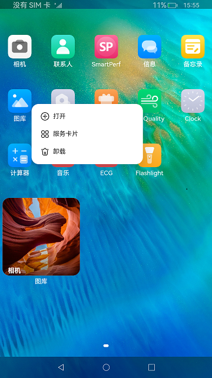
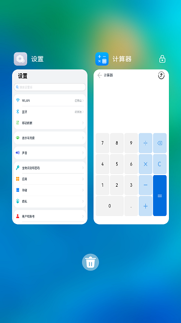

# 仿桌面应用（仅对系统应用开放）

### 介绍

本示例实现了一个简单桌面应用，实现了以下几点功能：

1.展示了系统安装的应用，实现点击启动、应用上滑弹出卡片、卡片添加到桌面、卡片移除功能。

2.实现桌面数据持久化存储，应用支持卸载、监听应用卸载和安装并显示。

3.实现最近任务管理功能，包括任务卡片加锁、解锁、清理和清理所有任务功能。

4.通过点击应用图标或点击由长按图标弹出的菜单栏中的打开按钮的方式打开应用，是以打开最近任务方式拉起应用Ability。

### 效果预览

|主页| 重置页面                                     |
|--------------------------------|------------------------------------------|
| |  |

使用说明

1.安装编译的hap包，使用hdc shell aa start -b ohos.samples.launcher -a MainAbility命令启动应用，应用启动后显示系统安装的应用。

2.点击应用主界面上的应用图标可以启动应用，长按弹出菜单，点击打开可以正常启动应用。

3.图库等支持卡片的应用，长按菜单中有服务卡片，点击进入卡片预览界面，在卡片预览界面点击**添加到桌面**，返回到桌面并且卡片成功添加到桌面。

4.上滑图库等支持卡片的应用，可以弹出默认上滑卡片，点击上滑卡片右上角的**+**图标，可以添加卡片到桌面。

5.应用在桌面界面，使用hdc install安装一个应用，桌面可以监听到应用安装，并显示新安装的应用到桌面上。

6.应用在桌面界面，使用hdc uninstall 卸载第5步安装的应用，桌面可以监听到卸载，并移除桌面上的应用。

7.在桌面空白处上滑，可以进入最近任务管理界面，下滑任务卡片可以加锁/解锁，上滑卡片可以清理该后台任务，点击垃圾桶可以清除所有后台任务（加锁的应用不会被清理掉）。

### 工程目录
```
entry/src/main/ets/
|---Application
|   |---MyAbilityStage.ts
|---components
|   |---FormManagerComponent.ets               // 弹窗组件
|---MainAbility
|   |---MainAbility.ts
|---manager
|   |---WindowManager.ts                       // 数据类型
|---pages
|   |---FormPage.ets                           // 首页
|   |---Home.ets                               // 详情页面
|   |---RecentsPage.ets                        // 详情页面
```
### 具体实现

* 获取应用功能模块
  * 使用launcherBundleManager模块接口（系统能力：SystemCapability.BundleManager.BundleFramework），获取所有应用信息和给定包名获取应用信息，实现桌面展示所有安装的应用。使用on接口监听应用的安装和卸载从而实现应用安装和卸载刷新桌面。
  * 源码链接：[LauncherAbilityManager.ts](base/src/main/ets/default/manager/LauncherAbilityManager.ts)
  * 接口参考：[@ohos.bundle.launcherBundleManager](https://gitee.com/openharmony/docs/blob/master/zh-cn/application-dev/reference/apis/js-apis-launcherBundleManager.md)

* 应用卸载功能模块
  * 使用bundle模块的getBundleInstaller接口获取到BundleInstaller（系统能力：SystemCapability.BundleManager.BundleFramework），调用uninstall接口实现应用卸载功能。
  * 源码链接：[LauncherAbilityManager.ts](base/src/main/ets/default/manager/LauncherAbilityManager.ts)
  * 接口参考：[@ohos.bundle](https://gitee.com/openharmony/docs/blob/master/zh-cn/application-dev/reference/apis/js-apis-Bundle.md)
  
* 添加卡片功能模块
  * 使用formHost接口（系统能力：SystemCapability.Ability.Form），获取应用卡片信息，使用FormComponent组件展示卡片内容，从而实现添加卡片到桌面的功能。
  * 源码链接：[FormManager.ts](base/src/main/ets/default/manager/FormManager.ts)
  * 接口参考：[@ohos.app.form.formHost](https://gitee.com/openharmony/docs/blob/master/zh-cn/application-dev/reference/apis/js-apis-app-form-formHost.md)

* 桌面数据持久化存储功能模块
  * 使用关系型数据库rdb接口（系统能力：SystemCapability.DistributedDataManager.RelationalStore.Core），实现桌面数据持久化存储，存储应用的位置信息，卡片信息。
  * 源码链接：[RdbManager.ts](base/src/main/ets/default/manager/RdbManager.ts)
  * 接口参考：[@ohos.data.relationalStore](https://gitee.com/openharmony/docs/blob/master/zh-cn/application-dev/reference/apis/js-apis-data-relationalStore.md)

* 加锁、解锁、清理后台任务功能模块
  * 使用missionManager模块接口（系统能力：SystemCapability.Ability.AbilityRuntime.Mission），获取最近任务信息，并实现加锁、解锁、清理后台任务的功能。
  * 源码链接：[MissionModel.ts](recents/src/main/ets/default/model/MissionModel.ts)
  * 接口参考：[@ohos.application.missionManager](https://gitee.com/openharmony/docs/blob/master/zh-cn/application-dev/reference/apis/js-apis-application-missionManager.md)

* 点击桌面应用拉起最近任务至前台功能模块
  * 使用ServiceExtensionContext模块的startRecentAbility接口（系统能力：SystemCapability.Ability.AbilityRuntime.Core），拉起最近任务至前台显示，若应用Ability未启动时，则拉起新创建的应用Ability显示到前台。
  * 源码链接：[LauncherAbilityManager.ts](./base/src/main/ets/default/manager/LauncherAbilityManager.ts)
  * 接口参考：[@ohos.app.ability.ServiceExtensionAbility](https://gitee.com/openharmony/interface_sdk-js/blob/master/api/@ohos.app.ability.ServiceExtensionAbility.d.ts)
### 相关权限

| 权限名                                     | 权限说明                                         | 级别         |
| ------------------------------------------ | ------------------------------------------------ | ------------ |
| ohos.permission.GET_BUNDLE_INFO_PRIVILEGED | 允许应用查询其他应用的信息。                     | system_basic |
| ohos.permission.LISTEN_BUNDLE_CHANGE       | 允许应用监听其他应用安装、更新、卸载状态的变化。 | system_basic |
| ohos.permission.INSTALL_BUNDLE             | 允许应用安装、卸载其他应用。                     | system_core  |
| ohos.permission.MANAGE_MISSIONS            | 允许用户管理元能力任务栈。                       | system_core  |
| ohos.permission.REQUIRE_FORM               | 允许应用获取Ability Form。                       | system_basic |
| ohos.permission.NOTIFICATION_CONTROLLER    | 允许应用管理通知和订阅通知。                     | system_core  |

### 依赖

1.Launcher通过卡片拉起橘子购物元服务需要依赖[ASOrangeShopping](../../../Solutions/Shopping/OrangeShopping/README_zh.md)。

2.Launcher测试[Launcher.test.ets](./entry/src/ohosTest/ets/test/Launcher.test.ets)需要依赖[CrossChainBack](../TestRely/LauncherTest/CrossChainBack/README_zh.md)以及[StartRecentAbility](../TestRely/LauncherTest/StartRecentAbility/README_zh.md)，开始测试前需先安装CrossChainBack应用和StartRecentAbility应用。

### 约束与限制

1.本示例仅支持标准系统上运行，支持设备：RK3568。

2.本示例为Stage模型，支持API10版本SDK，SDK版本号(API Version 10 Release),镜像版本号(4.0 Release)。

3.本示例需要使用DevEco Studio 版本号(4.0 Release)及以上版本才可编译运行。

4.本示例需要使用系统权限的系统接口，需要使用Full SDK编译。使用Full SDK时需要手动从镜像站点获取，并在DevEco Studio中替换，具体操作可参考[替换指南]( https://docs.openharmony.cn/pages/v3.2/zh-cn/application-dev/quick-start/full-sdk-switch-guide.md/ )。

5.本示例使用了ServiceExtensionAbility，需要在签名证书UnsgnedReleasedProfileTemplate.json中配置"app-privilege-capabilities": ["AllowAppUsePrivilegeExtension"]，否则安装失败。具体操作指南可参考[应用特权配置指南]( https://gitee.com/openharmony/docs/blob/eb73c9e9dcdd421131f33bb8ed6ddc030881d06f/zh-cn/device-dev/subsystems/subsys-app-privilege-config-guide.md/ )。

6.本示例所配置的权限均为system_basic或system_core级别(相关权限级别可通过[权限定义列表]( https://gitee.com/openharmony/docs/blob/master/zh-cn/application-dev/security/permission-list.md )查看)，需要手动配置对应级别的权限签名(具体操作可查看[自动化签名方案]( https://docs.openharmony.cn/pages/v3.2/zh-cn/application-dev/security/hapsigntool-overview.md/ ))。

7.本示例类型为系统应用，需要手动配置对应级别的应用类型("app-feature": "hos_system_app")。具体可参考profile配置文件[bundle-info对象内部结构]( https://gitee.com/openharmony/docs/blob/eb73c9e9dcdd421131f33bb8ed6ddc030881d06f/zh-cn/application-dev/security/app-provision-structure.md#bundle-info%E5%AF%B9%E8%B1%A1%E5%86%85%E9%83%A8%E7%BB%93%E6%9E%84 )

### 下载

如需单独下载本工程，执行如下命令：
```
git init
git config core.sparsecheckout true
echo code/SystemFeature/ApplicationModels/Launcher/ > .git/info/sparse-checkout
git remote add origin https://gitee.com/openharmony/applications_app_samples.git
git pull origin master
```
