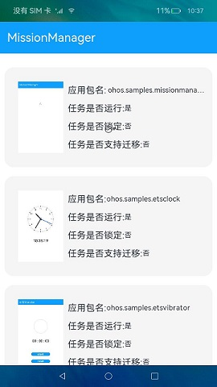
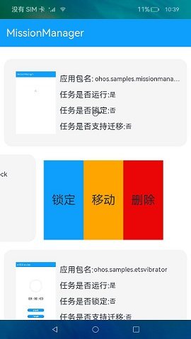
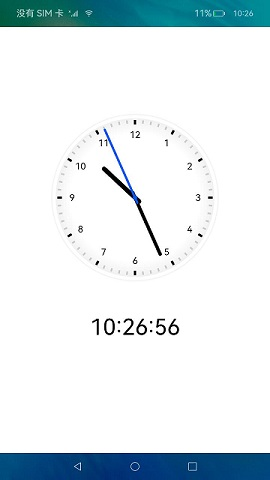

# 系统任务管理

### 介绍

本示例通过调用系统任务管理的能力，使用[@ohos.application.missionManager](https://gitee.com/openharmony/docs/blob/master/zh-cn/application-dev/reference/apis/js-apis-application-missionManager.md) 、[@ohos.multimedia.image](https://gitee.com/openharmony/docs/blob/master/zh-cn/application-dev/reference/apis/js-apis-image.md) 等接口完成对系统任务执行锁定、解锁、清理、切换到前台等操作。

### 效果预览

|初始页|任务页|任务操作页|时钟页|
|--------------------------------|--------------------------------|--------------------------------|--------------------------------|
|||||

使用说明

1.下拉“**获取系统任务信息**”，获取当前系统任务的包名、运行状态、锁定状态、任务是否支持迁移、任务快照等信息列表，且最多可获取10条任务；

2.左滑任务列表，点击“**锁定**”，即可锁定指定的任务；

3.若当前任务已锁定，可点击“**解锁**”，即可解锁指定的任务；

4.点击“**删除**”，即可删除指定的任务；

5.点击“**移动**”，即可将指定的任务移动到前台执行。

### 工程目录
```
entry/src/main/ets/
|---Application
|---common
|   |---MissionInfoComponent.ets       // 任务信息组件
|   |---TitleBar.ets                   // 标题组件
|---MainAbility
|---model
|   |---Logger.ts                      // 日志工具
|   |---Mission.ts                     // 虚拟数据
|---pages
|   |---Index.ets                      // 首页
```

### 具体实现

* 任务执行锁定、解锁、清理、切换到前台等操作的功能结构主要封装再在Index、MissionInfoComponent，源码参考:[Index.ets](https://gitee.com/openharmony/applications_app_samples/blob/master/code/SystemFeature/ApplicationModels/MissionManager/entry/src/main/ets/pages/Index.ets) ，[MissionInfoComponent.ets](https://gitee.com/openharmony/applications_app_samples/blob/master/code/SystemFeature/ApplicationModels/MissionManager/entry/src/main/ets/common/MissionInfoComponent.ets)
    * 获取任务信息：在Index页面中通过missionManager.getMissionInfos()方法来获取所有的mission；
    * 执行或者解锁锁定任务：在MissionInfoComponent组件当中可以通过missionManager.lockMission(missionId)方法来锁定指定的mission，而missionManager.unlockMission(missionId)用来解锁mission;
    * 移动指定的任务：将指定的任务移动到前台执行可以使用missionManager.moveMissionToFront(missionId)方法；
    * 删除指定的任务：删除指定的任务可以通过missionManager.clearMission(missionId)方法实现。
  
### 相关权限

[ohos.permission.MANAGE_MISSIONS](https://gitee.com/openharmony/docs/blob/master/zh-cn/application-dev/security/permission-list.md)

### 依赖

不涉及。

### 约束与限制

1.本示例仅支持在标准系统上运行。

2.本示例已适配API10版本SDK，本示例涉及使用系统接口：@ohos.application.missionManager，需要手动替换Full SDK才能编译通过，具体操作可参考[替换指南](https://gitee.com/openharmony/docs/blob/master/zh-cn/application-dev/quick-start/full-sdk-switch-guide.md)。

3.本示例需要使用DevEco Studio 3.1 Canary1 (Build Version: 3.1.0.100)及以上版本才可编译运行。

4.本示例所配置的权限ohos.permission.MANAGE_MISSIONS为system_core级别(相关权限级别可通过[权限定义列表](https://gitee.com/openharmony/docs/blob/master/zh-cn/application-dev/security/permission-list.md)查看)，需要手动配置对应级别的权限签名(具体操作可查看[自动化签名方案](https://docs.openharmony.cn/pages/v3.2Beta/zh-cn/application-dev/security/hapsigntool-overview.md/))。

### 下载

如需单独下载本工程，执行如下命令：
```
git init
git config core.sparsecheckout true
echo code/SystemFeature/ApplicationModels/MissionManager/ > .git/info/sparse-checkout
git remote add origin https://gitee.com/openharmony/applications_app_samples.git
git pull origin master

```
