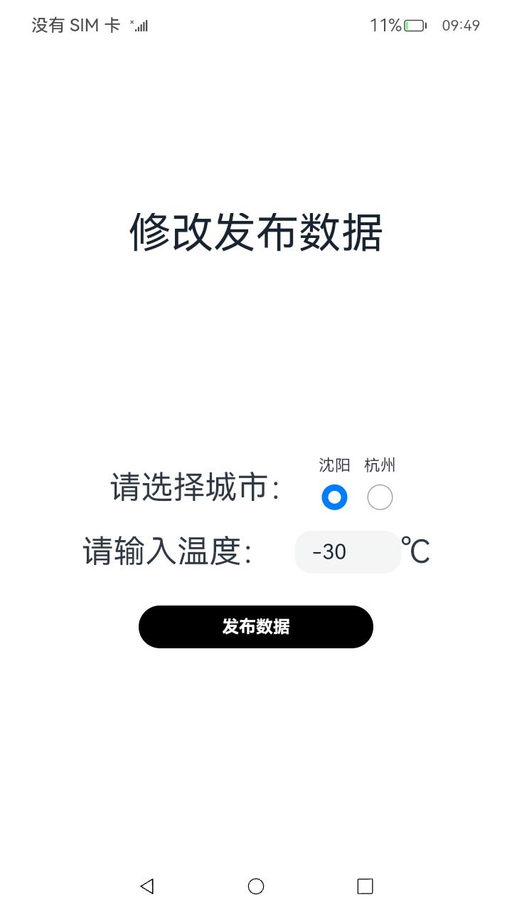

# 数据代理卡片（仿push应用刷新）

### 介绍

本示例主要展示了使用push应用形式的数据代理卡片功能，使用[@ohos.data.dataShare]([zh-cn/application-dev/reference/apis/js-apis-data-dataShare.md · OpenHarmony/docs - Gitee.com](https://gitee.com/openharmony/docs/blob/master/zh-cn/application-dev/reference/apis/js-apis-data-dataShare.md))等接口，实现了数据代理卡片的修改订阅条件功能及卡片的发布数据功能。

### 效果预览

| 应用主页面                                                                 | 修改订阅条件页面 | 发布数据页面 | 卡片预览图页面 |
|-----------------------------------------------------------------------| ------- | ------- | ------- |
|  |  |  |  |

使用说明

1.长按应用图标弹出菜单，点击"服务卡片"选项可以添加服务卡片至桌面；

2.长按数据卡片弹出菜单，点击"移除"可以将已添加至桌面的数据卡片从桌面上移除；

3.在应用中点击"修改数据"按钮，应用将跳转至发布数据界面，选择想要发布的数据并点击“发布数据”按钮，可以实现数据更新，并且将更新后的数据在卡片中显示；

4.在应用中点击"修改订阅条件"按钮，应用将跳转至修改订阅条件界面，选择想要发布的数据，完成对订阅条件的修改；

### 工程目录

```
entry/src/main/
|---common
|  |---Logger.ts
|---ets
|  |---entryability
|  |  |---EntryAbility.ts
|  |---entryformability
|  |  |---EntryFormAbility.ts                         
|  |---pages
|  |  |---Index.ets                          // EntryAbilit页面
|  |  |---IndexSec.ets                       // 发布数据页面
|  |  |---IndexThi.ets                       // 修改订阅条件页面
|  |---widget
|  |  |---pages
|  |  |  |---WidgetCard.ets                  // ArkTS卡片
|---js
|  |---common
|  |---i18n
|  |---JsWidget
|  |  |---pages
|  |  |  |---index
|  |  |  |  |---index.css                       // JS卡片样式
|  |  |  |  |---index.hml                       // JS卡片
|  |  |  |  |---index.json                      // JS卡片默认值
|---resources                                   // 资源信息
```

### 具体实现

- 修改数据卡片的订阅条件的功能封装在IndexThi中,  源码参考[IndexThi.ets](./entry/src/main/ets/pages/IndexThi.ets)。
  - 使用getRunningFormInfosByFilter获取已经建立出的卡片对象。
  - 使用updateCardDisplayContent遍历所有卡片对象，并根据界面获取的订阅条件使用updateForm实现修改订阅条件的功能。
- 发布数据的功能封装在IndexSec中，源码参考：[IndexSec.ets](./entry/src/main/ets/pages/IndexSec.ets)。
  - 使用getRunningFormInfosByFilter获取已经建立出的卡片对象，并使用updateCardDisplayContent遍历所有卡片对象。
  - 使用createDataShareHelper创建DataShareHelper对象，并根据界面获取的数据信息使用publish进行数据的发布以实现发布数据的功能。

### 相关权限

[ohos.permission.START_ABILITIES_FROM_BACKGROUND](https://gitee.com/openharmony/docs/blob/eb73c9e9dcdd421131f33bb8ed6ddc030881d06f/zh-cn/application-dev/security/permission-list.md)

[ohos.permission.START_INVISIBLE_ABILITY](https://gitee.com/openharmony/docs/blob/eb73c9e9dcdd421131f33bb8ed6ddc030881d06f/zh-cn/application-dev/security/permission-list.md)

[ohos.permission.GET_BUNDLE_INFO_PRIVILEGED](https://gitee.com/openharmony/docs/blob/eb73c9e9dcdd421131f33bb8ed6ddc030881d06f/zh-cn/application-dev/security/permission-list.md)

[ohos.permission.GET_BUNDLE_INFO](https://gitee.com/openharmony/docs/blob/eb73c9e9dcdd421131f33bb8ed6ddc030881d06f/zh-cn/application-dev/security/permission-list.md)

[ohos.permission.REQUIRE_FORM](https://gitee.com/openharmony/docs/blob/eb73c9e9dcdd421131f33bb8ed6ddc030881d06f/zh-cn/application-dev/security/permission-list.md)

### 依赖

本应用需要安装在仿桌面应用上进行测试。launcher应用地址：[Launcher](../../../Launcher)

### 约束与限制

1.本示例仅支持标准系统上运行，支持设备：RK3568。

2.本示例已适配API version 9版本SDK，版本号：3.2.11.9。

3.本示例需要使用DevEco Studio 3.1 Beta2 (Build Version: 3.1.0.400 构建 2023年4月7日)才可编译运行。

4.本示例所配置的权限为system_core级别(相关权限级别可通过[权限定义列表]( https://gitee.com/openharmony/docs/blob/master/zh-cn/application-dev/security/permission-list.md )查看)，需要手动配置对应级别的权限签名(具体操作可查看[自动化签名方案](https://docs.openharmony.cn/pages/v3.2/zh-cn/application-dev/security/hapsigntool-overview.md/))

### 下载

如需单独下载本工程，执行如下命令：
```
git init
git config core.sparsecheckout true
echo code/SystemFeature/ApplicationModels/ProcessProxyCard/ > .git/info/sparse-checkout
git remote add origin https://gitee.com/openharmony/applications_app_samples.git
git pull origin master
```