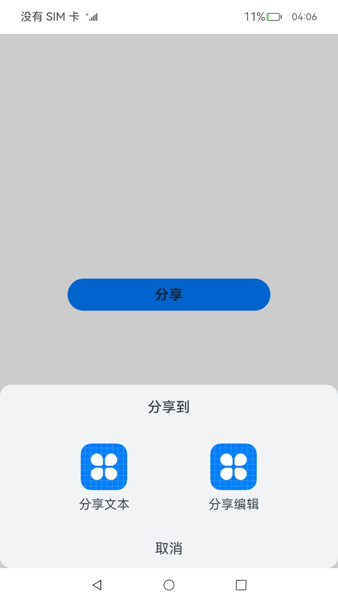

# share

### 介绍

本示例主要实现了点击分享按钮发起分享，罗列出支持分享的服务，选择对应服务可以发起分享；点击分享按钮发起分享，查看支持分享的服务列表并选择对应服务跳转的功能。

### 效果预览

| 应用主页面                                                                 | 选择分享页面 |
|-----------------------------------------------------------------------| ------- |
|  |  |

使用说明

1.点击“分享”按钮，弹出支持分享的应用列表；

2.选择对应想要分享的应用图标进行点击，跳转到对应的应用。

### 工程目录

```
entry/src/main/
|---ets
|  |---entryability
|  |  └---EntryAbility.ts                   
|  └---pages
|     |---Index.ets                          // EntryAbility页面
|     └---picker.ets                         // 自定义弹窗页面
|---model
|  └---Logger.ts
└---resources                                // 资源信息
```

### 具体实现

- ”分享“按钮显示并实现在Index.ets中,  源码参考[Index.ets](./entry/src/main/ets/pages/Index.ets)。
  - 在“分享”按钮的点击事件中，创建CustomDialogController对象，并调用open打开自定义ButtonDialogBuilder对话框容器。
- 弹出的对话框样式及内容封装在picker.ets中，源码参考：[picker.ets](./entry/src/main/ets/pages/picker.ets)。

### 相关权限

不涉及。

### 依赖

本应用需Template应用配合使用，Template应用地址：[Template](code/SystemFeature/ApplicationModels/Template)

### 约束与限制

1.本示例仅支持标准系统上运行，支持设备：RK3568。

2.本示例已适配API version 9版本SDK，版本号：3.2.11.9。

3.本示例需要使用DevEco Studio 3.1 Beta2 (Build Version: 3.1.0.400 构建 2023年4月7日)才可编译运行。

### 下载

如需单独下载本工程，执行如下命令：
```
git init
git config core.sparsecheckout true
echo code/SystemFeature/ApplicationModels/Share/ > .git/info/sparse-checkout
git remote add origin https://gitee.com/openharmony/applications_app_samples.git
git pull origin master
```