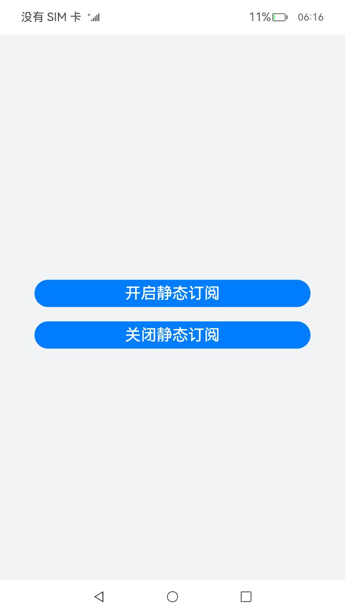
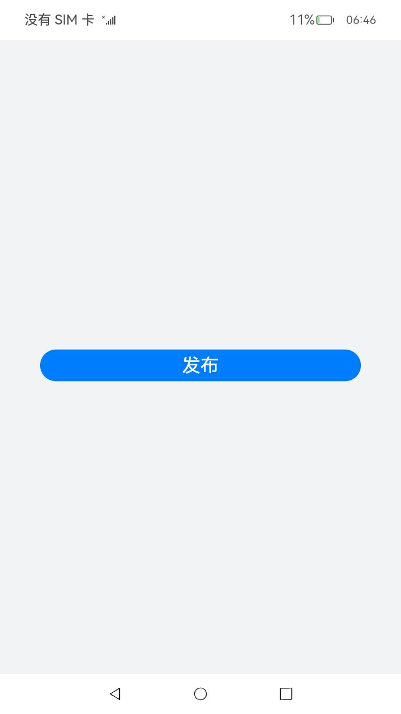
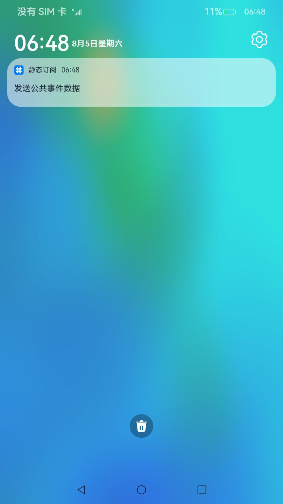

# 静态订阅（仅对系统应用开放）

### 介绍

本示例主要展示了静态订阅的创建与使用，以及静态订阅的使能和去使能。通过[CommonEventManager](https://gitee.com/openharmony/docs/blob/master/zh-cn/application-dev/reference/apis/js-apis-commonEventManager.md)发布自定义事件，使能和去使能静态订阅。通过[StaticSubscriberExtensionAbility](https://gitee.com/openharmony/docs/blob/master/zh-cn/application-dev/reference/apis/js-apis-application-staticSubscriberExtensionAbility.md)、[NotificationManager](https://gitee.com/openharmony/docs/blob/master/zh-cn/application-dev/reference/apis/js-apis-notificationManager.md)静态订阅已发布的自定义事件，订阅后即可自动收到该事件，收到该事件后，发送通知将自定义事件数据显示在通知栏。

### 效果预览

| 主页                             | 发布通知                              | 通知栏                                     |
| ------------------------------ | --------------------------------- | --------------------------------------- |
|  |  |  |

使用说明：

1. 在entry/src/main/resources/base/profile/subscribe.json中添加需要订阅的目标事件。

2. 修改系统配置文件/system/etc/app/install_list_capability.json，将应用的包名添加至该json文件中。

3. 本示例编译后共有两个hap包，包括静态订阅hap包和自定义事件发布hap包，需要全部安装。静态订阅hap包需要签名成系统应用并安装才可实现对目标事件的静态订阅，安装后即默认订阅了目标事件；自定义事件发布hap包直接安装即可，发布事件后即可被静态订阅方收到。

4. 点击关闭静态订阅按钮将不再进行静态订阅，不会收到相关通知，点击开启静态订阅会重新恢复。

### 工程目录

```
entry/src/main/ets/
|---Application
|   |---AbilityStage.ts                   
|---MainAbility
|   |---MainAbility.ts
|---model
|   |---Logger.ts                         // 日志工具
|---pages
|   |---Index.ets                         // 首页
|---StaticSubscriber
|   |---StaticSubscriber.ts               // 静态订阅
```

### 具体实现

* 通过CommonEventManager.publish方法发布自定义事件，该自定义事件为数据传输事件。

* 源码链接：[Index.ets](publish/src/main/ets/pages/Index.ets)

* 接口参考：[@ohos.commonEventManager](https://gitee.com/openharmony/docs/blob/master/zh-cn/application-dev/reference/apis/js-apis-commonEventManager.md)

* 通过CommonEventManager.setStaticSubscriberState方法为当前应用设置静态订阅事件使能或去使能状态。

* 源码链接：[Index.ets](publish/src/main/ets/pages/Index.ets)

* 接口参考：[@ohos.commonEventManager](https://gitee.com/openharmony/docs/blob/master/zh-cn/application-dev/reference/apis/js-apis-commonEventManager.md)

* 通过StaticSubscriberExtensionAbility接口静态订阅已发布的自定义事件，订阅后即可自动收到该事件，收到该事件后，setNotificationEnable，ContentType方法发送通知将自定义事件数据显示在通知栏。

* 源码链接：[StaticSubscriber.ts](entry/src/main/ets/StaticSubscriber/StaticSubscriber.ts)

* 接口参考：[@ohos.application.StaticSubscriberExtensionAbility](https://gitee.com/openharmony/docs/blob/master/zh-cn/application-dev/reference/apis/js-apis-application-staticSubscriberExtensionAbility.md)，[@ohos.notificationManager](https://gitee.com/openharmony/docs/blob/master/zh-cn/application-dev/reference/apis/js-apis-notificationManager.md)

### 相关权限

[ohos.permission.NOTIFICATION_CONTROLLER](https://gitee.com/openharmony/docs/blob/master/zh-cn/application-dev/security/permission-list.md#ohospermissionnotification_controller)

### 依赖

不涉及

### 约束与限制

1.本示例仅支持标准系统上运行，支持设备：RK3568。

2.本示例为Stage模型，支持API10版本SDK，SDK版本号(API Version 10 Release),镜像版本号(4.0 Release)。

3.本示例需要使用DevEco Studio 版本号(4.0 Release)及以上版本才可编译运行。

4.静态订阅仅支持系统应用，需要配置系统应用签名，可以参考[特殊权限配置方法](https://docs.openharmony.cn/pages/v3.2/zh-cn/application-dev/security/hapsigntool-overview.md/)，把配置文件中的“apl”字段信息改为“system_core”。

5.本示例开发中需要手动替换Full SDK才能编译通过，具体操作可参考[替换指南](https://docs.openharmony.cn/pages/v3.2/zh-cn/application-dev/quick-start/full-sdk-switch-guide.md/)。

6.实现静态订阅的应用需要经过性能功耗团队评审符合功耗要求，如果您希望在调试阶段尝试使用该功能，可修改系统配置文件/system/etc/app/install_list_capability.json,将待调试应用的包名添加至json文件中。

7.修改系统配置文件可以参考[静态订阅公共事件](https://gitee.com/openharmony/docs/blob/master/zh-cn/application-dev/application-models/common-event-static-subscription.md)。

8.本示例需要使用DevEco Studio 4.0 Beta2 (Build Version: 4.0.0.400 构建 2023年8月2日)及以上版本才可编译运行。

### 下载

如需单独下载本工程，执行如下命令：

```
git init
git config core.sparsecheckout true
echo code/SystemFeature/ApplicationModels/StaticSubscriber/ > .git/info/sparse-checkout
git remote add origin https://gitee.com/openharmony/applications_app_samples.git
git pull origin master
```
