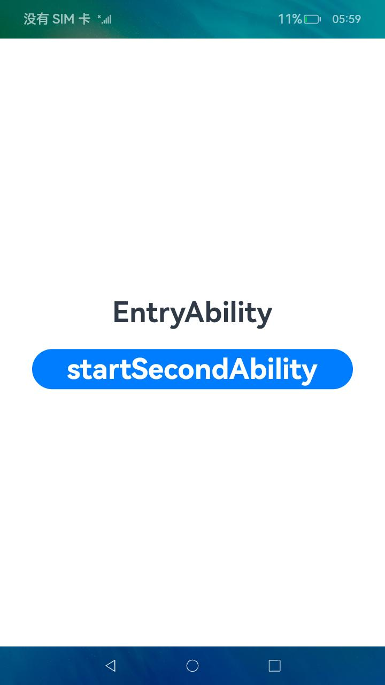
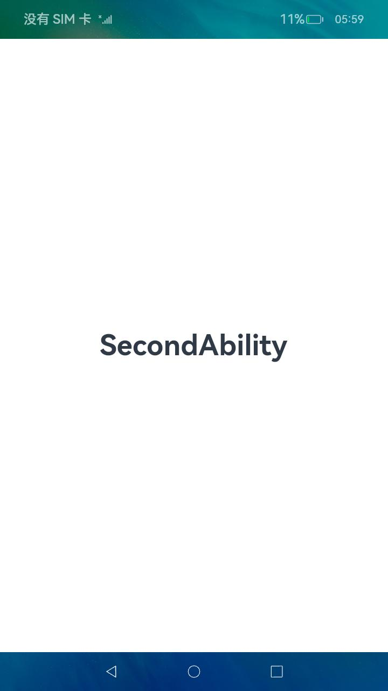

# 跨任务链返回

### 介绍

本示例为一个仿桌面应用测试demo，使用ServiceExtensionContext模块的startRecentAbility接口（系统能力：SystemCapability.Ability.AbilityRuntime.Core），测试的功能为：被其它UIAbility拉起的ServiceExtensionAbility，再拉起UIAbility时，如果将Want中设置返回当前任务链字段为true时，通过back键退出UIAbility后将返回拉起它的UIAbility，同时将该UIAbility拉到前台显示。

### 效果预览

| EntryAbility                                        | SecondAbility                                         |
| --------------------------------------------------- | ----------------------------------------------------- |
|  |  |

使用说明

1.安装编译的hap包。

2.点击应用主界面上的应用图标，可以启动应用。

3.长按应用图标弹出菜单，点击打开，可以正常启动应用。

4.在EntryAbility页面（页面中显示有”EntryAbility“文本）上点击StartSecondAbility按钮，可以通过拉起ServiceExtensionAbility，ServiceExtensionAbility后台拉起SecondAbility（页面中显示有”SecondAbility“文本）的方式打开SecondAbility。

5.当打开SecondAbility后，点击返回键，回到EntryAbility而不是桌面。

### 工程目录

```
entry/src/main/ets/
|---entryability
|  |---EntryAbility.ts                         
|---logger
|  |---Logger.ts
|---pages
|  |---Index.ets                               // EntryAbilit页面
|  |---IndexSecond.ets                         // SecondAbility页面
|---secondability
|  |---SecondAbility.ts
|---serviceability
|  |---ServiceAbility.ts                       // 后台拉起SecondAbility
```

### 具体实现

- 拉起任务至前台显示的功能接口封装在LauncherAbilityManager，源码参考：[LauncherAbilityManager.ts](./base/src/main/ets/default/manager/LauncherAbilityManager.ts)
  - 跨任务连返回：在ServiceExtensionAbility，使用ServiceExtensionContext.startRecentAbility(),将Want中将"ABILITY_BACK_TO_OTHER_MISSION_STACK"(返回当前任务链字段)设置为"true";
  - 接口参考：[@ohos.app.ability.wantConstant](https://gitee.com/openharmony/interface_sdk-js/blob/master/api/@ohos.app.ability.wantConstant.d.ts)

### 相关权限

[ohos.permission.START_ABILITIES_FROM_BACKGROUND](https://gitee.com/openharmony/docs/blob/master/zh-cn/application-dev/security/permission-list.md)

### 依赖

本测试demo需要安装在仿桌面应用上进行测试。launcher应用地址：[Launcher](../../../Launcher)

### 约束与限制

1.本示例仅支持标准系统上运行，支持设备：RK3568。

2.本示例已适配API version 9版本SDK，版本号：3.2.11.9。

3.本示例需要使用DevEco Studio 3.1 Beta2 (Build Version: 3.1.0.400 构建 2023年4月7日)才可编译运行。

4.本示例使用了ServiceExtensionAbility，需要在签名证书UnsgnedReleasedProfileTemplate.json中配置"app-privilege-capabilities": ["AllowAppUsePrivilegeExtension"]，否则安装失败。具体操作指南可参考[应用特权配置指南](https://gitee.com/openharmony/docs/blob/eb73c9e9dcdd421131f33bb8ed6ddc030881d06f/zh-cn/device-dev/subsystems/subsys-app-privilege-config-guide.md/)

5.本示例所配置的权限为system_basic级别(相关权限级别可通过[权限定义列表]( https://gitee.com/openharmony/docs/blob/master/zh-cn/application-dev/security/permission-list.md )查看)，需要手动配置对应级别的权限签名(具体操作可查看[自动化签名方案](https://docs.openharmony.cn/pages/v3.2/zh-cn/application-dev/security/hapsigntool-overview.md/)

### 下载

如需单独下载本工程，执行如下命令：
```
git init
git config core.sparsecheckout true
echo code/SystemFeature/ApplicationModels/TestRely/LauncherTest/CrossChainBack/ > .git/info/sparse-checkout
git remote add origin https://gitee.com/openharmony/applications_app_samples.git
git pull origin master
```