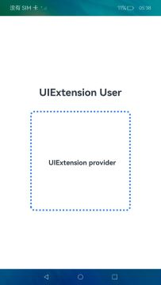

# UIExtensionAbility

### 介绍

本示例主要展示了[UIExtensionAbility](https://gitee.com/openharmony/docs/tree/master/zh-cn/application-dev/reference/apis-ability-kit/js-apis-app-ability-uiExtensionAbility.md)的提供方与拉起方的创建与使用。开发者可以在UIAbility的页面中通过UIExtensionComponent嵌入提供方应用的UIExtensionAbility提供的UI。

使用说明：

1. 当前UIExtensionAbility和UIExtensionComponent仅支持系统应用使用。
2. UIExtensionAbility支持多实例，每个嵌入式显示对应一个UIExtensionAbility实例。多实例场景下默认是多进程，可配置多进程模型。

### 效果预览

| 主页                             |
| ------------------------------- |
|  |

### 工程目录

```
entry/src/main/ets/
|---entryability
|   |---EntryAbility.ts
|---pages
|   |---Index.ets // 首页
|   |---Extension.ets // UIExtensionComponent页面
|---model
|   |---Logger.ts // 封装的日志类
|---uiextensionability
|   |---UIExtensionAbility.ets

entry/src/main/resources
|---base
|   |---element
|   |---media
|   |---profile
|   |   |---main_pages.json // 页面配置文件
|---en_US
|---rewfile
|---zh_CN
|---module.json5 // 配置文件
```

### 具体实现

* 使用方在主页面[Index.ets](entry/src/main/ets/pages/Index.ets)中通过UIExtensionComponent嵌入提供方应用的UIExtensionAbility提供的UI。

* 源码链接： [Index.ets](entry/src/main/ets/pages/Index.ets)

* 接口参考： [UIExtensionAbility](https://gitee.com/openharmony/docs/tree/master/zh-cn/application-dev/reference/apis-ability-kit/js-apis-app-ability-uiExtensionAbility.md)

* 提供方UIExtensionAbility页面在[Extension.ets](entry/src/main/ets/pages/Extension.ets)中实现，在页面中需要导入UIExtensionAbility的依赖包，自定义类继承UIExtensionAbility并实现onCreate、onSessionCreate、onSessionDestroy、onForeground、onBackground和onDestroy生命周期回调。

* 源码链接：[Extension.ets](entry/src/main/ets/pages/Extension.ets)

* 接口参考：[UIExtensionAbility](https://gitee.com/openharmony/docs/tree/master/zh-cn/application-dev/reference/apis-ability-kit/js-apis-app-ability-uiExtensionAbility.md)

* 主页面[Index.ets](entry/src/main/ets/pages/Index.ets)和提供方UIExtensionAbility页面在[Extension.ets](entry/src/main/ets/pages/Extension.ets)需要在[main_pages.json](entry\src\main\resources\base\profile\main_pages.json)中配置。

* 源码链接：[main_pages.json](entry/src/main/resources/base/profile/main_pages.json)

* 接口参考：[UIExtensionAbility](https://gitee.com/openharmony/docs/tree/master/zh-cn/application-dev/reference/apis-ability-kit/js-apis-app-ability-uiExtensionAbility.md)

* 在工程Module对应的[module.json5配置文件](entry/src/main/module.json5)中注册UIExtensionAbility，type字段需要配置为UIExtensionAbility所对应的类型。srcEntry字段表示当前UIExtensionAbility组件所对应的代码路径。

* 源码链接：[module.json5](entry/src/main/module.json5)

* 接口参考：[UIExtensionAbility](https://gitee.com/openharmony/docs/tree/master/zh-cn/application-dev/reference/apis-ability-kit/js-apis-app-ability-uiExtensionAbility.md)

### 相关权限

不涉及

### 依赖

不涉及

### 约束与限制

1. 本示例仅支持标准系统上运行，支持设备：RK3568;
   
2. 本示例开发中需要手动替换Full SDK才能编译通过，具体操作可参考[替换指南](https://docs.openharmony.cn/pages/v3.2/zh-cn/application-dev/quick-start/full-sdk-switch-guide.md/)。

3. UIExtensionAbility仅支持系统应用，需要配置系统应用签名，可以参考[特殊权限配置方法](https://docs.openharmony.cn/pages/v3.2Beta/zh-cn/application-dev/security/hapsigntool-overview.md/)，把配置文件中的“apl”字段信息改为“system_basic”。

4. 本示例需要使用DevEco Studio 4.0 Beta2 (Build Version: 4.0.0.400 构建 2023年8月2日)及以上版本才可编译运行。

### 下载

如需单独下载本工程，执行如下命令：

```
git init
git config core.sparsecheckout true
echo code/SystemFeature/ApplicationModels/UIExtensionAbility/ > .git/info/sparse-checkout
git remote add origin https://gitee.com/openharmony/applications_app_samples.git
git pull origin master
```