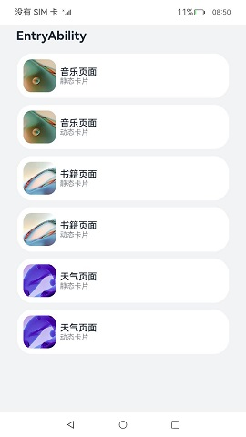
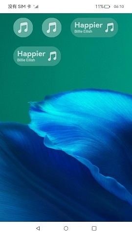

# ArkTS卡片能力增强

### 介绍

本示例使用动态和静态(form_config.json中isDynamic字段false为静态，true为动态)两种状态的锁屏卡片/deeplink卡片。

### 效果预览

|DeepLink页面|锁屏页面|解锁页面|对应Ability页面|
|-------|-------|-------|-------|
|||||

使用说明
1. 应用启动，首页存在“DeepLink”、“锁屏卡片”两个按钮。
2. 点击首页“DeepLink”按钮跳转到FormDeepLink页面，点击任意卡片(静态卡片/动态卡片)可跳转到对应ability。
3. 点击首页“锁屏卡片”按钮跳转到锁屏页面，在锁屏页面点击任意卡片(静态卡片/动态卡片/ 1x1样式 / 1x2样式)跳转到解锁页面，点击解锁按钮跳转回锁屏页面, 再由锁屏页面自动跳转至对应ability。

### 工程目录
```
entry/src/main/ets/			
|---bookability
|   |---bookAbility.ts
│      
|---dynamicbookcard
|   |---pages
|   |	|---DynamicBookCard.ets				// 动态书籍卡片
│          
|---dynamicmusiccard							
|   |---pages
|   |	|---DynamicMusicCard.ets			// 动态音乐卡片
|   |	|---DynamicMusicLockCard.ets		// 动态音乐锁屏卡片
│          
|---dynamicweathercard
|   |---pages
|   |	|---DynamicWeatherCard.ets 			// 动态天气卡片
│          
|---entryability
|   |---EntryAbility.ts					
│      
|---entryformability
|   |---EntryFormAbility.ts					// 卡片提供方
│      
|---pages
|   |---Book.ets							// 书籍页面
|   |---FormDeepLink.ets					// FormDeepLink页面
|   |---LockPage.ets						// 锁屏页面
|   |---MainPage.ets						// 起始页面
|   |---Music.ets							// 音乐页面
|   |---UnlockPage.ets						// 解锁页面
|   |---Weather.ets							// 天气页面
│      
|---secondability
|   |--- SecondAbility.ts					
│      
|---staticbookcard							
|   |---pages
|   |	|---StaticBookCard.ets				// 静态书籍卡片
│          
|---staticmusiccard
|   |---pages
|   |	|---StaticMusicCard.ets				// 静态音乐卡片
|   |	|---StaticMusicLockCard.ets			// 静态音乐锁屏卡片
│          
|---staticweathercard							
|   |---pages
|   |	|---StaticWeatherCard.ets			// 静态天气卡片
│          
|---thirdability
|   |--- ThirdAbility.ts
│      
|---util
|   |--- Logger.ts							// 日志
```

### 具体实现
+ DeepLink卡片：跳转方式支持uri参数跳转，ability参数改为非必填参数，同时设置ability优先级更高，在FormDeepLink中实现，源码参考[FormDeepLink.ets](entry/src/main/ets/pages/LockPage.ets)
  + 音乐页面拉起(静态卡片/动态卡片)：router由传入指定uri跳转至页面。
  + 书籍页面拉起(静态卡片/动态卡片)：router由abilityName传入书籍页面的Ability跳转至书籍页面。
  + 天气页面拉起(静态卡片/动态卡片)：router由abilityName传入天气页面的Ability与uri指定页面同时传入时，跳转至abilityName指定的天气页面。

+ 锁屏卡片：将提供方跳转页面转接给使用方能力在LockPage中实现，源码参考[LockPage.ets](entry/src/main/ets/pages/LockPage.ets)
  + 静态/动态锁屏卡片(1x1样式/1x2样式)支持解锁：卡片设置onAcquired，callback中调用formHost.setRouterProxy转接提供方跳转页面能力，传入formId获取对应want信息后跳转至对应ability。

### 相关权限

[ohos.permission.REQUIRE_FORM](https://gitee.com/openharmony/docs/blob/master/zh-cn/application-dev/security/permission-list.md#ohospermissionrequire_form)

### 依赖

不涉及。

### 约束与限制

1.本示例仅支持标准系统上运行，支持设备：RK3568（卡片设置成单色模式在RK3568不生效）;

2.本示例为Stage模型，支持API11版本SDK，版本号：4.1.3.5；

3.本示例涉及使用系统接口：FormComponent 、formHost ，需要手动替换Full SDK才能编译通过；

4.本示例需要使用DevEco Studio 3.1.1 Release (Build Version: 3.1.0.501, built on June 20, 2023)才可编译运行；

5.本示例涉及[ohos.permission.REQUIRE_FORM](https://gitee.com/openharmony/docs/blob/master/zh-cn/application-dev/security/permission-list.md#ohospermissionrequire_form)权限为system_basic级别，需要配置高权限签名；

### 下载
如需单独下载本工程，执行如下命令：

```
git init
git config core.sparsecheckout true
echo code/SystemFeature/ArkTSCard/ArkTSCard > .git/info/sparse-checkout
git remote add origin https://gitee.com/openharmony/applications_app_samples.git
git pull origin master
```