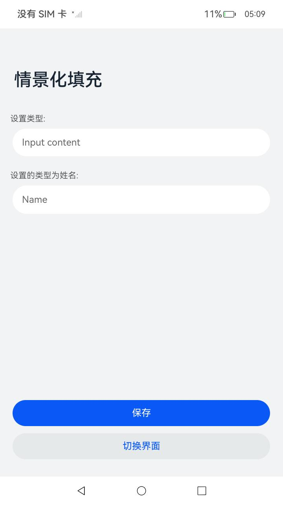
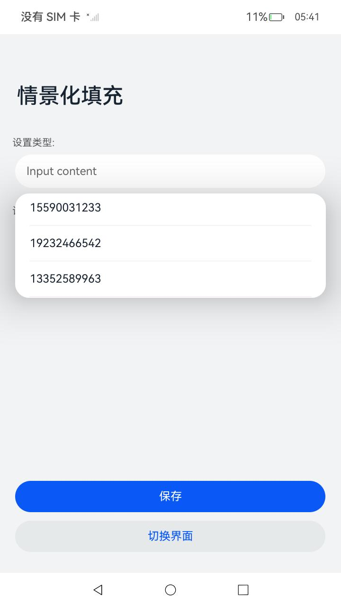

# 情景化自动填充能力

### 介绍

本示例使用[application/AutoFillRequest](https://gitee.com/openharmony/interface_sdk-js/blob/master/api/application/AutoFillRequest.d.ts)，[@ohos.app.ability.AutoFillExtensionAbility](https://gitee.com/openharmony/interface_sdk-js/blob/master/api/@ohos.app.ability.AutoFillExtensionAbility.d.ts)，[@ohos.app.ability.autoFillManager ](https://gitee.com/openharmony/interface_sdk-js/blob/master/api/@ohos.app.ability.autoFillManager.d.ts)等接口，展示了情景化填充能力。具体而言实现了如下几点功能：

1.数据的自动保存；
2.数据的手动保存；
3.设置情景化类型数据的自动填充；
4.情景化类型为姓名时，输入字符进行联想自动填充。

### 效果预览

| 情景化填充页面                      | 数据选择页面                               | 数据联想                                 | 跳转页面                                     | 保存数据页面                           |
| ----------------------------------- | ------------------------------------------ | ------------------------------------------- | -------------------------------------------- | -------------------------------------- |
|  |  |  |  |  |

使用说明：

1.安装编译生成的hap包，点击Scenarioization图标即可进入应用。

2.进入应用显示保存/切换界面，点击页面中设置类型的输入框，页面弹出select弹窗，选择其中任意号码后，输入框中分别显示出刚选择其对应的号码。

3.点击页面中设置类型为姓名的输入框，输入字符进行联想页面弹出select弹窗，选择其中联想对应的名字后，输入框中显示出刚选择其对应的名字。

4.在保存/切换界面分别手动输入任意数据，点击"保存"按钮，自动触发OnSaveRequest回调，立即跳转新页面显示"取消/保存"按钮，点击"保存"按钮，页面回到"保存/切换界面"主页面。

5.在保存/切换界面分别手动输入任意数据，点击"切换界面"按钮，页面先跳转"返回主界面"页面，自动触发OnSaveRequest回调，立即跳转新页面显示"取消/保存"按钮，点击"保存"，页面回到"返回主界面"页面。

### 工程目录

```
entry/src/main/ets/ 
|---autofillability
|   |---TextAutoFillAbility.ts               // AutoFillExtensionAbility实现类
|---autoFillPages
|   |---SelectorList.ets                     // 情景化填充界面页面 
|   |---ReturnMainPage.ets                   // 跳转的页面   
|   |---SavePage.ets                         // 保存页面
|---entryability 
|   |---EntryAbility.ts          
|---pages
|   |---index.ets                            // 主页面
```

### 具体实现

* 该示例分为四个分支：
  1. FULL_PHONE_NUMBER类型的情景化自动填充。

  * FULL_PHONE_NUMBER类型的TextInput控件获焦后拉起AutoFillExtensionAbility。
  * 源码链接：[Index.ets](entry/src/main/ets/pages/Index.ets)，[AutoFillAbility.ts](entry/src/main/ets/autofillability/TextAutoFillAbility.ts)，[SelectorList.ets](entry/src/main/ets/autofillpages/SelectorList.ets)
  * 参考接口：[@ohos.app.ability.UIExtensionContentSession](https://gitee.com/openharmony/interface_sdk-js/blob/master/api/@ohos.app.ability.UIExtensionContentSession.d.ts)，[@ohos.app.ability.autoFillManager](https://gitee.com/openharmony/interface_sdk-js/blob/master/api/@ohos.app.ability.autoFillManager.d.ts)

  2. PERSON_FULL_NAME类型的情景化自动填充。

  * PERSON_FULL_NAME类型的TextInput控件获焦后拉起AutoFillExtensionAbility，输入字符进行联想页面弹出select弹窗并触发onUpdateRequest回调，将选择的名字返回到textInput组件。
  * 源码链接：[Index.ets](entry/src/main/ets/pages/Index.ets)，[AutoFillAbility.ts](entry/src/main/ets/autofillability/TextAutoFillAbility.ts)，[SelectorList.ets](entry/src/main/ets/autofillpages/SelectorList.ets)
  * 参考接口：[@ohos.app.ability.UIExtensionContentSession](https://gitee.com/openharmony/interface_sdk-js/blob/master/api/@ohos.app.ability.UIExtensionContentSession.d.ts)，[@ohos.app.ability.autoFillManager](https://gitee.com/openharmony/interface_sdk-js/blob/master/api/@ohos.app.ability.autoFillManager.d.ts)
  
  3. 自动保存能力。
  
  * 当登录页面消失，发起自动保存请求，触发onSaveRequest生命周期。
  * 源码链接：[Index.ets](entry/src/main/ets/pages/Index.ets)，[AutoFillAbility.ts](entry/src/main/ets/autofillability/TextAutoFillAbility.ts)，[ReturnMainPage.ets](entry/src/main/ets/autofillpages/ReturnMainPage.ets)，[SavePage.ets](entry/src/main/ets/autofillpages/SavePage.ets)
  * 参考接口：[@ohos.app.ability.UIExtensionContentSession](https://gitee.com/openharmony/interface_sdk-js/blob/master/api/@ohos.app.ability.UIExtensionContentSession.d.ts)，[@ohos.app.ability.autoFillManager](https://gitee.com/openharmony/interface_sdk-js/blob/master/api/@ohos.app.ability.autoFillManager.d.ts)
  
  4. 用户主动调用保存接口。
  
  * 用户主动调用requestAutoSave接口保存账号密码。
  * 源码链接：[RegisterPage.ets](entry/src/main/ets/autofillpages/RegisterPage.ets)，[AutoFillAbility.ts](entry/src/main/ets/autofillability/TextAutoFillAbility.ts)，[SavePage.ets](entry/src/main/ets/autofillpages/SavePage.ets)
  * 参考接口：[@ohos.app.ability.UIExtensionContentSession](https://gitee.com/openharmony/interface_sdk-js/blob/master/api/@ohos.app.ability.UIExtensionContentSession.d.ts)，[@ohos.app.ability.autoFillManager](https://gitee.com/openharmony/interface_sdk-js/blob/master/api/@ohos.app.ability.autoFillManager.d.ts)

### 相关权限

不涉及。

### 依赖

不涉及。

### 约束与限制

1.本示例仅支持标准系统上运行，支持设备：RK3568；

2.本示例为Stage模型，支持API12版本SDK，版本号：5.0.0.22；

3.本示例涉及使用系统接口：AutoFillExtensionAbility.onFillRequest，AutoFillExtensionAbility.onSaveRequest，autoFillManager.requestAutoSave，需要手动替换Full SDK才能编译通过；

4.本示例需要使用DevEco Studio 4.1.3 Release（Build Version: 4.1.3.500, built on January 20, 2024）才可编译运行；

5.本示例涉及权限至少为system_basic级别；

6.本示例的bundleName只能是"com.ohos.textautofill"不可修改。

### 下载

如需单独下载本工程，执行如下命令：

```
git init
git config core.sparsecheckout true
echo code/SystemFeature/AutoFill/AutoFillScenarioization/ > .git/info/sparse-checkout
git remote add origin https://gitee.com/openharmony/applications_app_samples.git
git pull origin master
```

