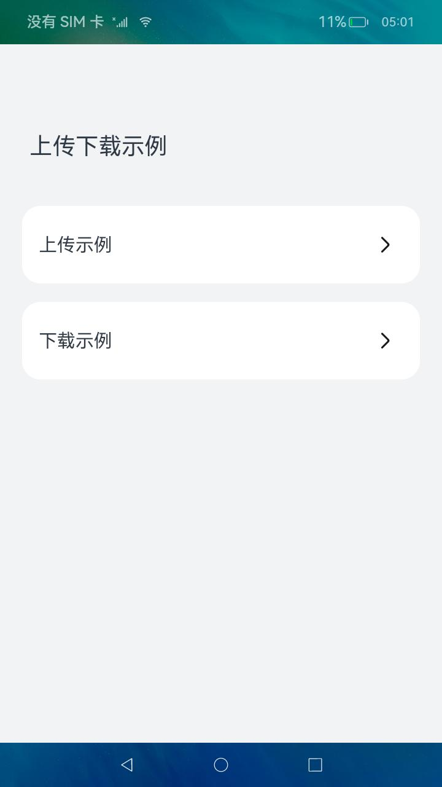
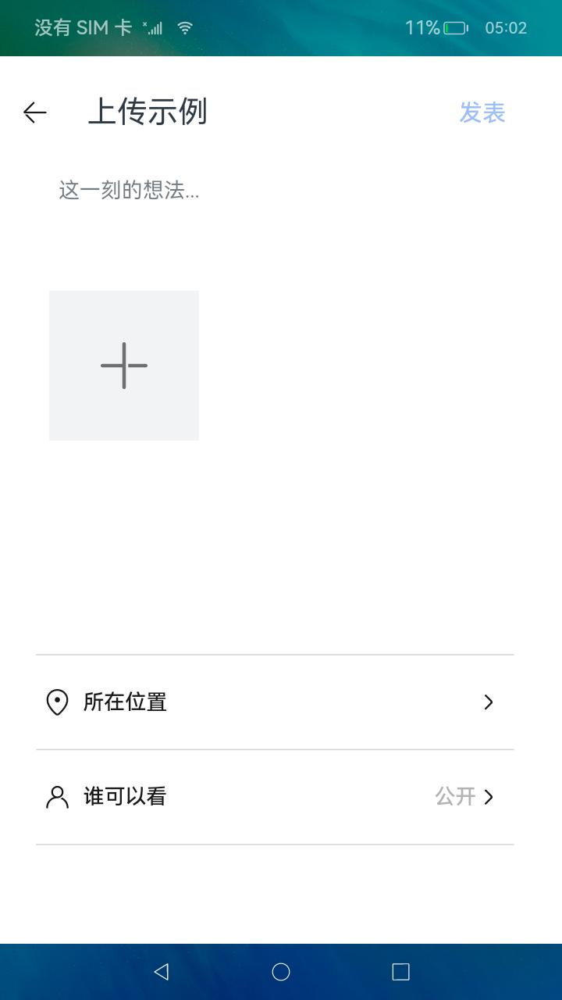
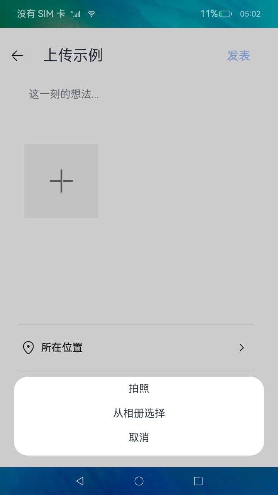
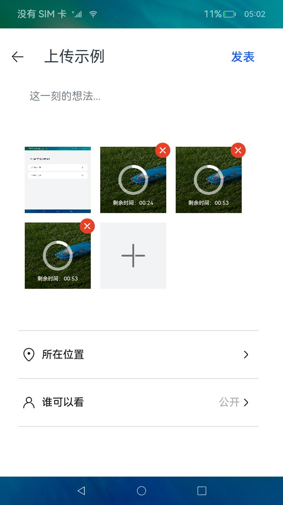
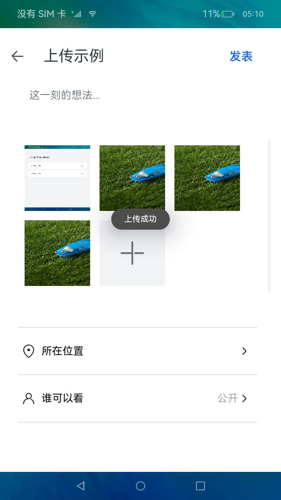
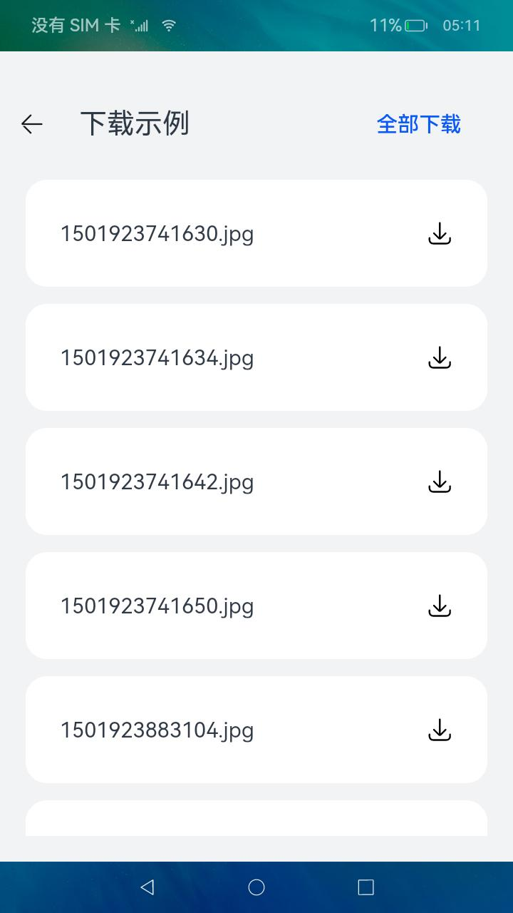
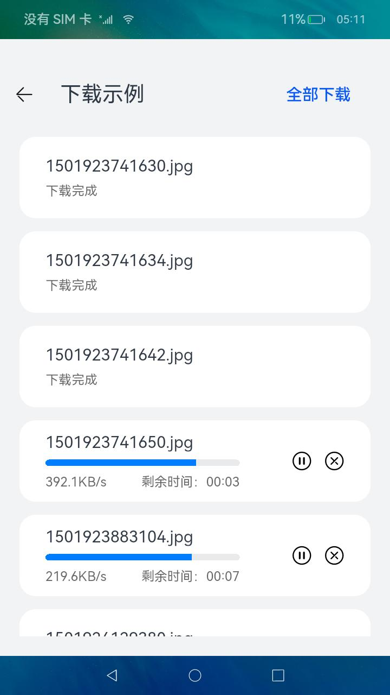

# 上传和下载

### 介绍

本示例主要展示Request服务向三方应用提供系统上传和下载服务能力，通过[@ohos.request](https://gitee.com/openharmony/docs/blob/master/zh-cn/application-dev/reference/apis/js-apis-request.md)，[@ohos.multimedia.mediaLibrary](https://gitee.com/openharmony/docs/blob/master/zh-cn/application-dev/reference/apis/js-apis-medialibrary.md)
等接口去实现图片的选取与上传，通过[@ohos.request](https://gitee.com/openharmony/docs/blob/master/zh-cn/application-dev/reference/apis/js-apis-request.md)，[@ohos.net.http](https://gitee.com/openharmony/docs/blob/master/zh-cn/application-dev/reference/apis/js-apis-http.md) 等接口获取下载列表和开始下载任务。

### 效果预览

| 首页                                     | 上传首页                                      | 添加图片                                      |
|----------------------------------------|-------------------------------------------|-------------------------------------------|
|  |  |  |

| 已添加图片                                     | 上传中                                       | 上传成功                                      |
|-------------------------------------------|-------------------------------------------|-------------------------------------------|
|  |  |  |

| 下载首页                                        | 下载中                                         | 下载成功                                        |
|---------------------------------------------|---------------------------------------------|---------------------------------------------|
|  |  |  |

使用说明

1.安装应用前，先本地配置好服务器；

2.将[config.ets](entry/src/main/ets/config/config.ets)
文件中的服务器地址替换成配置好的服务器地址；

3.启动应用，点击允许访问权限进入；

4.点击上传示例，点击加号，点击拍摄进行拍照，点击从图库选择进行选取照片，图片会进行上传，上传成功后会有弹窗提示；

5.返回，点击下载示例，如果服务器有文件，点击全部下载，会下载所有列表文件。

### 工程目录

```
entry/src/main/ets/
|	├─Application
|	│      MyAbilityStage.ets       
|	│      
|	├─componets
|	│      AddPictures.ets              //图片添加
|	│      DownloadController.ets       //下载交互控件
|	│      NavigationBar.ets            //导航栏
|	│      RequestBar.ets               //上传工具栏
|	│      SelectDialog.ets             //选择弹窗
|	│      UploadController.ets         //上传交互控件
|	│      
|	├─config
|	│      config.ets                   //配置文件
|	│      
|	├─download
|	│  └─pages
|	│          Download.ets             //下载首页
|	│          
|	├─feature
|	│      CameraService.ts             //相机服务
|	│      CostTimeCompute.ets          //耗时计算
|	│      DateTimeUtil.ts              //日期工具
|	│      GetPictures.ets              //获取图片
|	│      MediaUtils.ts                //媒体工具
|	│      UploadFile.ts                //上传文件
|	│      
|	├─MainAbility
|	│      MainAbility.ets              //主Ability
|	│      
|	├─pages
|	│      Index.ets                    //首页
|	│      
|	├─upload    
|	│  └─pages      
|	│          CameraPage.ets           //相机页
|	│          Upload.ets               //上传页
|	│          
|	└─util
|	        Logger.ts                   //日志工具
|	        Style.ts                    //样式
```

### 具体实现

* 上传控件，源码参考：[UploadController.ets](entry/src/main/ets/componets/UploadController.ets)
    * 使用 @ohos.request.uploadFile 开启上传任务
    * 使用 UploadTask.on('progress') 监听上传进度
    * 使用 UploadTask.on('complete'|'fail') 监听上传结果
* 下载控件，源码参考：[DownloadController.ets](entry/src/main/ets/componets/DownloadController.ets)
    * 使用 @ohos.request.downloadFile 开启下载任务
    * 使用 DownloadTask.on('progress') 监听下载进度
    * 使用 DownloadTask.on('complete'|'fail') 监听下载结果

### 相关权限

本示例需要在module.json5中配置如下权限:

1.允许应用读取用户外部存储中的媒体文件信息权限：[ohos.permission.READ_MEDIA](https://gitee.com/openharmony/docs/blob/master/zh-cn/application-dev/security/permission-list.md)

2.允许应用使用相机拍摄照片和录制视频权限：[ohos.permission.CAMERA](https://gitee.com/openharmony/docs/blob/master/zh-cn/application-dev/security/permission-list.md)

3.允许应用读写用户外部存储中的媒体文件信息权限：[ohos.permission.WRITE_MEDIA](https://gitee.com/openharmony/docs/blob/master/zh-cn/application-dev/security/permission-list.md)

4.允许使用Internet网络权限：[ohos.permission.INTERNET](https://gitee.com/openharmony/docs/blob/master/zh-cn/application-dev/security/permission-list.md)

### 依赖

1.需要本地配置好HFS服务器，创建好支持上传的文件目录；

2.执行uiTest时，相册需要有两张图片可供选择；

### 约束与限制

1.本示例仅支持标准系统上运行，支持设备:RK3568；

2.本示例已适配API version 9版本SDK，版本号：3.2.11.10；

3.本示例需要使用DevEco Studio 3.1 Beta2 (Build Version: 3.1.0.400, built on April 7, 2023)及以上版本才可编译运行；

4.本示例需要使用系统权限的接口。使用Full SDK时需要手动从镜像站点获取，并在DevEco Studio中替换，具体操作可参考[替换指南](https://docs.openharmony.cn/pages/v3.2/zh-cn/application-dev/quick-start/full-sdk-switch-guide.md/)。

### 下载

如需单独下载本工程，执行如下命令：

```
git init
git config core.sparsecheckout true
echo code/SystemFeature/Connectivity/Upload/ > .git/info/sparse-checkout
git remote add origin https://gitee.com/openharmony/applications_app_samples.git
git pull origin master

```