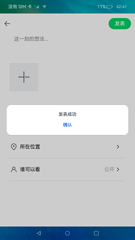

# 上传

### 介绍

本示例主要展示Request服务向三方应用提供系统上传服务能力，通过[@ohos.request](https://gitee.com/openharmony/docs/blob/master/zh-cn/application-dev/reference/apis/js-apis-request.md)，[@ohos.multimedia.mediaLibrary](https://gitee.com/openharmony/docs/blob/master/zh-cn/application-dev/reference/apis/js-apis-medialibrary.md)等接口去实现图片的选取与上传。

### 效果预览

|首页                                    |添加图片                                |上传图片                                |
|---------------------------------------|-------------------------------------|-------------------------------------|
| |||

使用说明

1.安装应用前，先本地配置好服务器；

2.将[NavigationBar.ets](https://gitee.com/openharmony/applications_app_samples/blob/master/code/SystemFeature/Connectivity/ToUpload/entry/src/main/ets/pages/NavigationBar.ets)文件中的服务器地址替换成配置好的服务器地址；

3.启动应用，点击允许访问权限进入；

4.点击加号，出现弹出框，点击拍摄进行拍照，点击从图库选择进行选取照片；

5.点击发表，图片会进行上传，上传成功后会有弹窗提示。

### 相关权限

本示例需要在module.json5中配置如下权限:

[ohos.permission.READ_MEDIA](https://gitee.com/openharmony/docs/blob/master/zh-cn/application-dev/security/permission-list.md)

[ohos.permission.CAMERA](https://gitee.com/openharmony/docs/blob/master/zh-cn/application-dev/security/permission-list.md)

[ohos.permission.WRITE_MEDIA](https://gitee.com/openharmony/docs/blob/master/zh-cn/application-dev/security/permission-list.md)

[ohos.permission.INTERNET](https://gitee.com/openharmony/docs/blob/master/zh-cn/application-dev/security/permission-list.md)

### 依赖

不涉及。

### 约束与限制

1.本示例仅支持标准系统上运行，支持设备:RK3568；

2.本示例已适配API10版本SDK，版本号：4.0.5.1；

3.本示例需要使用DevEco Studio 3.0 Release (Build Version: 3.0.0.993, built on September 4, 2022)才可编译运行；

4.本示例需要使用系统权限的接口。使用Full SDK时需要手动从镜像站点获取，并在DevEco Studio中替换，具体操作可参考[替换指南](https://gitee.com/openharmony/docs/blob/master/zh-cn/application-dev/quick-start/full-sdk-switch-guide.md)。