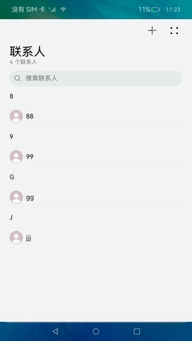
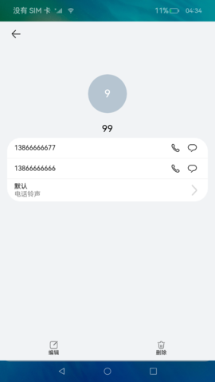
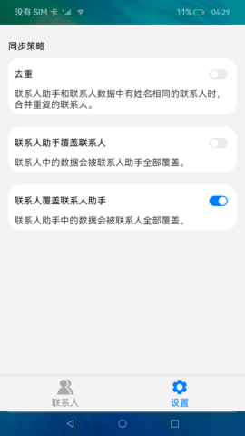

# 跨应用数据共享（仅对系统应用开放）

### 介绍

 本示例实现了一个跨应用数据共享实例，分为联系人（数据提供方）和联系人助手（数据使用方）两部分：联系人支持联系人数据的增、删、改、查等功能；联系人助手支持同步联系人数据，当联系人与联系人助手数据不一致时，支持合并重复数据。 

注：
1.联系人指的是内置联系人应用，为dataProvider生成的hap包，需要手动安装，由于联系人和联系人助手共用一个bundleName，因此打包之前需要更改bundleName，保证两个包的bundleName不同，这样两个应用打开才不会出问题。

### 效果预览

|主页| 联系人详情                                                               | 联系人                                                                                  | 设置                                                                                           |
|--------------------------------|---------------------------------------------------------------------|--------------------------------------------------------------------------------------|----------------------------------------------------------------------------------------------|
||  |  |  |

使用说明：

1. 联系人应用，首页中点击**+**按钮可以添加联系人，在首页展示联系人列表。
2. 联系人应用首页点击搜索框可以搜索联系人，点击联系人进入详情页，详情页提供编辑和删除功能入口。
3. 联系人助手应用，点击同步联系人可以同步联系人应用的数据到联系人助手，同步后可以点击联系人进入详情页，详情页提供编辑和删除功能。
4. 联系人助手首页点击**+**按钮，可以新增联系人。
5. 联系人助手设置页面可以设置同步策略，根据不同的同步策略，每次点击首页的同步联系人按钮会同步一次联系人数据，默认使用联系人覆盖联系人助手策略。

### 工程目录
```
dataProvider/src/main/ets/
|---Application
|   |---MyAbilityStage.ts                        
|---DataShareAbility
|   |---DataShareAbility.ts                      // 数据共享
|---MainAbility 
|   |---MainAbility.ts                               
|---pages
|   |   |---ContactDetail.ets                    // 联系人详情
|   |   |---ContactEdit.ets                      // 联系人编辑
|   |   |---Home.ets                             // 首页
|   |---Home
|   |   |---Contacts.ets                         // 联系人                    
|   |   |---HomeContent.ets                      // 首页列表
|   |   |---SearchContact.ets                    // 搜索
```
### 具体实现

* 使用DataShareExtensionAbility实现数据共享，关系型数据库实现数据的增、删、改、查接口，DataShare管理和访问数据库数据变化。
* 源码链接：[DataShareAbility.ts](code/SystemFeature/DataManagement/CrossAppDataShare/dataProvider/src/main/ets/DataShareAbility/DataShareAbility.ts)，[ContactEdit.ets](code/SystemFeature/DataManagement/CrossAppDataShare/dataProvider/src/main/ets/pages/ContactEdit.ets)，[ContactStore.ets](code/SystemFeature/DataManagement/CrossAppDataShare/dataUser/src/main/ets/feature/ContactStore.ets)
* 接口参考：[@ohos.data.DataShareResultSet](https://gitee.com/openharmony/docs/blob/master/zh-cn/application-dev/reference/apis/js-apis-application-dataShareExtensionAbility.md)，[@ohos.data.relationalStore](https://gitee.com/openharmony/docs/blob/master/zh-cn/application-dev/reference/apis/js-apis-data-dataShare.md)，[@ohos.data.rdb](https://gitee.com/openharmony/docs/blob/master/zh-cn/application-dev/reference/apis/js-apis-data-rdb.md)

### 相关权限

不涉及。

### 依赖

不涉及。

### 约束与限制

1. 本示例仅支持标准系统上运行，支持设备：RK3568。

2. 本示例为Stage模型，已适配API version 9版本SDK，版本号：3.2.11.9。

3. 本示例需要使用DevEco Studio 3.1 Beta2 (Build Version: 3.1.0.400, built on April 7, 2023)才可编译运行。

4. 本示例需要使用@ohos.data.dataShare，@ohos.data.dataSharePredicates，@ohos.data.ValuesBucket系统权限的系统接口。使用Full SDK时需要手动从镜像站点获取，并在DevEcoStudio中替换，具体操作可参考 [替换指南](https://docs.openharmony.cn/pages/v3.2/zh-cn/application-dev/quick-start/full-sdk-switch-guide.md/) 。

5. 本示例使用了DataShareExtensionAbility，安装需要手动配置签名，具体操作可查看[自动化签名方案](https://docs.openharmony.cn/pages/v3.2/zh-cn/application-dev/security/hapsigntool-overview.md/)。

### 下载

如需单独下载本工程，执行如下命令：
```
git init
git config core.sparsecheckout true
echo code/SystemFeature/DataManagement/CrossAppDataShare/ > .git/info/sparse-checkout
git remote add origin https://gitee.com/openharmony/applications_app_samples.git
git pull origin master

```
