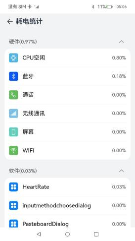
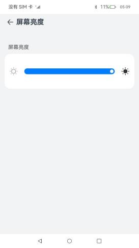

# 设备管理合集(系统特性)

### 介绍

本示例集合设备管理相关(系统特性)不需要复杂功能展示的模块，展示了各个模块的基础功能，包含：

- [@ohos.batteryStatistics (耗电统计)](https://docs.openharmony.cn/pages/v3.2/zh-cn/application-dev/reference/apis/js-apis-batteryStatistics.md/)
- [@ohos.brightness (屏幕亮度)](https://docs.openharmony.cn/pages/v3.2/zh-cn/application-dev/reference/apis/js-apis-brightness.md/)
- [@ohos.power (系统电源管理)](https://docs.openharmony.cn/pages/v3.2/zh-cn/application-dev/reference/apis/js-apis-power.md/)
- [@ohos.settings (设置数据项名称)](https://docs.openharmony.cn/pages/v3.2/zh-cn/application-dev/reference/apis/js-apis-settings.md/)
- [@ohos.systemCapability (系统能力)](https://docs.openharmony.cn/pages/v3.2/zh-cn/application-dev/reference/apis/js-apis-system-capability.md/)
- [@ohos.systemParameterEnhance (系统参数)](https://docs.openharmony.cn/pages/v3.2/zh-cn/application-dev/reference/apis/js-apis-system-parameterEnhance.md/)

### 效果预览

|                    **耗电统计**                     |                    **屏幕亮度**                    |                   **系统电源管理**                   |
|:-----------------------------------------------:|:----------------------------------------------:|:----------------------------------------------:|
|  |      |          |
|                   **设置数据项名称**                   |                    **系统能力**                    |                    **系统参数**                    |
|       |  |  |

使用说明

1.首页展示语言基础类库各个子模块菜单，点击进入对应的模块页面。

2.各个子模块界面中点击功能按钮完成各个功能。

3.耗电统计：进入耗电统计页面，展示软硬件耗电排行。

4.屏幕亮度：获取当前屏幕亮度，设置屏幕亮度。

5.系统电源管理：点击按钮分别实现休眠、关机、重启、设置电源模式功能。

6.设置数据项名称：将数据项名称及数据项的值保存到数据库中。

7.系统能力：获取系统能力集合的字符串并显示。

8.系统参数：点击按钮分别实现设置一个系统参数、获取并展示系统参数功能。

### 工程目录

```
DeviceManagementCollection
├── AppScope                                    
│   └── app.json5                               //APP信息配置文件
├── entry/src/main                              //语言基础类库应用首页
│   ├── ets
│   │   ├── entryability
│   │   ├── pages
│   │   │   ├── Index.ets                       //主页入口
│   │   │   ├── components                       
│   │   │   │   └── Capabilities.ets            //根据点击的菜单，展示对应的子界面
│   └── module.json5
│ 
├── common/src/main                             //公共组件及工具类
│   ├── ets
│   │   ├── components
│   │   │   └── CustomDataSource.ets            //自定义DataSource，LazyForEach时使用
│   │   ├── util
│   │   │   ├── Logger.ets                      //日志工具类
│   │   │   └── ResourceUtil.ets                //资源管理工具类
│   └── module.json5
│
├── menuitems/src/main                          //菜单
│   ├── ets
│   │   ├── Index.ets                           //对外提供的接口列表
│   │   ├── menulist                            //菜单组件
│   │   │   └── MenuList.ets                  
│   │   ├── components                          //菜单相关自定义组件
│   └── module.json5
│
├── capabilities/src/main                       //功能集
│   ├── ets
│   │   ├── capabilities                        //各个子模块功能组件
│   │   │   ├── BatteryStats.ets                //耗电统计
│   │   │   ├── BrightnessManager.ets           //屏幕亮度
│   │   │   ├── PowerManager.ets                //系统电源管理
│   │   │   ├── SettingsManager.ets             //设置数据项名称
│   │   │   ├── SystemCapability.ets            //系统能力
│   │   │   └── SystemParameter.ets             //系统参数
│   │   ├── components                          //子模块相关组件
│   │   │   ├── batterystats                    //耗电统计相关组件
│   │   │   ├── ColumnOperation.ets             //展示一列功能按钮的组件
│   │   │   └── RadiusColumn.ets                //白色圆角的自定义Columm组件
│   │   ├── model                               //相关数据模型
│   │   └── utils                               //相关工具类
│   └── module.json5
```

### 具体实现

1.首页菜单展示：使用一个module，menuitems完成菜单组件的实现，传入要展示的菜单的strarray类型的资源和菜单点击对应的组件即可。使用Navigation和NavRouter组件实现菜单点击进入功能界面，使用LocalStorage实现应用内Ability内数据共享，点击菜单时标记selectedLabel，在entry中的Capabilities组件中，通过selectedLabel显示对应的功能组件。

2.耗电统计：使用[@ohos.batteryStatistics.d.ts](https://docs.openharmony.cn/pages/v3.2/zh-cn/application-dev/reference/apis/js-apis-batteryStatistics.md/)
接口获取硬件和应用的耗电量与百分比，使用[@ohos.bundle.bundleManager.d.ts](https://docs.openharmony.cn/pages/v3.2/zh-cn/application-dev/reference/apis/js-apis-bundleManager.md/)
接口获取系统已安装应用信息。

3.屏幕亮度：使用[@ohos.brightness.d.ts](https://docs.openharmony.cn/pages/v3.2/zh-cn/application-dev/reference/apis/js-apis-brightness.md/)
实现屏幕亮度控制。

4.系统电源管理：使用[@ohos.power.d.ts](https://docs.openharmony.cn/pages/v3.2/zh-cn/application-dev/reference/apis/js-apis-power.md/)
实现休眠、关机、重启、设置电源模式功能。

5.设置数据项名称：使用[@ohos.settings.d.ts](https://docs.openharmony.cn/pages/v3.2/zh-cn/application-dev/reference/apis/js-apis-settings.md/)
实现将数据项名称及数据项的值保存到数据库中。

6.系统能力：使用[@ohos.systemCapability.d.ts](https://docs.openharmony.cn/pages/v3.2/zh-cn/application-dev/reference/apis/js-apis-system-capability.md/)
实现获取系统能力集合的字符串并显示。

7.系统参数：使用[@ohos.systemParameterEnhance.d.ts](https://docs.openharmony.cn/pages/v3.2/zh-cn/application-dev/reference/apis/js-apis-system-parameterEnhance.md/)
实现设置一个系统参数、获取并展示系统参数功能。

### 相关权限

1.允许应用重启设备权限：[ohos.permission.REBOOT](https://gitee.com/openharmony/docs/blob/OpenHarmony-3.2-Release/zh-cn/application-dev/security/permission-list.md#ohospermissionreboot)

2.允许系统应用设置省电模式、获取省电模式的配置信息并接收配置变化的通知权限：[ohos.permission.POWER_OPTIMIZATION](https://gitee.com/openharmony/docs/blob/OpenHarmony-3.2-Release/zh-cn/application-dev/security/permission-list.md#ohospermissionpower_optimization)

3.允许应用查询已安装应用的信息权限：[ohos.permission.GET_BUNDLE_INFO_PRIVILEGED](https://gitee.com/openharmony/docs/blob/OpenHarmony-3.2-Release/zh-cn/application-dev/security/permission-list.md#ohospermissionget_bundle_info_privileged)

### 依赖

不涉及。

### 约束与限制

1.本示例仅支持标准系统上运行。

2.本示例适配API version 10版本SDK，版本号：4.0.7.2，镜像版本号：OpenHarmony 4.0.7.2。

3.本示例需要使用DevEco Studio 3.1 Release (Build Version: 3.1.0.500, built on April 28, 2023)才可编译运行。

4.本示例需要使用系统权限的系统接口。使用Full SDK时需要手动从镜像站点获取，并在DevEco
Studio中替换，具体操作可参考[替换指南](https://docs.openharmony.cn/pages/v3.2/zh-cn/application-dev/quick-start/full-sdk-switch-guide.md/)。

5.本示例所配置的REBOOT、POWER_OPTIMIZATION、GET_BUNDLE_INFO_PRIVILEGED权限为system_basic或system_core级别(
相关权限级别可通过[权限定义列表]( https://docs.openharmony.cn/pages/v3.2/zh-cn/application-dev/security/permission-list.md/ )
查看)，需要手动配置对应级别的权限签名(
具体操作可查看[自动化签名方案]( https://docs.openharmony.cn/pages/v3.2/zh-cn/application-dev/security/hapsigntool-overview.md/ ))。

### 下载

如需单独下载本工程，执行如下命令：

```text
git init
git config core.sparsecheckout true
echo code/SystemFeature/DeviceManagement/DeviceManagementCollection/ > .git/info/sparse-checkout
git remote add origin https://gitee.com/openharmony/applications_app_samples.git
git pull origin master
```