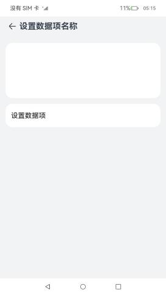
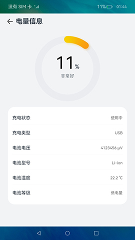
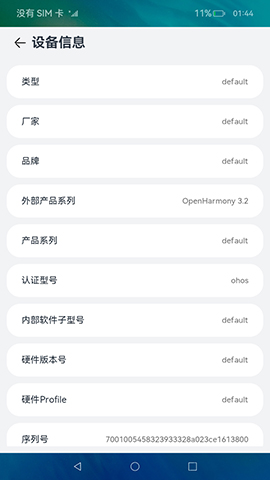
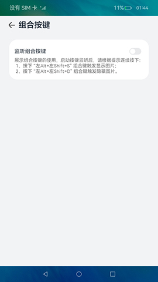
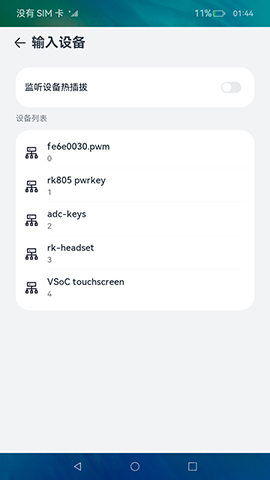
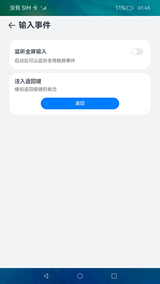
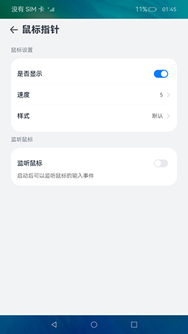
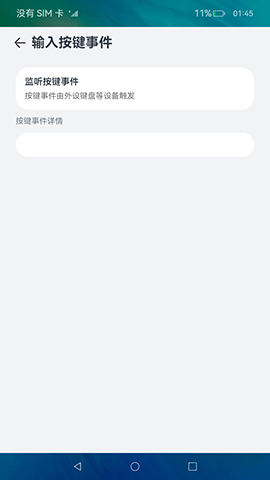

# 设备管理合集(系统特性)（仅对系统应用开放）

### 介绍

本示例集合设备管理相关(系统特性)不需要复杂功能展示的模块，展示了各个模块的基础功能，包含：

- [@ohos.batteryStatistics (耗电统计)](https://docs.openharmony.cn/pages/v3.2/zh-cn/application-dev/reference/apis/js-apis-batteryStatistics.md/)
- [@ohos.brightness (屏幕亮度)](https://docs.openharmony.cn/pages/v3.2/zh-cn/application-dev/reference/apis/js-apis-brightness.md/)
- [@ohos.power (系统电源管理)](https://docs.openharmony.cn/pages/v3.2/zh-cn/application-dev/reference/apis/js-apis-power.md/)
- [@ohos.settings (设置数据项名称)](https://docs.openharmony.cn/pages/v3.2/zh-cn/application-dev/reference/apis/js-apis-settings.md/)
- [@ohos.systemCapability (系统能力)](https://docs.openharmony.cn/pages/v3.2/zh-cn/application-dev/reference/apis/js-apis-system-capability.md/)
- [@ohos.systemParameterEnhance (系统参数)](https://docs.openharmony.cn/pages/v3.2/zh-cn/application-dev/reference/apis/js-apis-system-parameterEnhance.md/)
- [@ohos.batteryInfo (电量信息)](https://gitee.com/openharmony/docs/blob/master/zh-cn/application-dev/reference/apis/js-apis-battery-info.md)
- [@ohos.deviceInfo (设备信息)](https://gitee.com/openharmony/docs/blob/master/zh-cn/application-dev/reference/apis/js-apis-device-info.md)
- [@ohos.multimodalInput.inputConsumer (组合按键)](https://gitee.com/openharmony/docs/blob/master/zh-cn/application-dev/reference/apis/js-apis-inputconsumer.md)
- [@ohos.multimodalInput.inputDevice (输入设备)](https://gitee.com/openharmony/docs/blob/master/zh-cn/application-dev/reference/apis/js-apis-inputdevice.md)
- [@ohos.multimodalInput.inputEvent (输入事件)](https://gitee.com/openharmony/docs/blob/master/zh-cn/application-dev/reference/apis/js-apis-inputevent.md)
- [@ohos.multimodalInput.inputEventClient (按键注入)](https://gitee.com/openharmony/docs/blob/master/zh-cn/application-dev/reference/apis/js-apis-inputeventclient.md)
- [@ohos.multimodalInput.inputMonitor (输入监听)](https://gitee.com/openharmony/docs/blob/master/zh-cn/application-dev/reference/apis/js-apis-inputmonitor.md)
- [@ohos.multimodalInput.keyCode (键值)](https://gitee.com/openharmony/docs/blob/master/zh-cn/application-dev/reference/apis/js-apis-keycode.md)
- [@ohos.multimodalInput.keyEvent (按键输入事件)](https://gitee.com/openharmony/docs/blob/master/zh-cn/application-dev/reference/apis/js-apis-keyevent.md)
- [@ohos.multimodalInput.mouseEvent (鼠标输入事件)](https://gitee.com/openharmony/docs/blob/master/zh-cn/application-dev/reference/apis/js-apis-mouseevent.md)
- [@ohos.multimodalInput.pointer (鼠标指针)](https://gitee.com/openharmony/docs/blob/master/zh-cn/application-dev/reference/apis/js-apis-pointer.md)
- [@ohos.multimodalInput.touchEvent (触摸输入事件)](https://gitee.com/openharmony/docs/blob/master/zh-cn/application-dev/reference/apis/js-apis-touchevent.md)

### 效果预览

|                    **耗电统计**                     |                      **屏幕亮度**                       |                        **系统电源管理**                         |
|:-----------------------------------------------:|:---------------------------------------------------:|:---------------------------------------------------------:|
|  |           |                     |
|                   **设置数据项名称**                   |                      **系统能力**                       |                         **系统参数**                          |
|       |       |             |
|                   **电量信息**                   |                      **设备信息**                       |                         **组合按键**                          |
|       |  |  |
|                   **输入设备**                   |                      **输入事件**                       |                         **鼠标指针**                          |
|       |  |                    |
|                   **输入按键事件**                   |                                             |                                                 |
|      |                                                     |                                                           |

使用说明

1.首页展示语言基础类库各个子模块菜单，点击进入对应的模块页面。

2.各个子模块界面中点击功能按钮完成各个功能。

3.耗电统计：进入耗电统计页面，展示软硬件耗电排行。

4.屏幕亮度：获取当前屏幕亮度，设置屏幕亮度。

5.系统电源管理：点击按钮分别实现休眠、关机、重启、设置电源模式功能。

6.设置数据项名称：将数据项名称及数据项的值保存到数据库中。

7.系统能力：获取系统能力集合的字符串并显示。

8.系统参数：点击按钮分别实现设置一个系统参数、获取并展示系统参数功能。

9.电量信息：进入设备电量信息页面，页面主要显示电量信息，包括：当前设备是否支持电池或电池是否在位的查询、剩余电池电量百分比、充电状态、电池健康状态、充电器类型、电池电压、电池技术型号、电池温度、电量等级等信息。

10.设备基础信息：打开设备信息管理页面，展示基础信息。

11.组合按键：进入组合按键管理页面，包括显示组合按键信息，组合按键的订阅状态，在订阅状态下，组合按键被触发时显示组合按键的信息。

12.输入设备：进入设备输入管理页面，展示设备输入列表，可以查看输入设备详情，同时可以监听设备的热插拔状态。

13.输入事件：进入全屏监听页面，实现启动或取消全屏输入事件，在启动全屏输入事件监听时，可以查看当前触屏的详细信息，模拟注入返回事件，实现返回能力。

14.输入按键事件：进入输入按键事件管理页面，显示由外部设备如软键盘输入触发的消息。

15.鼠标指针：进入鼠标管理页面，实现鼠标状态、鼠标指针信息、设置鼠标速度和显示样式，启动鼠标事件监听时，可以查看鼠标在界面上操作的详细信息。

### 工程目录

```
DeviceManagementCollection
├── AppScope                                    
│   └── app.json5                               //APP信息配置文件
├── entry/src/main                              //语言基础类库应用首页
│   ├── ets
│   │   ├── entryability
│   │   ├── pages
│   │   │   ├── Index.ets                       //主页入口
│   │   │   ├── components                       
│   │   │   │   └── Capabilities.ets            //根据点击的菜单，展示对应的子界面
│   └── module.json5
│ 
├── common/src/main                             //公共组件及工具类
│   ├── ets
│   │   ├── components
│   │   │   └── CustomDataSource.ets            //自定义DataSource，LazyForEach时使用
│   │   ├── util
│   │   │   └── JSONUtils                       //JSON数据格式化
│   │   │   ├── Logger.ets                      //日志工具类
│   │   │   └── ResourceUtil.ets                //资源管理工具类
│   └── module.json5
│
├── menuitems/src/main                          //菜单
│   ├── ets
│   │   ├── Index.ets                           //对外提供的接口列表
│   │   ├── menulist                            //菜单组件
│   │   │   └── MenuList.ets                  
│   │   ├── components                          //菜单相关自定义组件
│   └── module.json5
│
├── capabilities/src/main                       //功能集
│   ├── ets
│   │   ├── capabilities                        //各个子模块功能组件
│   │   │   ├── BatteryStats.ets                //耗电统计
│   │   │   ├── BatteryView.ets                 //电量信息
│   │   │   ├── BrightnessManager.ets           //屏幕亮度
│   │   │   ├── DeviceInfo.ets                  //设备信息
│   │   │   ├── InputConsumer.ets               //组合按键
│   │   │   ├── InputDeviceManager.ets          //输入设备管理
│   │   │   ├── InputEventManager.ets           //输入事件管理
│   │   │   ├── InputKeyEventManager.ets        //输入按键事件
│   │   │   ├── MouseManager.ets                //鼠标事件
│   │   │   ├── PowerManager.ets                //系统电源管理
│   │   │   ├── SettingsManager.ets             //设置数据项名称
│   │   │   ├── SystemCapability.ets            //系统能力
│   │   │   └── SystemParameter.ets             //系统参数
│   │   ├── components                          //子模块相关组件
│   │   │   ├── batterystats                    //耗电统计相关组件
│   │   │   ├── ColumnOperation.ets             //展示一列功能按钮的组件
│   │   │   └── RadiusColumn.ets                //白色圆角的自定义Columm组件
│   │   ├── model                               //相关数据模型
│   │   └── utils                               //相关工具类
│   └── module.json5
```

### 具体实现

1.首页菜单展示：使用一个module，menuitems完成菜单组件的实现，传入要展示的菜单的strarray类型的资源和菜单点击对应的组件即可。使用Navigation和NavRouter组件实现菜单点击进入功能界面，使用LocalStorage实现应用内Ability内数据共享，点击菜单时标记selectedLabel，在entry中的Capabilities组件中，通过selectedLabel显示对应的功能组件。

2.耗电统计：使用[@ohos.batteryStatistics.d.ts](https://docs.openharmony.cn/pages/v3.2/zh-cn/application-dev/reference/apis/js-apis-batteryStatistics.md/)
接口获取硬件和应用的耗电量与百分比，使用[@ohos.bundle.bundleManager.d.ts](https://docs.openharmony.cn/pages/v3.2/zh-cn/application-dev/reference/apis/js-apis-bundleManager.md/)
接口获取系统已安装应用信息。

3.屏幕亮度：使用[@ohos.brightness.d.ts](https://docs.openharmony.cn/pages/v3.2/zh-cn/application-dev/reference/apis/js-apis-brightness.md/)
实现屏幕亮度控制。

4.系统电源管理：使用[@ohos.power.d.ts](https://docs.openharmony.cn/pages/v3.2/zh-cn/application-dev/reference/apis/js-apis-power.md/)
实现休眠、关机、重启、设置电源模式功能。

5.设置数据项名称：使用[@ohos.settings.d.ts](https://docs.openharmony.cn/pages/v3.2/zh-cn/application-dev/reference/apis/js-apis-settings.md/)
实现将数据项名称及数据项的值保存到数据库中。

6.系统能力：使用[@ohos.systemCapability.d.ts](https://docs.openharmony.cn/pages/v3.2/zh-cn/application-dev/reference/apis/js-apis-system-capability.md/)
实现获取系统能力集合的字符串并显示。

7.系统参数：使用[@ohos.systemParameterEnhance.d.ts](https://docs.openharmony.cn/pages/v3.2/zh-cn/application-dev/reference/apis/js-apis-system-parameterEnhance.md/)
实现设置一个系统参数、获取并展示系统参数功能。

8.电量信息：使用[@ohos.batteryInfo.d.ts](https://gitee.com/openharmony/docs/blob/master/zh-cn/application-dev/reference/apis/js-apis-battery-info.md)接口获取电池和充放电状态信息

9.设备信息：使用[@ohos.deviceInfo](https://gitee.com/openharmony/docs/blob/master/zh-cn/application-dev/reference/apis/js-apis-device-info.md)获取设备相关信息。

10.组合按键：使用[@ohos.multimodalInput.inputConsumer](https://gitee.com/openharmony/docs/blob/master/zh-cn/application-dev/reference/apis/js-apis-inputconsumer.md) 订阅组合按键，当组合按键被触发时展示组合按键回调信息。

11.输入设备：使用[@ohos.multimodalInput.inputDevice](https://gitee.com/openharmony/docs/blob/master/zh-cn/application-dev/reference/apis/js-apis-inputdevice.md) 获取输入设备列表，并显示输入设备信息，实现设备的热插拔监听。

12.输入事件：使用[@ohos.multimodalInput.inputMonitor](https://gitee.com/openharmony/docs/blob/master/zh-cn/application-dev/reference/apis/js-apis-inputmonitor.md)开启监听全局触屏事件，当触发触屏事件时显示触屏详情，使用[@ohos.multimodalInput.inputEventClient](https://gitee.com/openharmony/docs/blob/master/zh-cn/application-dev/reference/apis/js-apis-inputeventclient.md)模拟返回按键进行按键注入，实现返回功能，在column组件中添加[@ohos.multimodalInput.touchEvent](https://gitee.com/openharmony/docs/blob/master/zh-cn/application-dev/reference/apis/js-apis-touchevent.md)触摸事件，模拟按键被按下效果。

13.鼠标指针：使用[@ohos.multimodalInput.mouseEvent](https://gitee.com/openharmony/docs/blob/master/zh-cn/application-dev/reference/apis/js-apis-mouseevent.md)监听鼠标事件，并显示鼠标操作回调信息，使用[@ohos.multimodalInput.pointer](https://gitee.com/openharmony/docs/blob/master/zh-cn/application-dev/reference/apis/js-apis-pointer.md)实现鼠标指针的显示或隐藏状态，设置鼠标移动速度和显示样式。

14.输入按键事件：使用 [@ohos.multimodalInput.keyEvent (按键输入事件)](https://gitee.com/openharmony/docs/blob/master/zh-cn/application-dev/reference/apis/js-apis-keyevent.md)监听按键输入的信息。

### 相关权限

1.允许应用重启设备权限：[ohos.permission.REBOOT](https://gitee.com/openharmony/docs/blob/OpenHarmony-3.2-Release/zh-cn/application-dev/security/permission-list.md#ohospermissionreboot)

2.允许系统应用设置省电模式、获取省电模式的配置信息并接收配置变化的通知权限：[ohos.permission.POWER_OPTIMIZATION](https://gitee.com/openharmony/docs/blob/OpenHarmony-3.2-Release/zh-cn/application-dev/security/permission-list.md#ohospermissionpower_optimization)

3.允许应用查询已安装应用的信息权限：[ohos.permission.GET_BUNDLE_INFO_PRIVILEGED](https://gitee.com/openharmony/docs/blob/OpenHarmony-3.2-Release/zh-cn/application-dev/security/permission-list.md#ohospermissionget_bundle_info_privileged)

4.允许系统应用获取UDID权限：[ohos.permission.sec.ACCESS_UDID](https://gitee.com/openharmony/docs/blob/master/zh-cn/application-dev/security/permission-list.md#ohospermissionsecaccess_udid)

5.允许应用监听输入事件权限：[ohos.permission.INPUT_MONITORING](https://gitee.com/openharmony/docs/blob/master/zh-cn/application-dev/security/permission-list.md#ohospermissioninput_monitoring)

6.允许应用读取已安装应用列表：[ohos.permission.GET_INSTALLED_BUNDLE_LIST](https://gitee.com/openharmony/docs/blob/master/zh-cn/application-dev/security/permission-list.md#ohospermissionget_installed_bundle_list)
### 依赖

不涉及。

### 约束与限制

1.本示例仅支持标准系统上运行。

2.本示例适配API version 10版本SDK，SDK版本号(API Version 10 Release),镜像版本号(4.0Release)

3.本示例需要使用DevEco Studio 版本号(4.0Release)才可编译运行。

4.本示例需要使用系统权限的系统接口。使用Full SDK时需要手动从镜像站点获取，并在DevEco
Studio中替换，具体操作可参考[替换指南](https://docs.openharmony.cn/pages/v3.2/zh-cn/application-dev/quick-start/full-sdk-switch-guide.md/)。

5.本示例所配置的REBOOT、POWER_OPTIMIZATION、GET_BUNDLE_INFO_PRIVILEGED权限为system_basic或system_core级别(
相关权限级别可通过[权限定义列表]( https://docs.openharmony.cn/pages/v3.2/zh-cn/application-dev/security/permission-list.md/ )
查看)，需要手动配置对应级别的权限签名(
具体操作可查看[自动化签名方案]( https://docs.openharmony.cn/pages/v3.2/zh-cn/application-dev/security/hapsigntool-overview.md/ ))。

### 下载

如需单独下载本工程，执行如下命令：

```text
git init
git config core.sparsecheckout true
echo code/SystemFeature/DeviceManagement/DeviceManagementCollection/ > .git/info/sparse-checkout
git remote add origin https://gitee.com/openharmony/applications_app_samples.git
git pull origin master
```