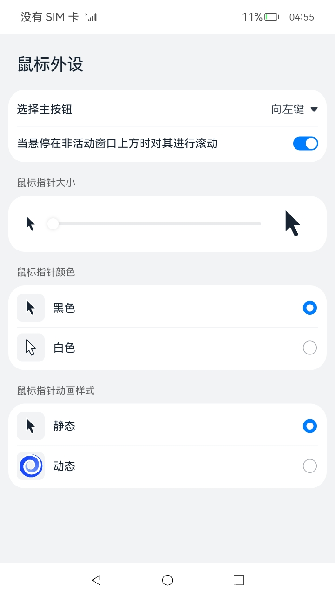

# 多模输入（仅对系统应用开放）

### 介绍

本示例展示了多模输入鼠标外设的五种场景：鼠标样式资源切换、设置鼠标大小及颜色、设置鼠标动画光标样式、通过switch开关切换鼠标滚轮在非激活悬停窗口的滚动操作使能状态、通过switch开关切换鼠标主次键等功能。

本实例使用[鼠标指针](https://gitee.com/openharmony/docs/blob/master/zh-cn/application-dev/reference/apis/js-apis-pointer.md)

### 效果预览

|鼠标外设|
|:------------------------------:|
| |

使用说明：

1.启动应用,首页展示鼠标外设的各种设置项。

2.选择主按钮中的下拉框可以切换鼠标主次键。

3.点击当悬停在非活动窗口上方时对其进行滚动右侧switch开关，可以切换鼠标滚轮在非激活悬停窗口的滚动操作使能状态。

4.鼠标指针大小中的滑动条可以设置鼠标指针大小。

5.点击鼠标指针颜色中的单选框，可以设置鼠标颜色。

6.点击鼠标指针动画样式中的静态或动态单选框，可以设置鼠标静态或动画光标样式。

### 工程目录
```
entry/src/main/ets/                 
|---entryability
|   |---EntryAbility.ts                    
|---pages
|   |---Main.ets                      // 鼠标外设
```

### 具体实现

* 本示例主要分为一个模块，
  * 鼠标外设模块
    * 主要展示了鼠标外设的五种功能设置场景
    * 源码链接：[Main.ets](entry/src/main/ets/pages/Main.ets)，
    * 接口参考：[@ohos.multimodalInput.pointer](https://gitee.com/openharmony/docs/blob/master/zh-cn/application-dev/reference/apis/js-apis-pointer.md)

### 相关权限

不涉及。


### 依赖

不涉及。


### 约束与限制

1.本示例仅支持标准系统上运行,支持设备:RK3568；

2.本示例已适配API10版本SDK，SDK版本号(API Version 10 Release),镜像版本号(4.0 Release)。当前支持的SDK版本链接如下：

[SDK全量包下载链接](http://ci.openharmony.cn/workbench/cicd/dailybuild/detail/component)

3.本示例需要使用DevEco Studio 版本号(4.0 Release)及以上版本才可编译运行；

4.本示例涉及使用系统接口@ohos.multimodalInput.pointer：setPointerSize，需要手动替换Full SDK才能编译通过，具体操作可参考[替换指南](https://docs.openharmony.cn/pages/v3.2/zh-cn/application-dev/quick-start/full-sdk-switch-guide.md/)

5.本示例所配置的权限为system_basic级别(相关权限级别可通过[权限定义列表](https://docs.openharmony.cn/pages/v3.2/zh-cn/application-dev/security/permission-list.md/)查看),需要手动配置对应级别的权限签名(具体操作可查看[自动化签名方案](https://docs.openharmony.cn/pages/v3.2/zh-cn/application-dev/security/hapsigntool-overview.md/))

6.本示例有使用系统特性api，需要手动配置对应级别的应用类型("app-feature": "hos_system_app")。具体可参考profile配置文件[bundle-info对象内部结构](https://gitee.com/openharmony/docs/blob/eb73c9e9dcdd421131f33bb8ed6ddc030881d06f/zh-cn/application-dev/security/app-provision-structure.md#bundle-info%E5%AF%B9%E8%B1%A1%E5%86%85%E9%83%A8%E7%BB%93%E6%9E%84)

### 下载

如需单独下载本工程，执行如下命令：
```
git init
git config core.sparsecheckout true
echo code/SystemFeature/DeviceManagement/Mouse/ > .git/info/sparse-checkout
git remote add origin https://gitee.com/openharmony/applications_app_samples.git
git pull origin master

```