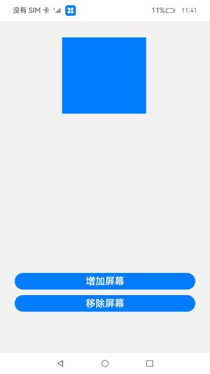
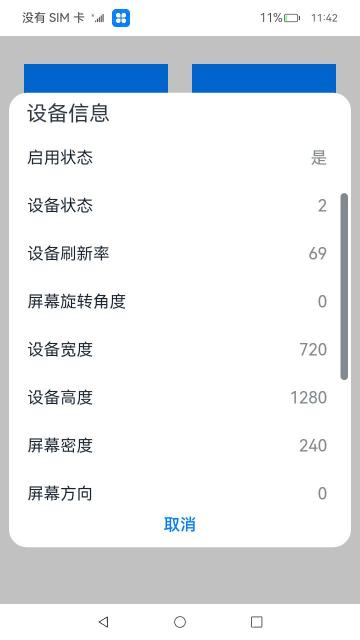
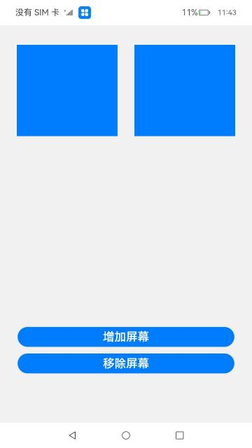

# 屏幕属性（仅对系统应用开放）

### 介绍

本示例主要展示了屏幕管理相关的功能，使用[@ohos.display](https://gitee.com/openharmony/docs/blob/master/zh-cn/application-dev/reference/apis/js-apis-display.md)、[@ohos.screen](https://gitee.com/openharmony/docs/blob/master/zh-cn/application-dev/reference/apis/js-apis-screen.md)接口，[@ohos.display](https://gitee.com/openharmony/docs/blob/master/zh-cn/application-dev/reference/apis/js-apis-display.md)接口提供获取默认display对象、获取所有display对象，开启监听、关闭监听功能；[@ohos.screen](https://gitee.com/openharmony/docs/blob/master/zh-cn/application-dev/reference/apis/js-apis-screen.md)接口提供创建虚拟屏幕、销毁虚拟屏幕、扩展屏幕、镜像屏幕等功能。

### 效果预览

本示例监听屏幕数量变化，创建、销毁虚拟屏幕模拟屏幕增减，读取屏幕属性并显示。

| 主页                              | 默认信息                                | 增加屏幕                        | 移除屏幕                           |
| --------------------------------- | --------------------------------------- | ------------------------------- | ---------------------------------- |
|  |  |  |  |

使用说明

1.点击主页面前一个矩形，弹窗显示默认设备ID、设备名称、启用状态、设备状态、设备刷新率、屏幕旋转角度、设备宽度、设备高度、屏幕密度、屏幕方向、逻辑密度、缩放因子、xDPI(x方向中每英寸屏幕的确切物理像素值)、yDPI(y方向中每英寸屏幕的确切物理像素值)，点击任意区域关闭弹窗，点击第二个矩形，弹窗显示所有屏幕信息。

2.点击**增加屏幕**按钮，监听到屏幕增加，增加矩形代表新增屏幕（因界面空间有效，增加超过一个屏幕，页面总共只显示两个矩形）。

3.点击**移除屏幕**按钮，监听到屏幕销毁，减少矩形代表移除屏幕。

### 工程目录

```
entry/src/main/ets/
|---Application
|---common
|   |---DisplayDevice.ets                  // 增加屏幕移除屏幕显示屏幕信息界面
|   |---ShowInfo.ets                       // 显示屏幕所有信息
|---MainAbility
|---model
|   |---DisplayModel.ts                    // 增加屏幕移除屏幕功能
|   |---Logger.ts                          // 日志文件
|---pages
|   |---index.ets                          // 首页
```

### 具体实现

- 增加屏幕、移除屏幕的功能接口封装在DisplayModel，源码参考：[DisplayModel](entry/src/main/ets/model/DisplayModel.ts)
  - 使用screen.createVirtualScreen来创建虚拟屏幕;
  - 使用screen.destroyVirtualScreen来销毁虚拟屏幕;
- 获取Display对象显示屏幕所有属性信息的功能封装在ShowInfo，源码参考：[ShowInfo](entry/src/main/ets/common/ShowInfo.ets)
  - 使用display.Display来显示默认屏幕信息;
  - 使用display.Display[]来显示所有屏幕信息;；

### 相关权限

不涉及。

### 依赖

不涉及

### 约束与限制

1.本示例仅支持在标准系统上运行。

2.本示例为Stage模型，支持API10版本SDK，SDK版本号(API Version 10 Release),镜像版本号(4.0 Release)。

3.编译前下载最新每日构建中ohos-sdk，解压并替换@ohos.screen.d.ts文件。

4.本示例需要使用DevEco Studio 版本号(4.0 Release)及以上版本才可编译运行。

5.本示例需要使用@ohos.screen系统权限的系统接口。使用Full SDK时需要手动从镜像站点获取，并在DevEco Studio中替换，具体操作可参考[替换指南](https://docs.openharmony.cn/pages/v3.2/zh-cn/application-dev/quick-start/full-sdk-switch-guide.md/)。

### 下载

如需单独下载本工程，执行如下命令：
```
git init
git config core.sparsecheckout true
echo code/SystemFeature/DEviceManagement/Screen/ > .git/info/sparse-checkout
git remote add origin https://gitee.com/openharmony/applications_app_samples.git
git pull origin master

```