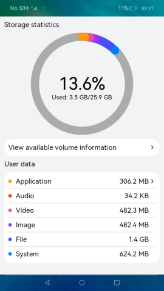
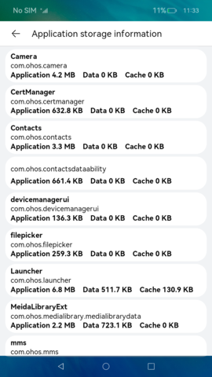
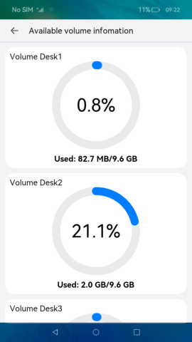

# Storage Space Statistics

### Introduction

This sample presents how to view the storage space usage, space of all installed applications, and available volumes of a device by using the application bundle management, application space statistics, and volume management modules.

This sample uses the [<**DataPanel** component>](https://gitee.com/openharmony/docs/blob/master/en/application-dev/reference/arkui-ts/ts-basic-components-datapanel.md) to display the space information about different applications; uses [**Bundle**](https://gitee.com/openharmony/docs/blob/master/en/application-dev/reference/apis/js-apis-Bundle.md) to obtain the application name and bundle information; uses [**App Space Statistics**](https://gitee.com/openharmony/docs/blob/master/en/application-dev/reference/apis/js-apis-file-storage-statistics.md) to obtain the storage space usage of the device; use [**Volume Management**](https://gitee.com/openharmony/docs/blob/master/en/application-dev/reference/apis/js-apis-file-volumemanager.md) to obtain information about available volumes of the device.
Instructions:

1. The main page displays the detailed information about the storage space usage of the current device.

2. Tap **Application** to view the space of all installed applications.

3. Tap **View Available Volumes** to view information about all available volumes of the device.

### Display Effect

### Required Permissions

- Permission to obtain storage space information and available volumes: [ohos.permission.STORAGE_MANAGER](https://gitee.com/openharmony/docs/blob/master/en/application-dev/security/permission-list.md)

- Permission to obtain information about installed applications: [ohos.permission.GET_BUNDLE_INFO_PRIVILEGED](https://gitee.com/openharmony/docs/blob/master/en/application-dev/security/permission-list.md)

### Dependency

N/A

### Constraints

1. This sample can only be run on standard-system devices that use the Rockchip RK3568 development board.

2. This sample is based on the stage model, which is supported from API version 10 (API Version 10 Release). 

3. DevEco Studio (4.0 Release) must be used.

4. This sample uses the **@ohos.bundle.innerBundleManager**, **@ohos.volumeManager**, and **@ohos.storageStatistics** system APIs. To use the full SDK, obtain it from a mirror site and switch to it in DevEco Studio. For details, see [Guide to Switching to Full SDK](https://docs.openharmony.cn/pages/v3.2/zh-cn/application-dev/quick-start/full-sdk-switch-guide.md/).

5. This example uses the **system_core** permissions (see [App Permission List](https://gitee.com/openharmony/docs/blob/master/en/application-dev/security/permission-list.md)). You need to [configure a high-level permission signature](https://docs.openharmony.cn/pages/v3.2/en/application-dev/security/hapsigntool-overview.md/).
