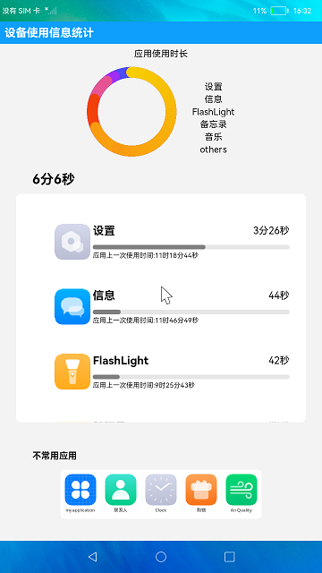

#  设备使用信息统计

### 介绍

本示例使用[ @ohos.bundleState](https://gitee.com/openharmony/docs/blob/master/zh-cn/application-dev/reference/apis-backgroundtasks-kit/js-apis-deviceUsageStatistics-sys.md)相关接口完成设备中应用时长的统计功能。

### 效果预览

|主页|
|--------------------------------|
||

使用说明：

1.顶部的数据面板展示了最常用的五个应用的使用时间占比情况。

2.中部的竖向滑动栏展示了每个应用的使用总时长和最后一次使用的时间。

3.底部的横向滑动栏展示了不常用应用列表。

### 工程目录
```
entry/src/main/ets/
|---common
|   |---FreeApps.ets                     // 不常用应用
|   |---PanelView.ets                    // 使用时长
|   |---UsageList.ets                    // 使用列表
|---entryAbility
|   |---EntryAbility.ts
|---model
|   |---HmsTime.ets                      // 时间
|   |---Logger.ts                        // 日志工具
|---pages
|   |---Index.ets                        // 首页
|---utils
|   |---DataSource.ets                   // 资源数据
```
### 具体实现

* 该示例使用bundleState接口中isIdleState方法判断指定bundleName的应用当前是否是空闲状态来分类不常用应用列表，queryBundleStateInfos方法通过指定起始和结束时间查询应用使用时长统计信息来获得每个应用的使用总时长。
* 源码链接：[BundleStateUtil.ets](Library/src/main/ets/utils/BundleStateUtil.ets)，[FreeApps.ets](entry/src/main/ets/common/FreeApps.ets)，[PanelView.ets](entry/src/main/ets/common/PanelView.ets)，[UsageList.ets](entry/src/main/ets/common/UsageList.ets)
* 接口参考：[@ohos.bundleState](https://gitee.com/openharmony/docs/blob/master/zh-cn/application-dev/reference/apis-backgroundtasks-kit/js-apis-deviceUsageStatistics-sys.md)

### 相关权限

应用信息权限：[ohos.permission.BUNDLE_ACTIVE_INFO](https://gitee.com/openharmony/docs/blob/master/zh-cn/application-dev/security/AccessToken/permissions-for-system-apps.md#ohospermissionbundle_active_info)

### 依赖

不涉及。

### 约束与限制

1.本示例仅支持在标准系统上运行。

2.本示例已适配API version 9版本SDK，版本号：3.2.11.9。

3.本示例需要使用DevEco Studio 3.1 Beta2 (Build Version: 3.1.0.400, built on April 7, 2023)及以上版本才可编译运行；

4.本示例涉及使用系统接口：queryBundleStateInfos()，需要手动替换Full SDK才能编译通过，具体操作可参考[替换指南](https://gitee.com/openharmony/docs/blob/master/zh-cn/application-dev/faqs/full-sdk-switch-guide.md)。

5.本示例所配置的权限为ohos.permission.BUNDLE_ACTIVE_INFO为system_basic级别(相关权限级别可通过[权限定义列表](https://gitee.com/openharmony/docs/blob/master/zh-cn/application-dev/security/AccessToken/permissions-for-system-apps.md)查看)，需要手动配置对应级别的权限签名(具体操作可查看[自动化签名方案](https://docs.openharmony.cn/pages/v4.0/zh-cn/application-dev/security/hapsigntool-overview.md)。

### 下载
如需单独下载本工程，执行如下命令：

```
git init
git config core.sparsecheckout true
echo code/SystemFeature/DeviceUsageStatistics/DeviceUsageStatistics/ > .git/info/sparse-checkout
git remote add origin https://gitee.com/openharmony/applications_app_samples.git
git pull origin master
```