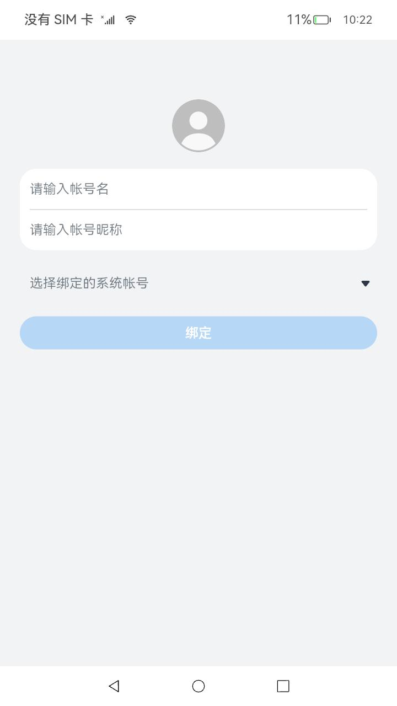

# 分布式帐号

### 介绍

本示例主要展示了分布式帐号相关的功能，使用[@ohos.account.distributedAccount](https://gitee.com/openharmony/docs/blob/master/zh-cn/application-dev/reference/apis/js-apis-distributed-account.md)、[@ohos.account.osAccount](https://gitee.com/openharmony/docs/blob/master/zh-cn/application-dev/reference/apis/js-apis-osAccount.md)等接口，实现了绑定分布式帐号、解绑分布式帐号、更新分布式帐号信息和管理分布式帐号的功能；

### 效果预览

| 首页                        | 帐号列表                                     | 帐号信息                                     |
| --------------------------- | -------------------------------------------- | -------------------------------------------- |
|  |  |  |

使用说明

1. 首次进入应用会根据分布式帐号绑定状态进行页面跳转，若帐号已绑定，则直接跳转至帐号列表界面；若帐号未绑定，则需要在首页进行绑定；
1. 首页输入分布式帐号名（必填）、昵称，选择头像（需先使用hdc命令将图片推到storage/media/100/local/files/Pictures/路径下并重启），选择绑定的系统帐号，点击**绑定**，绑定成功跳转至帐号列表界面；
2. 在帐号列表界面，可对所有可解绑分布式帐号进行管理，点击选择分布式帐号，跳转至对应的帐号信息界面；
3. 在帐号信息界面，点击**解绑**，可解绑该分布式帐号；
3. 在帐号解绑之后，可对分布式帐号信息进行更新，在首页直接进行输入后点击绑定即可。

### 工程目录

```
entry/src/main/ets/
|---pages
|   |---Index.ets                           // 首页
|---distributedaccount
|   |---pages
|   |   |---DistributedAccountList.ets      // 帐号列表
|   |   |---DistributedAccountInfo.ets      // 帐号信息
|---common
|   |---component
|   |   |---ListItemComponent.ets           // 列表项
|   |   |---TitleBar.ets                    // 标题栏
|   |---constants
|   |   |---CommonConstants.ets
|   |---database
|   |   |---Account.ets                     // 帐号数据库
|   |---utils
|   |   |---DatabaseUtils.ets               // 封装关系型数据库工具类
|---model
|   |---BasicDataSource.ets                 // 懒加载数据
|   |---Logger.ts                           // 日志工具
|   |---DistributedAccountModel.ets         // 封装分布式帐号类
```

### 具体实现

* 绑定、解绑、查询、更新分布式帐号的功能接口封装在DistributedAccountModel，源码参考：[DistributedAccountModel.ets](entry/src/main/ets/model/DistributedAccountModel.ets)
    * 使用distributedAccount.getDistributedAccountAbility()获取分布式帐号单实例对象accountAbility;
    * 绑定、解绑和更新分布式帐号：使用accountAbility.setOsAccountDistributedInfoByLocalId();
    * 查询分布式帐号信息：使用accountAbility.getOsAccountDistributedInfo()和accountAbility.getOsAccountDistributedInfoByLocalId;
### 相关权限

[ohos.permission.MANAGE_LOCAL_ACCOUNTS](https://gitee.com/openharmony/docs/blob/master/zh-cn/application-dev/security/permission-list.md#ohospermissionmanage_local_accounts)

[ohos.permission.MANAGE_DISTRIBUTED_ACCOUNTS](https://gitee.com/openharmony/docs/blob/master/zh-cn/application-dev/security/permission-list.md#ohospermissionmanage_distributed_accounts)

### 依赖

不涉及。

### 约束与限制

1. 本示例仅支持标准系统上运行，支持设备：RK3568；
2. 本示例仅支持API10版本SDK，SDK版本号(API Version 10 Release),镜像版本号(4.0 Release)；
3. 本示例需要使用DevEco Studio 版本号(4.0 Release)及以上版本才可编译运行；
4. 本示例涉及使用系统接口：@ohos.account.osAccount中的queryAllCreatedOsAccounts接口，需要手动替换Full SDK才能编译通过，具体操作可参考[替换指南](https://gitee.com/openharmony/docs/blob/master/zh-cn/application-dev/faqs/full-sdk-switch-guide.md)；
5. 本示例涉及系统接口，需要配置系统应用签名，可以参考[特殊权限配置方法](https://gitee.com/openharmony/docs/blob/master/zh-cn/application-dev/security/app-provision-structure.md#修改harmonyappprovision配置文件)，把配置文件中的“app-feature”字段信息改为“hos_system_app”。

### 下载

如需单独下载本工程，执行如下命令：

```
git init
git config core.sparsecheckout true
echo code/SystemFeature/DistributedAppDev/DistributedAccount > .git/info/sparse-checkout
git remote add origin https://gitee.com/openharmony/applications_app_samples.git
git pull origin master
```
