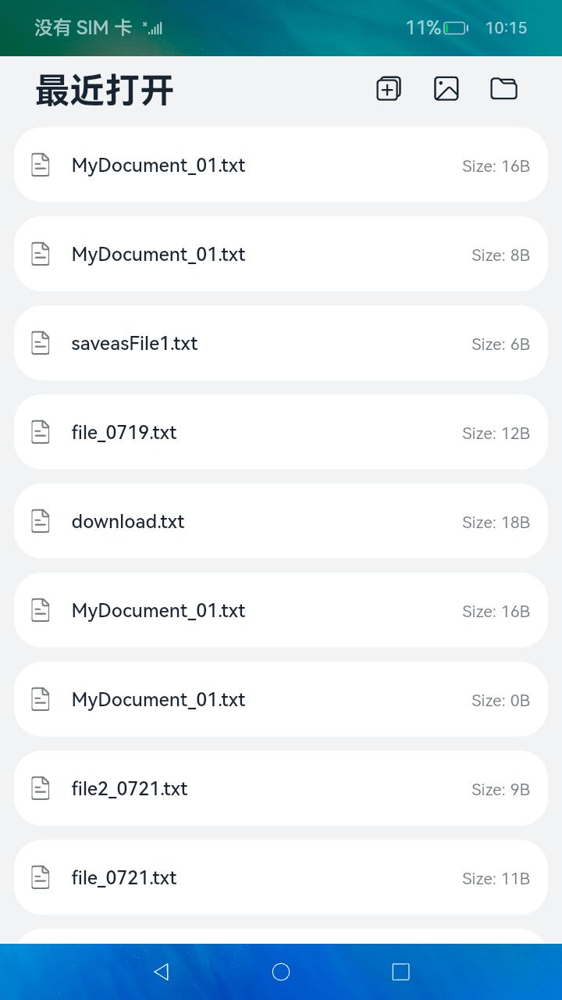
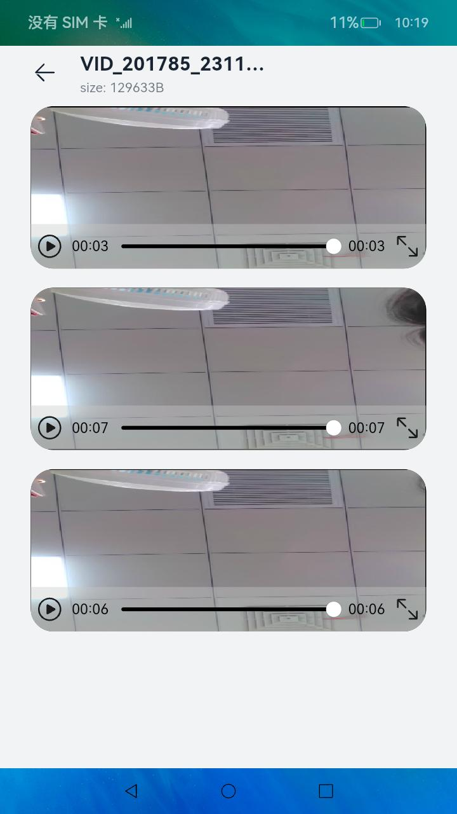

# 选择并查看文档与媒体文件

### 介绍

应用使用[@ohos.file.picker](https://gitee.com/openharmony/docs/blob/master/zh-cn/application-dev/reference/apis-core-file-kit/js-apis-file-picker.md)、[@ohos.multimedia.mediaLibrary](https://gitee.com/openharmony/docs/blob/master/zh-cn/application-dev/reference/apis-media-library-kit/js-apis-medialibrary-sys.md)、[@ohos.file.fs](https://gitee.com/openharmony/docs/blob/master/zh-cn/application-dev/reference/apis-core-file-kit/js-apis-file-fs.md) 等接口，实现了picker拉起文档编辑保存、拉起系统相册图片查看、拉起视频并播放的功能。

### 效果预览

| 首页                                 | 查看并编辑文档界面                  | 查看图片界面                           | 查看视频界面                         |
| ------------------------------------ | ----------------------------------- | -------------------------------------- | ------------------------------------ |
|  |  |  |  |

 使用说明：

1. 在首页，应用展示出最近打开过的文档信息，点击信息可以进入对应文档的查看界面。通过点击右上方的三个按钮，可以分别实现新建文档、选择图片或视频并打开预览、选择文档并打开的功能。
2. 在查看文档界面，点击右上方左一按钮，可以实现当前文档另存为的功能；点击右上方中间的按钮，开启文档的编辑功能，textArea变成可编辑状态，用户输入数据后点击右上方第三个按钮，可以将当前文档内容进行保存操作。
3. 在查看图片界面，picker拉起系统相册的图片，用户至多可选择三张图片查看，点击图片可以切换所显示的图片名及大小信息。
4. 在查看视频界面，picker拉起系统相册的视频，用户至多可选择三个视频查看，点击视频播放并且可以显示的视频名及大小信息。

### 工程目录

```
entry/src/main/ets/
|---common
|	|---Common.ts
|	|---Utils.ts
|	|---Logger.ts						//日志工具
|---entryability
|	|---EntryAbility.ts					//ability类
|---media
|	|---MediaFileUri.ts					//媒体文件相关函数
|---pages
|	|---EditFile.ets					//查看并编辑文档界面
|	|---Index.ets						//首页
|	|---ViewMedia.ets					//查看图片和视频界面
```

### 具体实现

- 拉起picker选择文件、拉起picker保存文件、拉起picker选择图片或视频的功能封装在Index.ets，源码参考：[Index.ets](entry/src/main/ets/pages/Index.ets)

  * 使用mediaLiabrary.getMediaLibrary来获取媒体库的实例，用于访问和修改用户等个人媒体数据信息（如视频、图片、文档等）；使用media.getFileAssets来获取文件资源；使用来fetchFileResult.getFirstObject获取文件检索结果中的头一个文件资产，接口参考：[@ohos.multimedia.mediaLibrary](https://gitee.com/openharmony/docs/blob/master/zh-cn/application-dev/reference/apis-media-library-kit/js-apis-medialibrary-sys.md)
  * 使用new picker.DocumentViewPicker来创建文件picker实例，使用documentPicker.select来拉起picker选择文件，使用documentPicker.save来拉起picker保存文件，接口参考：[@ohos.file.picker](https://gitee.com/openharmony/docs/blob/master/zh-cn/application-dev/reference/apis-core-file-kit/js-apis-file-picker.md)
  * 使用new picker.PhotoViewPicker来创建图库picker实例，使用photoPicker.select来拉起picker选择图片或视频，接口参考：[@ohos.file.picker](https://gitee.com/openharmony/docs/blob/master/zh-cn/application-dev/reference/apis-core-file-kit/js-apis-file-picker.md)
- 编辑文件并保存的功能封装在EditFile.ets，源码参考：[EditFile.ets](entry/src/main/ets/pages/EditFile.ets)

  * 使用fs.mkdirSync、fs.openSync、fs.writeSync、fs.readSync、fs.closeSync分别用来来创建文件夹、打开文件、写文件、读文件、关闭文件，接口参考：[@ohos.file.fs](https://gitee.com/openharmony/docs/blob/master/zh-cn/application-dev/reference/apis-core-file-kit/js-apis-file-fs.md)
- 拉起图片或视频并查看的功能封装在ViewMedia.ets，源码参考：[ViewMedia.ets](entry/src/main/ets/pages/ViewMedia.ets)

  * 使用new picker.PhotoViewPicker来创建图库picker实例，使用photoPicker.save来拉起picker保存图片或视频，接口参考：[@ohos.file.picker](https://gitee.com/openharmony/docs/blob/master/zh-cn/application-dev/reference/apis-core-file-kit/js-apis-file-picker.md)
  * 使用mediaLiabrary.getMediaLibrary来获取媒体库的实例，用于访问和修改用户等个人媒体数据信息（如视频、图片、文档等），然后使用media.getFileAssets来获取文件资源再使用fileAsset.displayName来获取图片或视频的名称，接口参考：[@ohos.multimedia.mediaLibrary](https://gitee.com/openharmony/docs/blob/master/zh-cn/application-dev/reference/apis-media-library-kit/js-apis-medialibrary-sys.md)

### 相关权限

| 权限名                           | 权限说明                                 | 级别         |
| -------------------------------- | ---------------------------------------- | ------------ |
| ohos.permission.MEDIA_LOCATION   | 允许应用访问用户媒体文件中的地理位置信息 | normal       |
| ohos.permission.READ_MEDIA       | 允许应用读取用户外部存储中的媒体文件信息 | normal       |
| ohos.permission.WRITE_MEDIA      | 允许应用读写用户外部存储中的媒体文件信息 | normal       |
| ohos.permission.WRITE_IMAGEVIDEO | 允许修改用户公共目录的图片或视频文件     | system_basic |
| ohos.permission.READ_IMAGEVIDEO  | 允许读取用户公共目录的图片或视频文件     | system_basic |

### 依赖

不涉及

### 约束与限制

1.本示例仅支持标准系统上运行，支持设备：RK3568。

2.本示例为Stage模型，支持API10版本SDK，SDK版本号(API Version 10 Release),镜像版本号(4.0 Release)

3.本示例需要使用DevEco Studio 版本号(4.0 Release)及以上版本才可编译运行。

4.本示例涉及部分接口需要配置系统应用签名，可以参考[特殊权限配置方法](https://gitee.com/openharmony/docs/blob/master/zh-cn/device-dev/subsystems/subsys-app-privilege-config-guide.md) ，把配置文件中的“apl”字段信息改为“system_basic”。

### 下载

如需单独下载本工程，执行如下命令：

```
git init
git config core.sparsecheckout true
echo code/SystemFeature/FileManagement/FileShare/Picker > .git/info/sparse-checkout
git remote add origin https://gitee.com/openharmony/applications_app_samples.git
git pull origin master
```
