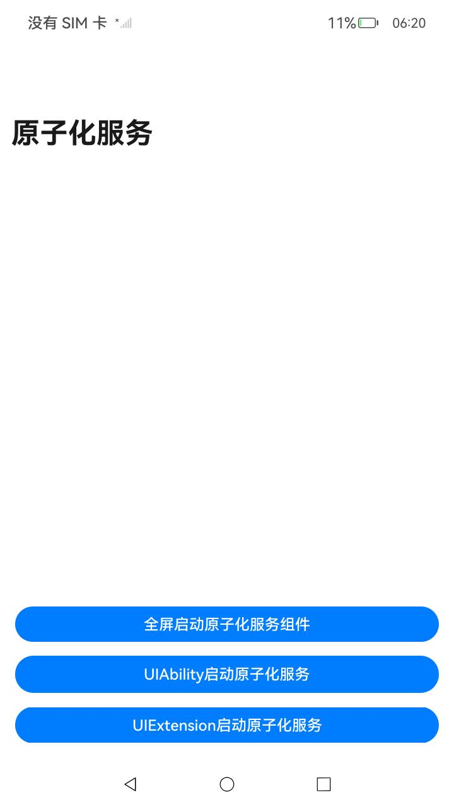

# 全屏启动原子化服务

### 介绍

本示例使用[@ohos.app.ability.EmbeddableUIAbility](https://gitee.com/openharmony/docs/blob/master/zh-cn/application-dev/reference/apis-ability-kit/js-apis-app-ability-embeddableUIAbility.md),[@ohos.arkui.advanced.FullScreenLaunchComponent](https://gitee.com/openharmony/docs/blob/master/zh-cn/application-dev/reference/apis-arkui/arkui-ts/ohos-arkui-advanced-FullScreenLaunchComponent.md)，[UIAbilityContext.openAtomicService](https://gitee.com/openharmony/docs/blob/master/zh-cn/application-dev/reference/apis-ability-kit/js-apis-inner-application-uiAbilityContext.md)，[UIExtensionContext.openAtomicService](https://gitee.com/openharmony/docs/blob/master/zh-cn/application-dev/reference/apis-ability-kit/js-apis-inner-application-uiExtensionContext.md)等接口，展示了如何全屏启动原子化服务。

### 效果预览

| 主页                                      | 原子化服务页面                                         |
|:----------------------------------------|-------------------------------------------------| 
|  |  |

使用说明：

1.安装本应用和原子化服务应用，点击FullScreenStart图标启动FullScreenStart应用。

2.进入应用显示页面，点击页面中"全屏启动原子化服务组件"按钮，通过嵌入式启动原子化服务并跳转到原子化服务应用的计算器页面。

3.关闭原子化服务页面重新进入启动页面，点击"UIAbility启动原子化服务"按钮，通过跳出式启动原子化服务并跳转到原子化服务应用的计算器页面。

4.关闭原子化服务页面重新进入启动页面，点击"UIExtension启动原子化服务"按钮，通过跳出式启动原子化服务并跳转到原子化服务应用的计算器页面。


### 工程目录

```
entry/src/main/ets/
├──entryability
│   └──EntryAbility.ets
├──pages
│   ├──ExtensionIndex.ets            // UIExtenionAbility页面
│   └──Index.ets                     // 启动原子化服务页面
└──uiextensionability
    └──UIExtensionAbility.ets        // UIExtenionAbility实现类
```

### 具体实现

* 本示例分为3个分支：
    * FullScreenLaunchComponent (全屏启动原子化服务组件)
        * 调用FullScreenLaunchComponent全屏启动原子化服务组件，当被拉起方授权使用方可以嵌入式运行原子化服务时，使用方全屏嵌入式运行原子化服务。
        * 源码链接：[Index.ets](entry/src/main/ets/pages/Index.ets)
        * 参考接口：[@ohos.arkui.advanced.FullScreenLaunchComponent](https://gitee.com/openharmony/docs/blob/master/zh-cn/application-dev/reference/apis-arkui/arkui-ts/ohos-arkui-advanced-FullScreenLaunchComponent.md)

    * UIAbility全屏启动原子化服务
        * 调用UIAbilityContext.openAtomicService()，使用方全屏跳出式启动原子化服务。
        * 源码链接：[Index.ets](entry/src/main/ets/pages/Index.ets)
        * 参考接口：[UIAbilityContext.openAtomicService](https://gitee.com/openharmony/docs/blob/master/zh-cn/application-dev/reference/apis-ability-kit/js-apis-inner-application-uiAbilityContext.md)

    * UIExtension全屏启动原子化服务
        * 调用UIExtensionContext.openAtomicService()，使用方全屏跳出式启动原子化服务。
        * 源码链接：[ExtensionIndex.ets](entry/src/main/ets/pages/ExtensionIndex.ets)
        * 参考接口：[UIExtensionContext.openAtomicService](https://gitee.com/openharmony/docs/blob/master/zh-cn/application-dev/reference/apis-ability-kit/js-apis-inner-application-uiExtensionContext.md)

### 相关权限

不涉及。

### 依赖

本示例依赖原子化服务，需要安装[FullScreenStart_Service](https://gitee.com/openharmony/applications_app_samples/tree/master/code/SystemFeature/FullScreenStart/FullScreenStart_Service)原子化服务应用。

### 约束与限制

1.本示例仅支持标准系统上运行，支持设备：RK3568；

2.本示例为Stage模型，支持API12版本SDK，版本号：5.0.0.29；

3.本示例涉及使用系统接口：UIExtensionComponent，需要手动替换Full SDK才能编译通过；

4.本示例需要使用DevEco Studio NEXT Developer Beta1（Build Version: 5.0.3.403, built on June 20, 2024）及以上版本才可编译运行；

5.本示例配置权限为system_basic级别及以上；

6.本示例涉及HarmonyOS特性，需要开发者在[AppGallery Connect](https://developer.huawei.com/consumer/cn/service/josp/agc/index.html#/)内创建原子化服务应用并替换工程内[Index_appId](entry/src/main/ets/pages/Index.ets)，[ExtensionIndex_appId](entry/src/main/ets/pages/ExtensionIndex.ets)。具体创建方式参考[元服务开发准备](https://developer.huawei.com/consumer/cn/doc/atomic-guides-V5/atomic-dev-preparation-V5)。


### 下载

如需单独下载本工程，执行如下命令：

```
git init
git config core.sparsecheckout true
echo code/SystemFeature/FullScreenStart/FullScreenStart/ > .git/info/sparse-checkout
git remote add origin https://gitee.com/openharmony/applications_app_samples.git
git pull origin master
```

