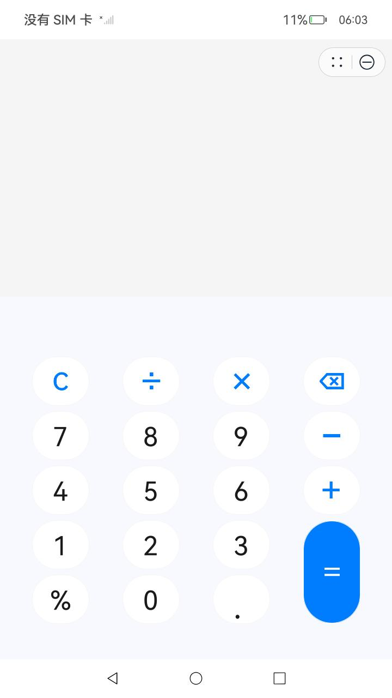

# 原子化服务

### 介绍

本示例对应[全屏启动原子化服务](https://gitee.com/openharmony/applications_app_samples/tree/master/code/SystemFeature/FullScreenStart/FullScreenStart)中的原子化服务

### 效果预览

| 原子化服务页面                                    |
|-------------------------------------------------| 
|  |

使用说明：

1.安装本应用编译生成的hap包和全屏启动原子化服务应用编译生成的hap包，点击FullScreenStart图标即可进入全屏启动原子化服务应用，点击按钮拉起本示例。

### 工程目录

```
├──entry/src/main/ets	                   // 代码区
│  ├──common
│  │  ├──constants
│  │  │  └──CommonConstants.ets            // 公共常量类
│  │  └──util
│  │     ├──CalculateUtil.ets              // 计算工具类
│  │     └──CheckEmptyUtil.ets             // 非空判断工具类
│  ├──entryability
│  │  └──EntryAbility.ts                   // 程序入口类
│  ├──pages
│  │  └──HomePage.ets                      // 计算器页面
│  └──viewmodel    
│     ├──PressKeysItem.ets                 // 按键信息类
│     └──PresskeysViewModel.ets            // 计算器页面键盘数据
└──entry/src/main/resource                 // 应用静态资源目录
```

### 具体实现

* 本示例作为提供方提供原子化服务。

### 相关权限

不涉及。

### 依赖

本示例依赖[FullScreenStart](https://gitee.com/openharmony/applications_app_samples/tree/master/code/SystemFeature/FullScreenStart/FullScreenStart)应用，使用前请先安装该应用。

### 约束与限制

1.本示例仅支持标准系统上运行，支持设备：RK3568；

2.本示例为Stage模型，支持API12版本SDK，版本号：5.0.0.29；

3.本示例涉及使用系统接口：UIExtensionComponent，需要手动替换Full SDK才能编译通过；

4.本示例需要使用DevEco Studio NEXT Developer Beta1（Build Version: 5.0.3.403, built on June 20, 2024）及以上版本才可编译运行；

5.本示例涉及HarmonyOS特性并且只能使用HarmonyOS工程，需要开发者在[AppGallery Connect](https://developer.huawei.com/consumer/cn/service/josp/agc/index.html#/)内创建原子化服务应用并替换工程内[bundleName](AppScope/app.json5)。具体创建方式参考[元服务开发准备](https://developer.huawei.com/consumer/cn/doc/atomic-guides-V5/atomic-dev-preparation-V5)。


### 下载

如需单独下载本工程，执行如下命令：

```
git init
git config core.sparsecheckout true
echo code/SystemFeature/FullScreenStart/FullScreenStart_Service/ > .git/info/sparse-checkout
git remote add origin https://gitee.com/openharmony/applications_app_samples.git
git pull origin master
```

