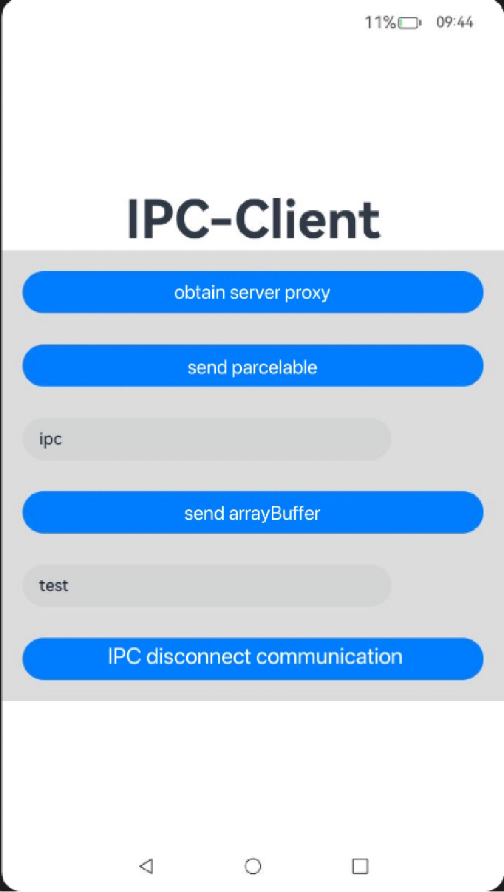
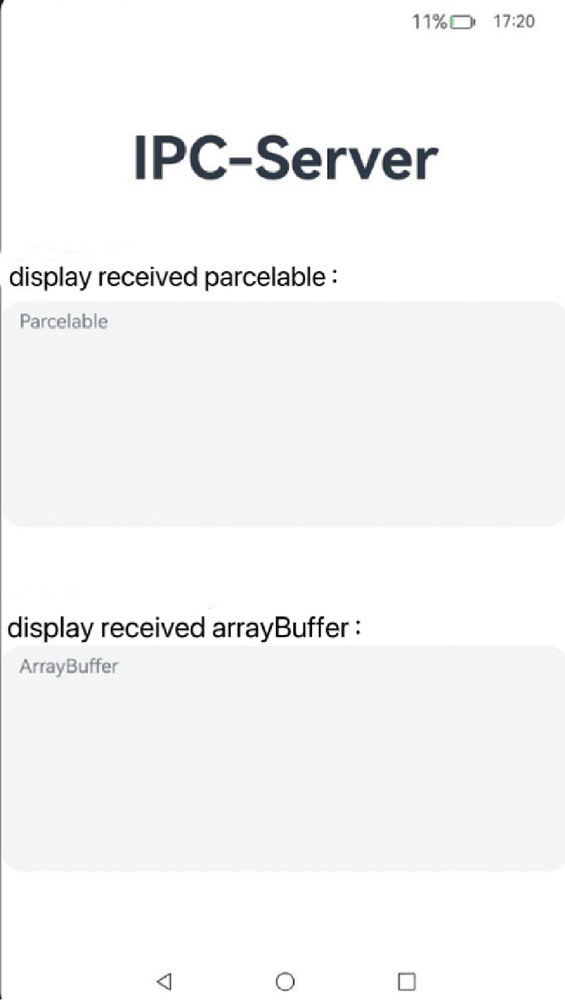
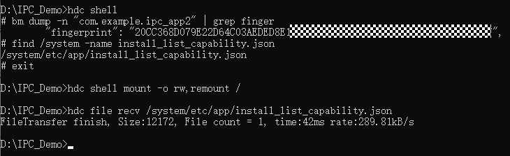
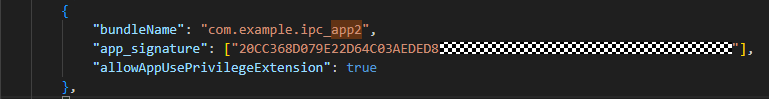

# IPC Example

## 1. Introduction

This example demonstrates how to use the [@ohos.rpc](https://gitcode.com/openharmony/docs/blob/master/en/application-dev/reference/apis-ipc-kit/js-apis-rpc.md) related APIs to develop a complete example of IPC client-server communication, and shows how to use Parcelable/ArrayBuffer objects to pass string information.

### 1.1 Sample UI

|Client|Server|
|-----------------|----------------------|
|||

### 1.2 How to Use

1. Tap **Obtain server proxy** to connect to the server. Enter the content to be sent in the input boxes under **send parcelable** and **send arrayBuffer**, and tap the corresponding buttons to send string information to the server.

2. The information sent from the client will be displayed under the texts **display received parcelable** and **display received arrayBuffer** on the server.

## 2. Project Structure

### Client - IPC_Client

```
entry/src/main/ets/
|---entryability
|   |---EntryAbility.ets              // Entry file
|---pages
|   |---Index.ets                     // Page layout
|---service/cnn
|   |---IPC_Client.ets                // Client capabilities, connecting to server and sending Parcelable and ArrayBuffer
```

### Server - IPC_Service

```
entry/src/main/ets/
|---entryability
|   |---EntryAbility.ets              // Entry file
|---pages
|   |---Index.ets                     // Page layout
|---serviceextability
|   |---IPC_Service.ets               // Server capabilities, receiving and processing data
|   |---ServiceExtAbility.ets         // General Service capabilities
```

## 3. How to Implement

* This example is divided into two major modules.

  ### 3.1 Client-Server Connection and Disconnection

    * 3.1.1 Obtain server proxy: After you tap the button, the server is connected through **connectServiceExtensionAbility()** in **connectIpc()**.
    ```
    let connect: common.ConnectOptions = {
      // Callback to get request result
      onConnect: (elementName, remoteProxy) => {
        hilog.info(DOMAIN, TAG, 'IpcClient:onConnect.callend(server),elementName:'+
          JSON.stringify(elementName))
        proxy = remoteProxy
        ObtainResult.Result = 'success'
        callback()
      },
      onDisconnect: (elementName) => {
        hilog.info(DOMAIN, TAG, 'IpcClient onDisconnect:' + elementName)
      },
      onFailed: (code: number) => {
        ObtainResult.Result = 'error '+code
        hilog.info(DOMAIN, TAG, 'IpcClient onFailed,code:' + code)
        callback()
      },
    }

    // Connect to server extension function
    connectid = context.connectServiceExtensionAbility(want, connect)
    hilog.info(DOMAIN, TAG, 'IpcClient connectid:' + connectid)
    ```

    * 3.1.2 Disconnect from the server proxy: After you tap the button, the connection is disabled through **disconnectServiceExtensionAbility()** in **disConnectIpc()**.
    ```
    function disConnectIpc(context: common.UIAbilityContext) {
      if (connectid != undefined) {
        context.disconnectServiceExtensionAbility(connectid);
        proxy = undefined;
      } 
    }
    ```
  
    Source code reference: [IPC_Client.ets](entry/src/main/ets/client/cnn/IPC_Client.ets)
  
    Interface reference: [@ohos.rpc](https://gitcode.com/openharmony/docs/blob/master/en/application-dev/reference/apis-ipc-kit/js-apis-rpc.md)
  
    [IPC and RPC Development](https://docs.openharmony.cn/pages/v5.0/en/application-dev/ipc/ipc-rpc-development-guideline.md)


  ### 3.2 Client Sending Data and Server Receiving Data

    * 3.2.1 Sending data through Parcelable objects:
      
      (1) Create a **MessageSequence** object through **rpc.MessageSequence.create()** in **sendParcelable()** of the client's **IPC_Client.ets**;
      ```
      let data = rpc.MessageSequence.create()
      ```
      (2) Write the **Parcelable** object encapsulating string information into the **MessageSequence** object through **MessageSequence.writeParcelable()**;
      ```
      // Depend on how the MyParcelable class is defined, or what data type needs to be passed during serialization;
      // In this example, MyParcelable takes number and string as examples, and the server receives string.
      let parcelable = new MyParcelable(1, str); 
      data.writeParcelable(parcelable);
      ```
      (3) Send the **Parcelable** object containing the string to be sent to the server process through **rpc.RemoteObject.sendMessageRequest()** in **sendData()**;
      ```
      // Use the proxy object returned after successful connection to the service to send messages.
      proxy.sendMessageRequest(code, data, reply, options)
        .then((result: rpc.RequestResult) => {
          if (result.errCode === 0) {
            hilog.info(DOMAIN, TAG, 'sendMessageRequest got result');
            try {
              let rsp = result.reply.readString()
              hilog.info(DOMAIN, TAG, 'IpcClient result.' + rsp);
            } catch (error) {
              let e: BusinessError = error as BusinessError;
              hilog.error(DOMAIN, TAG, 'rpc read exception fail, error is ' + e);
            }
          } else {
            hilog.error(DOMAIN, TAG, 'RPCTest: sendMessageRequest failed, errCode: ' + result.errCode);
          }
        }).catch((e: Error) => {
        hilog.error(DOMAIN, TAG, 'RPCTest: sendMessageRequest got exception: ' + e);
      }).finally (() => {
        hilog.info(DOMAIN, TAG, 'RPCTest: sendMessageRequest ends, reclaim parcel');
        data.reclaim();
        reply.reclaim();
      });
      ```

  * 3.2.2 Sending data through ArrayBuffer objects:
    
    (1) Create a **MessageSequence** object through **rpc.MessageSequence.create()** in **sendArrayBuffer()** of the client's **IPC_Client.ets**.
      ```
      let data = rpc.MessageSequence.create()
      ```

    (2) Convert the string to be sent to ArrayBuffer, then write the **ArrayBuffer** object into the **MessageSequence** object through **MessageSequence.writeArrayBuffer()**.
      ```
      let buffer = new ArrayBuffer(str.length);
      let Uint8View = new Uint8Array(buffer);
      for (let i = 0; i < str.length; i++) {
        Uint8View[i] = str.charCodeAt(i);
      }
      // Perform verification.
      data.writeInterfaceToken(proxy.getDescriptor())
      // Write ArrayBuffer.
      data.writeArrayBuffer(buffer, rpc.TypeCode.UINT8_ARRAY);
      ```

    (3) Send the **ArrayBuffer** object containing the string to be sent to the server process through **rpc.RemoteObject.sendMessageRequest()** in **sendData()**.
      ```
      // Use the proxy object returned after successful connection to the service to send messages.
      proxy.sendMessageRequest(code, data, reply, options)
        .then((result: rpc.RequestResult) => {
          if (result.errCode === 0) {
            hilog.info(DOMAIN, TAG, 'sendMessageRequest got result');
            try {
              let rsp = result.reply.readString()
              hilog.info(DOMAIN, TAG, 'IpcClient result.' + rsp);
            } catch (error) {
              let e: BusinessError = error as BusinessError;
              hilog.error(DOMAIN, TAG, 'rpc read exception fail, error is ' + e);
            }
          } else {
            hilog.error(DOMAIN, TAG, 'RPCTest: sendMessageRequest failed, errCode: ' + result.errCode);
          }
        }).catch((e: Error) => {
        hilog.error(DOMAIN, TAG, 'RPCTest: sendMessageRequest got exception: ' + e);
      }).finally (() => {
        hilog.info(DOMAIN, TAG, 'RPCTest: sendMessageRequest ends, reclaim parcel');
        data.reclaim();
        reply.reclaim();
      });
      ```
    Source code reference: [IPC_Client.ets](entry/src/main/ets/client/cnn/IPC_Client.ets)
    
    Interface reference: [@ohos.rpc](https://gitcode.com/openharmony/docs/blob/master/en/application-dev/reference/apis-ipc-kit/js-apis-rpc.md)
    
    [IPC and RPC Development](https://docs.openharmony.cn/pages/v5.0/en/application-dev/ipc/ipc-rpc-development-guideline.md)

  * 3.2.3 Server reading data:
    
    (1) Create a ServiceExtensionAbility and return a **StubServer** object in the **onConnect** callback.
      ```
      let globalStubServer: StubServer | undefined

      function getInstance(): StubServer {
        if (globalStubServer == undefined) {
          globalStubServer = new StubServer('serverStub_App2')
        }
        return globalStubServer
      }

      export default class ServiceExtension extends ServiceExtensionAbility {
        onCreate(want: Want) {
          hilog.info(DOMAIN, TAG, 'ServiceExtensionAbility onCreate,want param:' + JSON.stringify(want) ?? ' ')
        }

        onRequest(want: Want, startId: number) {
          hilog.info(DOMAIN, TAG,
            'ServiceExtensionAbility onRequest,want param:' + JSON.stringify(want) ?? "+,startId:" + JSON.stringify(startId))
        }

        onConnect(want: Want): rpc.RemoteObject | Promise<rpc.RemoteObject> {
          hilog.info(DOMAIN, TAG, 'ServiceExtensionAbility onConnect,want param:' + JSON.stringify(want) ?? "")
          return getInstance()
        }

        onDisconnect(want: Want) {
          hilog.info(DOMAIN, TAG, 'ServiceExtensionAbility onDisconnect,want param::' + JSON.stringify(want))
        }

        onDestroy() {
          hilog.info(DOMAIN, TAG, 'ServiceExtensionAbility onDestroy')
        }
      }
      ```

    (2) The API for processing MessageRequest requests is encapsulated in StubServer, where the transmitted data is received.
      ```
      onRemoteMessageRequest(code: number, data: rpc.MessageSequence, reply: rpc.MessageSequence,
        options: rpc.MessageOption): boolean | Promise<boolean> {
        hilog.info(DOMAIN, TAG, 'Client Send code:' + code)
        let descriptor = this.getDescriptor()
        // Perform verification.
        if (descriptor != data.readInterfaceToken()) {
          hilog.info(DOMAIN, TAG, 'VERIFICATION FAILED');
          return false;
        }

        onHandleClientReq(code, data, reply)
        return true
      }
      ```
    
    (3) Then process the received MessageSequence information through **onHandleClientReq()**. According to different code values (Parcelable: 1001, ArrayBuffer: 1002), use **rpc.RemoteObject.readParcelable()** and **rpc.RemoteObject.readArrayBuffer()** respectively to obtain the transmitted objects, and get the string passed from the client by parsing the objects.
      ```
      function onHandleClientReq(code: number, data: rpc.MessageSequence, reply: rpc.MessageSequence) {
        hilog.info(DOMAIN, TAG, 'onHandle Client,code:' + code)
        switch (code) {
          // Receive Parcelable object.
          case 1001: 
            let parcelable = new MyParcelable(0, '');
            data.readParcelable(parcelable);
            dataStatus.updataParcelable(parcelable.str)
            hilog.info(DOMAIN, TAG, 'read parcelable: ' + parcelable.str);
            break
          // Receive ArrayBuffer object.
          case 1002: 
            let result = data.readArrayBuffer(rpc.TypeCode.UINT8_ARRAY);
            let decoder = util.TextDecoder.create('utf-8');
            let stringData = decoder.decodeToString(new Uint8Array(result));
            dataStatus.updataArrayBuffer(stringData)
            hilog.info(DOMAIN, TAG, 'read arraybuffer: ' + stringData);
            break
          default:
            hilog.info(DOMAIN, TAG, 'onHandleClient-default,code: ' + 1001);
            break
        }
      }
      ```
    Source code reference: [IPC_Service.ets](../IPC_Service/entry/src/main/ets/serviceextability/IPC_Service.ets)

    API reference: [@ohos.rpc](https://gitcode.com/openharmony/docs/blob/master/en/application-dev/reference/apis-ipc-kit/js-apis-rpc.md)

    [IPC and RPC Development](https://docs.openharmony.cn/pages/v5.0/en/application-dev/ipc/ipc-rpc-development-guideline.md)


## 4. Related Permissions

Since Service Ability (the application where the server is located) can only be called by system applications, the IPC communication mechanism is not open to ordinary applications in a single framework, so the server needs to apply for system application permissions.
(The server needs to provide ohos-sdk-full.)

4.1 Configure permissions: Configure the following permissions in the module under the server's entry: [module.json5](../IPC_Service/entry/src/main/module.json5) (lines 38-45).

  ```
  "extensionAbilities": [
  // Configure IpcServiceExtAbility.
    {
      "name": "IpcServiceExtAbility",
      "srcEntry": "./ets/serviceextability/ServiceExtAbility.ets",
      "type": "service",
      "exported": true,
      "description": "service"
    }
  ]
  ```

4.2 Comment out the permissions added in "4.1 Configure permissions", and run the project and push the server hap to the device.

4.3 Register the system application permissions required by the server to the device.

  4.3.1 Obtain the signature fingerprint and the **install_list_capability.json** file.

  

  4.3.2 Add the following permission information to the **install_list_capability.json** file pulled to the local.


    {
      "bundleName": "Application bundle name",
      "app_signature": ["Signature fingerprint obtained in 4.3.1"],
      // Add system application permission
      "allowAppUsePrivilegeExtension": true    
    },



  4.3.3 Push the **install_list_capability.json** file with added permissions to the original path of the device and restart the device.

    ```
    hdc shell mount -o rw,remount / 
    hdc file send install_list_capability.json /system/etc/app/install_list_capability.json 
    hdc shell chmod 777 /system/etc/app/install_list_capability.json 
    hdc shell reboot
    ``` 

4.4 Uncomment the permissions added in "4.1 Configure permissions", and run the project. At this time, the hap has IpcServiceExtAbility.

## 5. Dependencies

This application depends on the [IPC_Service](../IPC_Service/) for IPC.

## 6. Constraints

6.1 This example only supports running on standard systems, supporting RK3568.

6.2 This example involves the use of system APIs: **UIAbilityContext.connectServiceExtensionAbility**, which requires manual replacement of the Full SDK to compile successfully. It is recommended to use the latest version of the Full SDK. To download the Full SDK, visit the [link](https://ci.openharmony.cn/workbench/cicd/dailybuild/dailylist).

6.3 It is recommended to compile and run this example with DevEco Studio 5.0.2 Beta1 (build version: 5.0.7.100 built on January 16, 2025) or later.

6.4 This example recommends using API version 16 SDK, version number: 5.1.0.46.

## 7. Download

To download this project and the server separately, execute the following commands:

```
git init
git config core.sparsecheckout true
echo code/BasicFeature/Connectivity/IPC/ObjectTransfer/ > .git/info/sparse-checkout
git remote add origin https://gitee.com/openharmony/applications_app_samples.git
git pull origin master
```