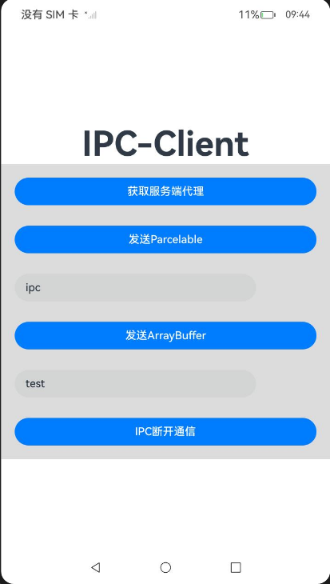
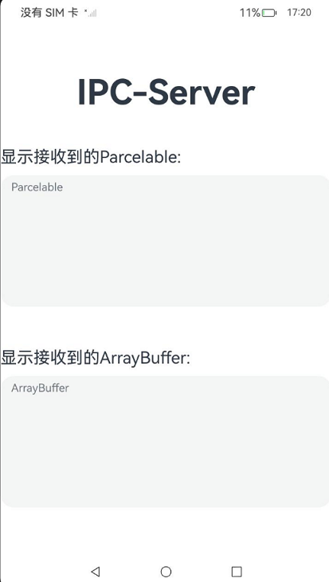
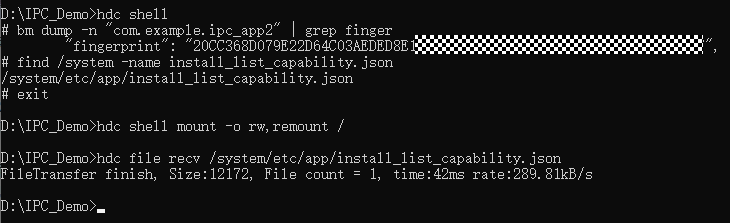
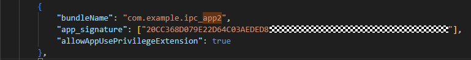

# IPC通信示例

## 一、介绍

本示例展示了如何使用[@ohos.rpc](https://gitee.com/openharmony/docs/blob/master/zh-cn/application-dev/reference/apis-ipc-kit/js-apis-rpc.md) 相关接口，开发一个IPC客户端与服务端通信的完整示例，并在此示例中演示如何使用Parcelable/ArrayBuffer对象传递字符串信息。

### 1.1、示例界面：
|客户端|服务端|
|-----------------|----------------------|
|||

### 1.2、使用说明：

1. 点击“获取服务端代理”进行连接服务端，在“发送Parcelable”和“发送ArrayBuffer”底下的输入框中输入发送内容，点击对应按钮即可发送字符串信息至服务端；

2. 在服务端的“显示接收到的Parcelable”、“显示接收到的ArrayBuffer”文本下显示从客户端发来的对应信息；


## 二、工程目录
### 客户端-IPC_Client
```
entry/src/main/ets/
|---entryability
|   |---EntryAbility.ets              // 入口文件
|---pages
|   |---Index.ets                     // 页面布局
|---service/cnn
|   |---IPC_Client.ets                // 客户端能力，连接服务端，发送Parcelable和ArrayBuffer
```

### 服务端-IPC_Service
```
entry/src/main/ets/
|---entryability
|   |---EntryAbility.ets              // 入口文件
|---pages
|   |---Index.ets                     // 页面布局
|---serviceextability
|   |---IPC_Service.ets               // 服务端能力，接收、处理数据
|   |---ServiceExtAbility.ets         // Service通用能力
```

## 三、具体实现

* 本示例分为两大模块

  ### 3.1、客户端与服务端的连接和断开模块

    * 3.1.1、获取服务端代理：按下按钮后，通过connectIpc()中的connectServiceExtensionAbility()进行连接服务端;
    ```
    let connect: common.ConnectOptions = {
      //回调获取请求结果
      onConnect: (elementName, remoteProxy) => {
        hilog.info(DOMAIN, TAG, 'IpcClient:onConnect.callend(server),elementName:'+
          JSON.stringify(elementName))
        proxy = remoteProxy
        ObtainResult.Result = 'success'
        callback()
      },
      onDisconnect: (elementName) => {
        hilog.info(DOMAIN, TAG, 'IpcClient onDisconnect:' + elementName)
      },
      onFailed: (code: number) => {
        ObtainResult.Result = 'error '+code
        hilog.info(DOMAIN, TAG, 'IpcClient onFailed,code:' + code)
        callback()
      },
    }

    //连接至服务端扩展功能
    connectid = context.connectServiceExtensionAbility(want, connect)
    hilog.info(DOMAIN, TAG, 'IpcClient connectid:' + connectid)
    ```
    * 3.1.2、断开服务端代理：按下按钮后，通过disConnectIpc()disconnectServiceExtensionAbility()进行断开连接;
    ```
    function disConnectIpc(context: common.UIAbilityContext) {
      if (connectid != undefined) {
        context.disconnectServiceExtensionAbility(connectid);
        proxy = undefined;
      } 
    }
    ```
    
    源码参考：[IPC_Client.ets](entry/src/main/ets/client/cnn/IPC_Client.ets);
    
    接口参考：[@ohos.rpc](https://gitee.com/openharmony/docs/blob/master/zh-cn/application-dev/reference/apis-ipc-kit/js-apis-rpc.md);
    
    [IPC与RPC通信开发指南](https://docs.openharmony.cn/pages/v5.0/zh-cn/application-dev/ipc/ipc-rpc-development-guideline.md)


  ### 3.2、客户端发送数据与服务端接收数据

    * 3.2.1、通过Parcelable对象发送数据：
      
      (1).在客户端的IPC_Client.ets中的sendParcelable()中通过rpc.MessageSequence.create()创建MessageSequence对象；
      ```
      let data = rpc.MessageSequence.create()
      ```
      (2).通过MessageSequence.writeParcelable()将封装字符串信息的Parcelable对象写入MessageSequence对象中；
      ```
      //取决于MyParcelable类如何定义，或需要序列化时准备传递什么数据类型;
      //本示例中MyParcelable是以number和string为例，且服务端接收string
      let parcelable = new MyParcelable(1, str); 
      data.writeParcelable(parcelable);
      ```
      (3).通过sendData()中的rpc.RemoteObject.sendMessageRequest()将包裹待发送字符串的Parcelable对象发送到服务端进程中；
      ```
      //用连接服务成功后返回的对象proxy，进行消息发送
      proxy.sendMessageRequest(code, data, reply, options)
        .then((result: rpc.RequestResult) => {
          if (result.errCode === 0) {
            hilog.info(DOMAIN, TAG, 'sendMessageRequest got result');
            try {
              let rsp = result.reply.readString()
              hilog.info(DOMAIN, TAG, 'IpcClient result.' + rsp);
            } catch (error) {
              let e: BusinessError = error as BusinessError;
              hilog.error(DOMAIN, TAG, 'rpc read exception fail, error is ' + e);
            }
          } else {
            hilog.error(DOMAIN, TAG, 'RPCTest: sendMessageRequest failed, errCode: ' + result.errCode);
          }
        }).catch((e: Error) => {
        hilog.error(DOMAIN, TAG, 'RPCTest: sendMessageRequest got exception: ' + e);
      }).finally (() => {
        hilog.info(DOMAIN, TAG, 'RPCTest: sendMessageRequest ends, reclaim parcel');
        data.reclaim();
        reply.reclaim();
      });
      ```

  * 3.2.2、通过ArrayBuffer对象发送数据：
    
    (1).在客户端的IPC_Client.ets中的sendArrayBuffer()中通过rpc.MessageSequence.create()创建MessageSequence对象；
      ```
      let data = rpc.MessageSequence.create()
      ```

    (2).然后将待发送字符串转为ArrayBuffer，之后通过MessageSequence.writeArrayBuffer()将ArrayBuffer对象写入MessageSequence对象中；
      ```
      let buffer = new ArrayBuffer(str.length);
      let Uint8View = new Uint8Array(buffer);
      for (let i = 0; i < str.length; i++) {
        Uint8View[i] = str.charCodeAt(i);
      }
      //进行校验
      data.writeInterfaceToken(proxy.getDescriptor())
      //写入ArrayBuffer
      data.writeArrayBuffer(buffer, rpc.TypeCode.UINT8_ARRAY);
      ```

    (3).通过sendData()中的rpc.RemoteObject.sendMessageRequest()将包裹待发送字符串的ArrayBuffer对象发送到服务端进程中；
      ```
      //用连接服务成功后返回的对象proxy，进行消息发送
      proxy.sendMessageRequest(code, data, reply, options)
        .then((result: rpc.RequestResult) => {
          if (result.errCode === 0) {
            hilog.info(DOMAIN, TAG, 'sendMessageRequest got result');
            try {
              let rsp = result.reply.readString()
              hilog.info(DOMAIN, TAG, 'IpcClient result.' + rsp);
            } catch (error) {
              let e: BusinessError = error as BusinessError;
              hilog.error(DOMAIN, TAG, 'rpc read exception fail, error is ' + e);
            }
          } else {
            hilog.error(DOMAIN, TAG, 'RPCTest: sendMessageRequest failed, errCode: ' + result.errCode);
          }
        }).catch((e: Error) => {
        hilog.error(DOMAIN, TAG, 'RPCTest: sendMessageRequest got exception: ' + e);
      }).finally (() => {
        hilog.info(DOMAIN, TAG, 'RPCTest: sendMessageRequest ends, reclaim parcel');
        data.reclaim();
        reply.reclaim();
      });
      ```
    源码参考：[IPC_Client.ets](entry/src/main/ets/client/cnn/IPC_Client.ets);
    
    接口参考：[@ohos.rpc](https://gitee.com/openharmony/docs/blob/master/zh-cn/application-dev/reference/apis-ipc-kit/js-apis-rpc.md);
    
    [IPC与RPC通信开发指南](https://docs.openharmony.cn/pages/v5.0/zh-cn/application-dev/ipc/ipc-rpc-development-guideline.md);

  * 3.2.3、服务端读取数据：
    
    (1).创建一个ServiceExtensionAbility，并在onConnect回调中返回一个StubServer对象；
      ```
      let globalStubServer: StubServer | undefined

      function getInstance(): StubServer {
        if (globalStubServer == undefined) {
          globalStubServer = new StubServer('serverStub_App2')
        }
        return globalStubServer
      }

      export default class ServiceExtension extends ServiceExtensionAbility {
        onCreate(want: Want) {
          hilog.info(DOMAIN, TAG, 'ServiceExtensionAbility onCreate,want param:' + JSON.stringify(want) ?? ' ')
        }

        onRequest(want: Want, startId: number) {
          hilog.info(DOMAIN, TAG,
            'ServiceExtensionAbility onRequest,want param:' + JSON.stringify(want) ?? "+,startId:" + JSON.stringify(startId))
        }

        onConnect(want: Want): rpc.RemoteObject | Promise<rpc.RemoteObject> {
          hilog.info(DOMAIN, TAG, 'ServiceExtensionAbility onConnect,want param:' + JSON.stringify(want) ?? "")
          return getInstance()
        }

        onDisconnect(want: Want) {
          hilog.info(DOMAIN, TAG, 'ServiceExtensionAbility onDisconnect,want param::' + JSON.stringify(want))
        }

        onDestroy() {
          hilog.info(DOMAIN, TAG, 'ServiceExtensionAbility onDestroy')
        }
      }
      ```

    (2).处理MessageRequest请求的接口封装在StubServer里面，在这里接收传递来的数据；
      ```
      onRemoteMessageRequest(code: number, data: rpc.MessageSequence, reply: rpc.MessageSequence,
        options: rpc.MessageOption): boolean | Promise<boolean> {
        hilog.info(DOMAIN, TAG, 'Client Send code:' + code)
        let descriptor = this.getDescriptor()
        // 进行校验
        if (descriptor != data.readInterfaceToken()) {
          hilog.info(DOMAIN, TAG, 'VERIFICATION FAILED');
          return false;
        }

        onHandleClientReq(code, data, reply)
        return true
      }
      ```
    
    (3).然后经过onHandleClientReq()处理接收的MessageSequence信息，通过不同的code值（Parcelable：1001，ArrayBuffer：1002），分别使用rpc.RemoteObject.readParcelable()和rpc.RemoteObject.readArrayBuffer()获取传递来的对象，通过解析该对象获得客户端传递来的字符串；
      ```
      function onHandleClientReq(code: number, data: rpc.MessageSequence, reply: rpc.MessageSequence) {
        hilog.info(DOMAIN, TAG, 'onHandle Client,code:' + code)
        switch (code) {
          //接收Parcelable对象
          case 1001: 
            let parcelable = new MyParcelable(0, '');
            data.readParcelable(parcelable);
            dataStatus.updataParcelable(parcelable.str)
            hilog.info(DOMAIN, TAG, 'read parcelable: ' + parcelable.str);
            break
          //接收ArrayBuffer对象
          case 1002: 
            let result = data.readArrayBuffer(rpc.TypeCode.UINT8_ARRAY);
            let decoder = util.TextDecoder.create('utf-8');
            let stringData = decoder.decodeToString(new Uint8Array(result));
            dataStatus.updataArrayBuffer(stringData)
            hilog.info(DOMAIN, TAG, 'read arraybuffer: ' + stringData);
            break
          default:
            hilog.info(DOMAIN, TAG, 'onHandleClient-default,code: ' + 1001);
            break
        }
      }
      ```
    源码参考：[IPC_Service.ets](../IPC_Service/entry/src/main/ets/serviceextability/IPC_Service.ets);

    接口参考：[@ohos.rpc](https://gitee.com/openharmony/docs/blob/master/zh-cn/application-dev/reference/apis-ipc-kit/js-apis-rpc.md);

    [IPC与RPC通信开发指南](https://docs.openharmony.cn/pages/v5.0/zh-cn/application-dev/ipc/ipc-rpc-development-guideline.md);


## 四、相关权限

由于Service Ability（服务端所在应用）只能被系统应用调用，所以IPC通信机制在单框架上不对普通应用开放，故服务端需要申请系统应用权限。
(服务端需提供ohos-sdk-full)

4.1、配置权限：在服务端entry下的module中配置如下权限：[module.json5](IPC_Service/entry/src/main/module.json5),参考第38-45行。
  ```
  "extensionAbilities": [
  //配置IpcServiceExtAbility能力
    {
      "name": "IpcServiceExtAbility",
      "srcEntry": "./ets/serviceextability/ServiceExtAbility.ets",
      "type": "service",
      "exported": true,
      "description": "service"
    }
  ]
  ```

4.2、将“4.1.配置权限”中添加的权限注释起来，然后运行工程，在设备上推送服务端hap。

4.3、将服务端需要的系统应用权限注册到设备：

  4.3.1、 获取签名指纹，及获取install_list_capability.json文件
  
  

  4.3.2、 在拉取到本地的install_list_capability.json文件中添加如下权限信息：

    
    {
      "bundleName": "应用包名",
      "app_signature": ["4.3.1获取到的签名指纹"],
      //添加系统应用权限
      "allowAppUsePrivilegeExtension": true    
    },
    


  4.3.3、 将添加权限后的install_list_capability.json文件推送至设备原路径，并重启设备

    ```
    hdc shell mount -o rw,remount / 
    hdc file send install_list_capability.json /system/etc/app/install_list_capability.json 
    hdc shell chmod 777 /system/etc/app/install_list_capability.json 
    hdc shell reboot
    ``` 
  

4.4、将“4.1.配置权限”中添加的权限取消注释，然后运行工程，此时的hap具有IpcServiceExtAbility。

## 五、依赖

本应用需依赖[IPC_Service](../IPC_Service/)端来进行IPC通信。

## 六、约束与限制

6.1、本示例仅支持在标准系统上运行，支持RK3568；

6.2、本示例涉及使用系统接口：UIAbilityContext.connectServiceExtensionAbility，需要手动替换Full SDK才能编译通过，推荐使用最新版本Full SDK。[Full SDK下载链接](https://ci.openharmony.cn/workbench/cicd/dailybuild/dailylist)；

6.3、本示例推荐使用DevEco Studio 5.0.2 Beta1 (Build Version: 5.0.7.100 构建 2025年1月16日)及以上版本编译运行。

6.4、本示例推荐使用API version 16版本SDK，版本号：5.1.0.46。

## 七、下载

如需单独下载本工程及服务端，执行如下命令：

```
git init
git config core.sparsecheckout true
echo code/BasicFeature/Connectivity/IPC/ObjectTransfer/ > .git/info/sparse-checkout
git remote add origin https://gitee.com/openharmony/applications_app_samples.git
git pull origin master
``` 