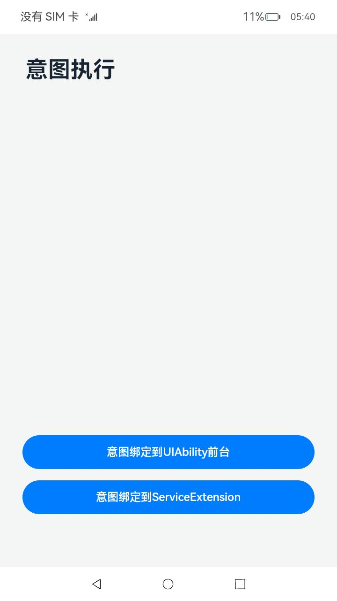
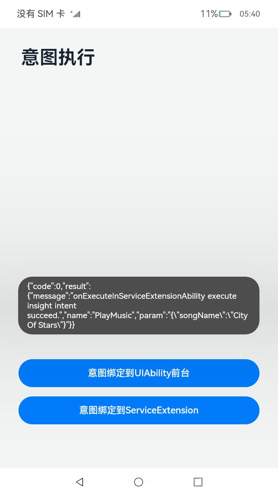

# 意图执行

### 介绍

本示例使用[@ohos.app.ability.InsightIntentExecutor](https://gitee.com/openharmony/docs/blob/master/zh-cn/application-dev/reference/apis/js-apis-app-ability-insightIntentExecutor.md)、[@ohos.app.ability.insightIntent](https://gitee.com/openharmony/docs/blob/master/zh-cn/application-dev/reference/apis/js-apis-app-ability-insightIntent.md)、[@ohos.app.ability.insightIntentDriver](https://gitee.com/openharmony/docs/blob/master/zh-cn/application-dev/reference/apis/js-apis-app-ability-insightIntentDriver.md)等接口，展示了意图绑定到UIAbility前台执行、意图绑定到ServiceExtension执行两种意图执行方法，主要包括构造意图配置文件、构造意图调用执行参数、触发意图调用的执行、取得意图调用结果等。

### 效果预览：

| 主页                                                         | 意图绑定到UIAbility前台执行<br>(参照应用[IntentExecutor](../../../BasicFeature/InsightIntent/IntentExecutor)） | 意图绑定到ServiceExtension执行                               |
| ------------------------------------------------------------ | ------------------------------------------------------------ | ------------------------------------------------------------ |
|  |  |  |

使用说明

1.启动应用后，主页面上显示两个按钮：意图绑定到UIAbility前台、意图绑定到ServiceExtension；

2.点击按钮“意图绑定到UIAbility前台”，触发意图执行，在意图调用业务逻辑中加载新的页面，返回意图调用结果通过promptAction.showToast显示结果；

3.点击按钮“意图绑定到ServiceExtension”，触发意图执行，返回意图调用结果并通过promptAction.showToast显示结果；

### 工程目录

```
entry/src/main/
├─ets
│  ├─entryability
│  │  └─EntryAbility.ets				  // UIAbility，意图绑定到该UIAbility前台执行
│  ├─intents
│  │  ├─PlayMusicIntentDriver.ets	      // 通过insightIntentDriver.execute执行意图调用
│  │  └─PlayMusicIntentExecutorImpl.ets	  // 通过意图调用执行基类对接端侧意图框架，实现响应意图调用的业务逻辑
│  ├─pages
│  │  └─Index.ets				          // 主页面，通过按钮点击事件将意图调用转发给模块PlayMusicIntentDriver
│  ├─serviceextability
│  │  └─ServiceExtAbility.ets			  // ServiceExtensionAbility，意图绑定到该ServiceExtension执行
│  └─util
│     └─Logger.ets				          // 日志工具
└─resources
    └─base
      └─profile
         └─insight_intent.json            // 意图配置文件
```

### 具体实现

* 实现意图调用业务逻辑的功能接口封装在PlayMusicIntentExecutorImpl，源码参考：[PlayMusicIntentExecutorImpl.ets](entry/src/main/ets/intents/PlayMusicIntentExecutorImpl.ets)
    * 意图绑定到ServiceExtension运行的业务逻辑：
    
      实现意图调用执行基类InsightIntentExecutor的onExecuteInServiceExtensionAbility()回调函数；
    
* 触发意图调用的接口封装在PlayMusicIntentDriver，源码参考：[PlayMusicIntentDriver.ets](entry/src/main/ets/intents/PlayMusicIntentDriver.ets)
    * 触发绑定到UIAbility前台运行的意图调用：
    在函数executeUIAbilityForeground中，构造意图调用执行参数，调用@ohos.app.ability.insightIntentDriver中的execute接口触发意图调用；
    
    * 触发绑定到ServiceExtension运行的意图调用：
    
      在函数executeServiceExtension中，构造意图调用执行参数，调用@ohos.app.ability.insightIntentDriver中的execute接口触发意图调用；

* 在意图配置文件[insight_intent.json](entry/src/main/resources/base/profile/insight_intent.json)中配置应用支持的意图API列表
    * 配置内容包括：
    意图API名称、意图API所属的垂域、意图API版本号、代码相对路径入口、执行模式等；
    
* 在主页面[Index.ets](entry/src/main/ets/pages/Index.ets)中通过按钮的onClick事件将意图调用转发给模块PlayMusicIntentDriver
    * 意图绑定到UIAbility前台按钮
      点击按钮时，调用PlayMusicIntentDriver的executeUIAbilityForeground函数，触发意图调用；
    * 意图绑定到ServiceExtension按钮
      点击按钮时，调用PlayMusicIntentDriver的executeServiceExtension函数，触发意图调用；

### 相关权限

[ohos.permission.EXECUTE_INSIGHT_INTENT](https://gitee.com/openharmony/docs/blob/master/zh-cn/application-dev/security/permission-list.md)

### 依赖

本应用的运行依赖应用[IntentExecutor](../../../BasicFeature/InsightIntent/IntentExecutor)。

### 约束与限制

1.本示例仅支持标准系统上运行，支持设备：RK3568;

2.本示例为Stage模型，支持API11版本SDK，版本号：4.1.3.1；

3.本示例涉及使用系统接口：insightIntentDriver.execute，需要手动替换Full SDK才能编译通过；

4.本示例需要使用DevEco Studio 3.1.1 Release (Build Version: 3.1.0.501, built on June 20, 2023)才可编译运行；

5.本示例涉及[ohos.permission.EXECUTE_INSIGHT_INTENT](https://gitee.com/openharmony/docs/blob/master/zh-cn/application-dev/security/permission-list.md)权限为system_basic级别，需要配置高权限签名；

6.本示例使用了ServiceExtensionAbility，需要手动配置特权应用能力申请"app-privilege-capabilities": ["AllowAppUsePrivilegeExtension"]，否则安装失败。具体操作指南可参考[应用特权配置指南]( https://gitee.com/openharmony/docs/blob/eb73c9e9dcdd421131f33bb8ed6ddc030881d06f/zh-cn/device-dev/subsystems/subsys-app-privilege-config-guide.md/ )。在文件最后添加内容：    
    "app-privilege-capabilities" : [
        "AllowAppUsePrivilegeExtension"
    ]

7.本示例中使用到ServiceExtensionAbility，需要将本示例加入到白名单中再进行安装。详细内容如下
{
    "bundleName": "com.samples.intentdriver",
    "app_signature" : [],
    "allowAppUsePrivilegeExtension": true
}

### 下载

如需单独下载本工程，执行如下命令：

```
git init
git config core.sparsecheckout true
echo code/SystemFeature/InsightIntent/IntentDriver/ > .git/info/sparse-checkout
git remote add origin https://gitee.com/openharmony/applications_app_samples.git
git pull origin master
```
