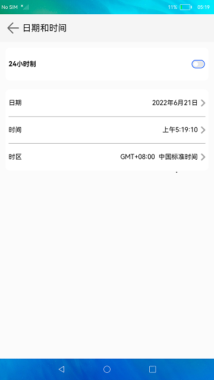
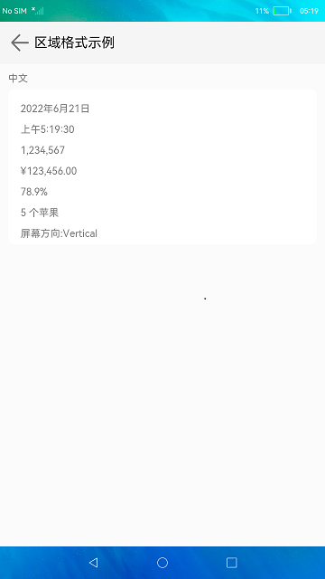

# 国际化（仅对系统应用开放）

### 介绍

本示例展示了i18n，intl，resourceManager在eTS中的使用，使用相关api实现系统语言和地区设置、时间和时区设置，展示了区域格式化示例。

### 效果预览

|主页| 语言和地区                                                       | 日期和时间                                            | 区域格式示例                                             |
|--------------------------------|-------------------------------------------------------------|--------------------------------------------------|----------------------------------------------------|
| |  |  |  |

使用说明

1.启动应用，进入应用，首页分为三个按钮，点击**语言和地区**可以进入界面设置系统语言和地区。

2.点击**日期和时间**，可以进入界面设置系统时间和时区。

3.点击**区域格式示例**进入界面展示当前区域，当前系统语言下的时间、数字、货币、百分比、单复数、屏幕方向等信息的格式化显示。

### 工程目录
```
International
├── AppScope                                    
│   └── app.json5                               //APP信息配置文件
├── entry/src/main                              //国际化应用
│   ├── ets
│   │   ├── entryability
│   │   ├── compnents                           //公共组件
│   │   ├── international                       //国际化业务
│   │   │   └── pages                           //国际化业务页面
│   │   │   │   ├── AddLanguage.ets             //添加语言
│   │   │   │   ├── DateAndTime.ets             //时间和日期
│   │   │   │   ├── EditPreferred.ets           //编辑功能
│   │   │   │   ├── Examples.ets                //区域格式示例
│   │   │   │   ├── Language.ets                //语言
│   │   │   │   ├── Region.ets                  //地区
│   │   │   │   └── TimeZone.ets                //区域
│   │   ├── pages
│   │   │   └──Index.ets                        //主页入口
│   │   ├── utils                               //工具类
│   └── module.json5
```
### 具体实现

* 本示例分为三个模块：
  * 语言和地区模块
    * 使用i18n接口中getDisplayCountry方法获取指定国家的本地化显示文本，getSystemRegion方法获取系统地区，getSystemLocale方法设置系统Locale，getSystemLanguage方法获取系统支持的语言列表，getPreferredLanguageList方法获取系统偏好语言列表，removePreferredLanguage方法删除系统偏好语言列表中指定位置的偏好语言。
    * 源码链接：[IntlUtil.ts](entry/src/main/ets/utils/IntlUtil.ets)，[Language.ets](entry/src/main/ets/international/pages/Language.ets)，[EditPreferred.ets](entry/src/main/ets/international/pages/EditPreferred.ets)
    * 接口参考：[@ohos.i18n](https://gitee.com/openharmony/docs/blob/master/zh-cn/application-dev/reference/apis/js-apis-i18n.md)，[@ohos.intl](https://gitee.com/openharmony/docs/blob/master/zh-cn/application-dev/reference/apis/js-apis-intl.md)
    
  * 日期和时间模块
    * 使用i18n接口中is24HourClock方法判断系统时间是否为24小时制，getTimeZone方法获取日历对象的时区，set24HourClock方法修改系统时间的24小时制设置，setTime方法设置系统时间，setDate方法设置系统日期，getTimezone方法获取系统时区。
    * 源码链接：[DateAndTime.ets](entry/src/main/ets/international/pages/DateAndTime.ets)，[TimeZone.ets](entry/src/main/ets/international/pages/TimeZone.ets)
    * 接口参考：[@ohos.i18n](https://gitee.com/openharmony/docs/blob/master/zh-cn/application-dev/reference/apis/js-apis-i18n.md)，[@ohos.systemTime](https://gitee.com/openharmony/docs/blob/master/zh-cn/application-dev/reference/apis/js-apis-system-time.md)

  * 区域格式示例模块
    * 使用i18n接口中is24HourClock方法判断系统时间是否为24小时制，NumberFormat方法创建一个NumberFormat对象，getResourceManager方法获取当前应用的资源管理对。
    * 源码链接：[Examples.ets](entry/src/main/ets/international/pages/Examples.ets)，[ResourceUtil.ts](entry/src/main/ets/utils/ResourceUtil.ets)
    * 接口参考：[@ohos.i18n](https://gitee.com/openharmony/docs/blob/master/zh-cn/application-dev/reference/apis/js-apis-i18n.md)，[@ohos.intl](https://gitee.com/openharmony/docs/blob/master/zh-cn/application-dev/reference/apis/js-apis-intl.md)，[@ohos.resourceManager](https://gitee.com/openharmony/docs/blob/master/zh-cn/application-dev/reference/apis/js-apis-resource-manager.md)

#### 相关概念

国际化：Intl模块包含国际化能力基础接口，i18n模块包含国际化能力增强接口，资源管理模块，根据当前configuration（语言，区域，横竖屏，mccmnc）和device capability（设备类型，分辨率）提供获取应用资源信息读取接口。三个结合一起实现语言地区设置、时区设置和国际化资源管理相关功能。

### 相关权限

1.更新配置权限：[ohos.permission.UPDATE_CONFIGURATION](https://gitee.com/openharmony/docs/blob/master/zh-cn/application-dev/security/permission-list.md#ohospermissionupdate_configuration)

2.设置时区权限：[ohos.permission.SET_TIME_ZONE](https://gitee.com/openharmony/docs/blob/master/zh-cn/application-dev/security/permission-list.md#ohospermissionset_time_zone)

3.设置系统时间权限：[ohos.permission.SET_TIME](https://gitee.com/openharmony/docs/blob/master/zh-cn/application-dev/security/permission-list.md#ohospermissionset_time)

### 依赖

不涉及。

### 约束与限制

1.本示例仅支持标准系统上运行。

2.本示例需要使用DevEco Studio 版本号(4.0 Release)及以上版本才可编译运行。

3.本示例已适配API version 10版本SDK，SDK版本号(API Version 10 Release),镜像版本号(4.0 Release)。

4.本示例需要使用 @ohos.i18n 系统权限的系统接口。使用Full SDK时需要手动从镜像站点获取，并在DevEco Studio中替换，具体操作可参考[替换指南](https://docs.openharmony.cn/pages/v3.2/zh-cn/application-dev/quick-start/full-sdk-switch-guide.md/)。

5.本示例所配置的权限ohos.permission.UPDATE_CONFIGURATION、ohos.permission.SET_TIME_ZONE、ohos.permission.SET_TIME均为system_basic级别(相关权限级别可通过[权限定义列表](https://gitee.com/openharmony/docs/blob/master/zh-cn/application-dev/security/permission-list.md)查看)，需要手动配置对应级别的权限签名(具体操作可查看[自动化签名方案](https://docs.openharmony.cn/pages/v3.2/zh-cn/application-dev/security/hapsigntool-overview.md/))。

### 下载

如需单独下载本工程，执行如下命令：
```
git init
git config core.sparsecheckout true
echo code/SystemFeature/Internationalnation/International/ > .git/info/sparse-checkout
git remote add origin https://gitee.com/openharmony/applications_app_samples.git
git pull origin master

```
