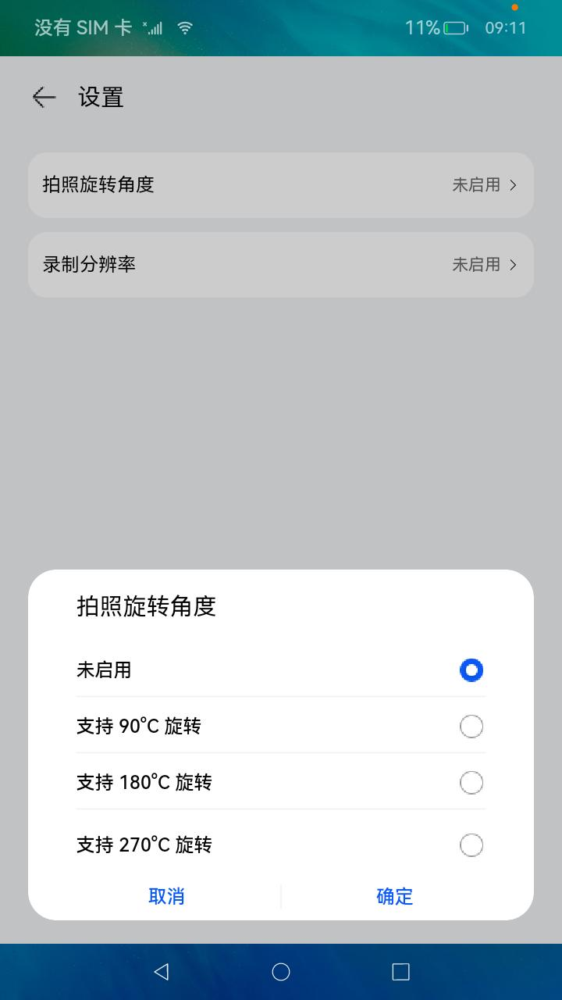

# 相机和媒体库

### 介绍

此Demo展示如何在eTS中调用相机拍照和录像，以及使用媒体库接口将图片和视频保存的操作。实现效果如下：

### 效果预览
| 预览界面 | 设置界面 |
|------------------------------------|----------------------------------|
|  |  |

使用说明

1.启动应用，在权限弹窗中授权后返回应用，进入相机界面。

2.相机界面默认是拍照模式，点击底部拍照按钮可以拍照，拍照完成会在底部左侧显示照片预览图。

3.点击**录像**或者左滑切换到录像模式，点击底部按钮开始录像，点击结束按钮结束录像，结束录像后底部左侧显示视频图标。

4.点击系统**Back**键或界面顶部**返回**按钮退出应用。

5.点击顶部右侧按钮进入设置界面，点击拍照旋转角度，选择0，90，180，270四个角度其中一个，返回至界面再次拍照，照片角度根据选择角度旋转。

6.点击顶部右侧按钮进入设置界面，点击录像分辨率，选择1920x1080，1280x720，800x600三个分辨率其中一个，返回至界面再次录像，视频分辨率根据选择分辨率设置。

7.返回相机界面点击底部左侧预览图可进入相册应用，可以在其中查看照片和录制的视频

### 工程目录

```
/Socket
├── entry             # 主entry模块目录
│   └── src
│       ├── main
│           ├── ets                                # ets模块目录
│               ├── components                     # 
│                   ├── SelectComponent.ets        # 选择弹窗
│                   ├── TitleComponent.ets         # 标题组件
│               ├── entryability                
│               ├── model                          #  
│                   ├── CameraModel.ts             # 相机相关操作
│                   ├── MediaModel.ts              # 媒体文件相关操作
│               ├── pages                          # 
│                   ├── Camera.ets                 # 相机页面
│                   ├── Setting.ets                # 设置页面
│               ├── utils                          # 工具类目录
```

#### 相关概念

媒体库管理：媒体库管理提供接口对公共媒体资源文件进行管理，包括文件的增、删、改、查等。  
相机：相机模块支持相机相关基础功能的开发，主要包括预览、拍照、录像等。

### 相关权限

相机权限：ohos.permission.CAMERA
麦克风权限：ohos.permission.MICROPHONE
访问媒体文件地理位置信息权限：ohos.permission.MEDIA_LOCATION
读取公共媒体文件权限：ohos.permission.READ_MEDIA
读写公共媒体文件权限：ohos.permission.WRITE_MEDIA

### 具体实现

1.使用@ohos.multimedia.camera接口实现相机示例的主要功能：拍照、录像、参数配置等。代码：[CameraModel.ts](entry%2Fsrc%2Fmain%2Fets%2Fmodel%2FCameraModel.ts)。  
2.使用@ohos.multimedia.mediaLibrary接口实现对媒体文件的存储。代码：[MediaModel.ts](entry%2Fsrc%2Fmain%2Fets%2Fmodel%2FMediaModel.ts)。  
3.通过跳转至相册来访问设备上的照片和录制视频。

### 依赖

1.该示例需要安装相册应用。

### 约束与限制

1.rk3568底层录像功能有问题，暂不支持录像功能，当前拍照功能仅支持部分机型。

2.本示例仅支持标准系统上运行。

3.本示例为Stage模型，仅支持API10版本SDK，版本号：4.0.9.1，镜像版本号：Openharmony 4.0.9.1。

4.本示例需要使用DevEco Studio 3.1 Release (Build Version: 3.1.0.500)及以上版本才可编译运行。

5.本示例需要使用系统权限的系统接口。使用Full SDK时需要手动从镜像站点获取，并在DevEco Studio中替换，具体操作可参考[替换指南](https://docs.openharmony.cn/pages/v3.2/zh-cn/application-dev/quick-start/full-sdk-switch-guide.md/)。


### 下载

如需单独下载本工程，执行如下命令：

```
git init
git config core.sparsecheckout true
echo code/SystemFeature/Media/Camera/ > .git/info/sparse-checkout
git remote add origin https://gitee.com/openharmony/applications_app_samples.git
git pull origin master
```