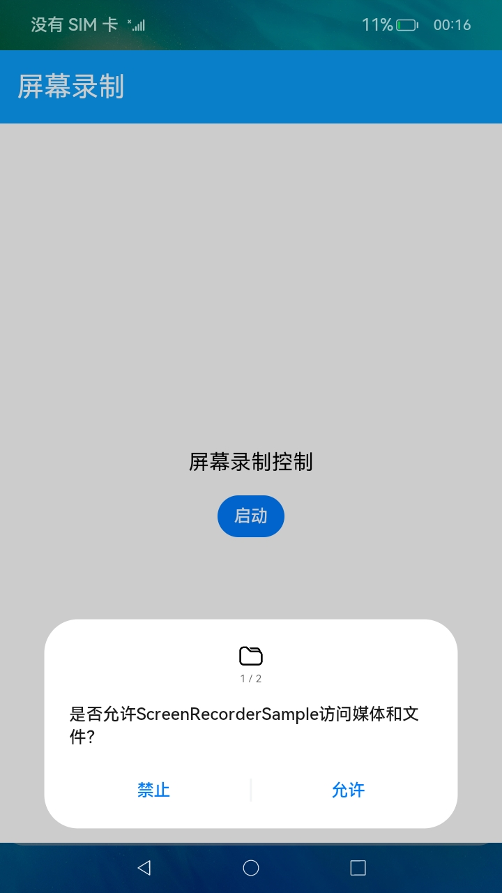
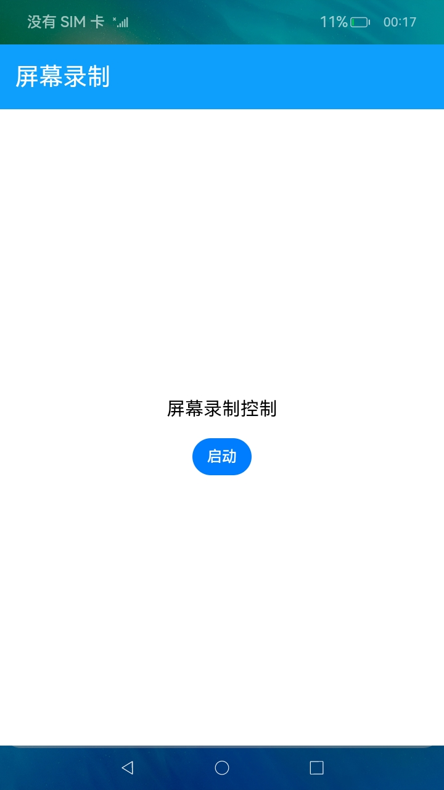
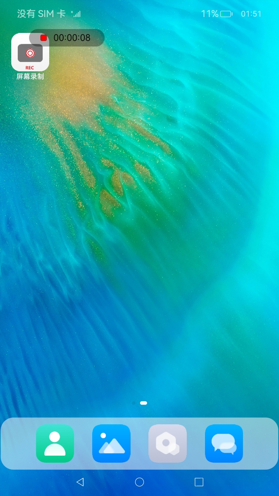

# 录屏示例

### 介绍

 该示例展示设备屏幕（含音频）录制功能。屏幕录制的主要工作是通过创建一个虚拟屏，捕获屏幕显示图形帧，完成视频编码并保存到文件中，帮助OEM设备厂家系统应用实现屏幕录制功能，也可以通过此应用抓取屏幕帧用于问题复现录制。

### 效果预览

|获取媒体权限|获取录音权限|应用主界面|录制过程界面|
|--------------------------------|--------------------------------|--------------------------------|--------------------------------|
|||||

使用说明

1.启动应用，首次启动需要用户授予“**访问媒体和文件**”和“**麦克风**”的权限

2.点击**启动**按钮，启动屏幕录制。

3.启动录制后会弹出一个透明录制悬浮控件，并显示录制时间计时，此时可以操作屏幕，操作过程屏幕显示会被录制下来。

4.需要停止录屏时，点击悬浮半透明的红色按钮，屏幕录制停止。

5.打开图库应用，在图库中可以看到最新录屏的媒体文件，点击后可支持录屏回放。

### 工程目录
```
entry/src/main/ets/
|---common
|   |---Constants.ts                // 数据初始化
|   |---Logger.ts                   // 日志工具
|---MainAbility
|   |---MainAbility.ts
|---pages
|   |---index.ets                   // 首页
|   |---ScreenRecordre.ets          // 屏幕录制
```
### 具体实现

* 该示例通过Screen方法获取屏幕实例，createVirtualScreen方法创建一个虚拟屏，getAllScreens方法获取获取所有的屏幕，makeMirror方法将屏幕设置为镜像模式，setVirtualScreenSurface方法设置虚拟屏幕的surface，display接口捕获屏幕显示图形帧，media，mediaLibrary接口完成视频编码并保存到文件中，帮助OEM设备厂家系统应用实现屏幕录制功能。
* 源码链接：[ScreenRecorder.ets](https://gitee.com/openharmony/applications_app_samples/blob/master/code/SystemFeature/Media/ScreenRecorder/entry/src/main/ets/pages/ScreenRecorder.ets)
* 接口参考：[@ohos.screen](https://gitee.com/openharmony/docs/blob/master/zh-cn/application-dev/reference/apis/js-apis-screen.md)，[@ohos.multimedia.media](https://gitee.com/openharmony/docs/blob/master/zh-cn/application-dev/reference/apis/js-apis-media.md)，[@ohos.multimedia.mediaLibrary](https://gitee.com/openharmony/docs/blob/master/zh-cn/application-dev/reference/apis/js-apis-medialibrary.md)，[@ohos.display](https://gitee.com/openharmony/docs/blob/master/zh-cn/application-dev/reference/apis/js-apis-display.md)

### 相关权限

1.允许应用访问用户媒体文件中的地理位置信息权限：[ohos.permission.MEDIA_LOCATION](https://gitee.com/openharmony/docs/blob/master/zh-cn/application-dev/security/permission-list.md#ohospermissionmedia_location)

2.允许应用读写用户外部存储中的媒体文件信息权限：[ohos.permission.WRITE_MEDIA](https://gitee.com/openharmony/docs/blob/master/zh-cn/application-dev/security/permission-list.md#ohospermissionwrite_media)

3.允许应用读取用户外部存储中的媒体文件信息权限：[ohos.permission.READ_MEDIA](https://gitee.com/openharmony/docs/blob/master/zh-cn/application-dev/security/permission-list.md#ohospermissionread_media)

4.允许应用使用麦克风权限：[ohos.permission.MICROPHONE](https://gitee.com/openharmony/docs/blob/master/zh-cn/application-dev/security/permission-list.md#ohospermissionmicrophone)

5.允许应用使用悬浮窗的能力权限，需要配置为system_basic类型系统应用：[ohos.permission.SYSTEM_FLOAT_WINDOW](https://gitee.com/openharmony/docs/blob/master/zh-cn/application-dev/security/permission-list.md#ohospermissionsystem_float_window)

6.允许应用截取屏幕图像权限，需要配置为system_core类型系统应用：[ohos.permission.CAPTURE_SCREEN](https://gitee.com/openharmony/docs/blob/master/zh-cn/application-dev/security/permission-list.md#ohospermissioncapture_screen)

### 依赖

不涉及。

### 约束与限制

1.本示例仅支持标准系统上安装运行。

2.本示例已适配API version 9版本SDK，版本号：3.2.11.9。

3.本示例需要使用DevEco Studio 3.1 Canary1 (Build Version: 3.1.0.100)及以上版本才可编译运行。

4.本示例需要使用@ohos.screen系统权限的系统接口，使用Full SDK时需要手动从镜像站点获取，并在DevEco Studio中替换，具体操作可参考[替换指南](https://gitee.com/openharmony/docs/blob/master/zh-cn/application-dev/quick-start/full-sdk-switch-guide.md)。

5.系统权限的自动化签名指南，可通过打开DevEco Studio中菜单，File -> Project Structure -> Project -> Signing Configs(TAB页最下方蓝色字体) -> “**View the operation guide**” 跳转链接，可支持系统权限的自动签名生成。

6.rk设备由于芯片限制，应用中videoFrameWidth，videoFrameHeight，videoFrameRate需同比缩小3/5, 才能实现rk上的播放效果。

7.库上代码为rk设备所适用代码，其他设备需要修改完应用代码后(应用代码中缩小3/5的地方，在其他设备不需要缩小),单独打包。

### 下载

如需单独下载本工程，执行如下命令：
```
git init
git config core.sparsecheckout true
echo code/SystemFeature/Media/ScreenRecorder/ > .git/info/sparse-checkout
git remote add origin https://gitee.com/openharmony/applications_app_samples.git
git pull origin master

```