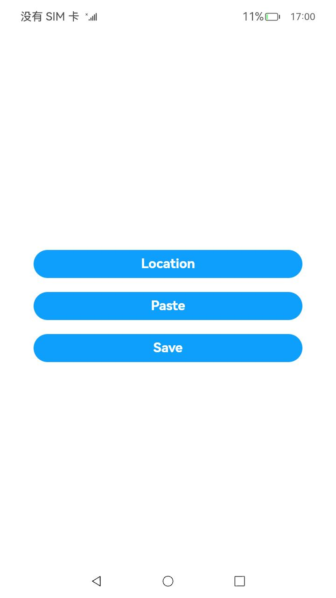
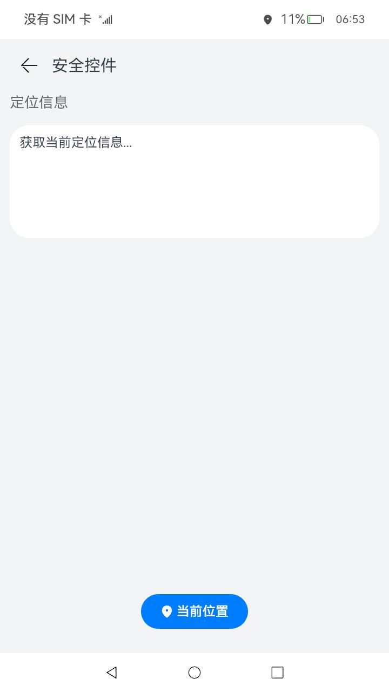
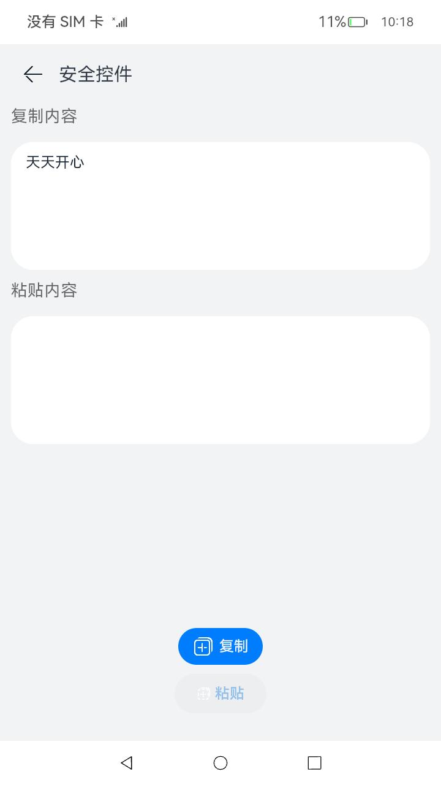
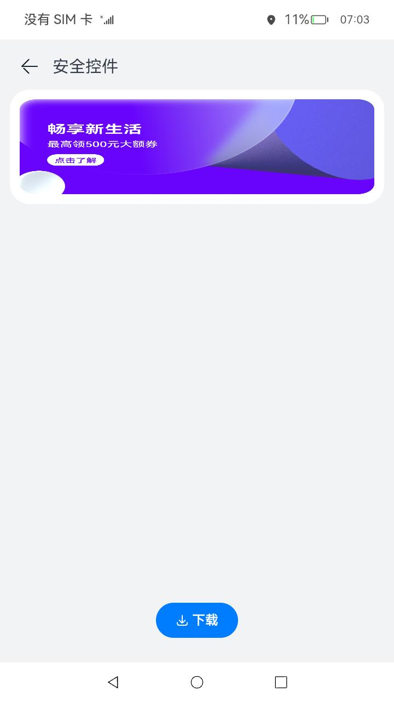

# 安全控件类型的UI控件（仅对系统应用开放）

### 介绍

本示例提供了安全控件类型的UI控件，支撑应用开发者集成安全控件做临时授权场景，当用户实际点击了某种类型的安全控件时，会对应用进行相应的临时授权，减少权限弹窗对用户的干扰，同时提供更小的授权范围。

### 效果预览

|                   主页                   |                    Location                    |                  Paste                   |                **Save**                |
|:--------------------------------------:|:----------------------------------------------:|:----------------------------------------:|:--------------------------------------:|
|  |  |  |  |

使用说明
1. 在主界面，点击“LocationButton安全控件”按钮，进入“LocationButton安全控件”界面，点击“当前位置”按钮，成功获取当前定位信息，并显示在方框中。

2. 在主界面，点击“PasteButton安全控件”按钮，进入“PasteButton安全控件”界面，点击”复制“按钮，复制下方“天天开心”文本，点击“粘贴”按钮，获取剪贴板内容并显示在其下方框中。

3. 在主界面，点击“SaveButton安全控件”按钮，进入“SaveButton安全控件”界面，点击“下载”按钮，将当前页面中的图片保存到本地图库中。

### 工程目录

```
entry/src/main/ets/
|---securitycomponent
|   |---pages
|   |   |---Location.ets                   // 位置服务安全控件界面
|   |   |---Paste.ets                      // 剪贴板安全控件界面
|   |   |---Save.ets                       // 媒体库安全控件界面
|---pages
|   |---Index.ets                          // 首页
|---common
|   |---Component
|   |   |---AuthorizedButton.ets           // 安全控件样式
|   |   |---CopyButton.ets                 // 剪贴板复制控件
|   |   |---LocationButton.ets             // 位置服务安全控件
|   |   |---PasteButton.ets                // 剪贴板粘贴控件
|   |   |---SaveButton.ets                 // 媒体库写入文件控件
|   |   |---TitleBar.ets                   // 标题栏
|---utils
|   |---Logger.ts                          // 日志工具
```

### 具体实现

* 本示例分为Location安全控件模块，剪贴板安全控件模块，媒体库安全控件模块

  * Location安全控件模块
  
    * 使用SecLocationButton组件开发获取定位信息功能，在其点击回调onclick事件中调用geoLocationManager.getCurrentLocation()得到当前定位信息经纬度
    * 源码链接：[LocationButton.ets](entry/src/main/ets/common/Component/LocationButton.ets)
    * 接口参考：[@ohos.geoLocationManager](https://gitee.com/openharmony/docs/blob/master/zh-cn/application-dev/reference/apis/js-apis-geoLocationManager.md#geolocationmanagergetcurrentlocation)

  * 剪贴板安全控件模块
  
    * 使用SecPasteButton组件开发获取剪贴板信息功能，在其点击回调onclick事件中调用ystemPasteboard.setData()将文本复制到剪贴板中，systemPasteboard.getData()得到剪贴板内容
    * 源码链接：[PasteButton.ets](entry/src/main/ets/common/Component/PasteButton.ets)
    * 接口参考：[@ohos.pasteboard](https://gitee.com/openharmony/docs/blob/master/zh-cn/application-dev/reference/apis/js-apis-pasteboard.md#getdata9)

  * 媒体库安全控件模块
  
    * 使用SecSaveButton组件开发保存图片到媒体库功能，在其点击回调onclick事件中调用photoAccessHelper.getPhotoAccessHelper()得到媒体库图片管理器helper， 
    helper.createAsset()得到保存到媒体库图片的uri，
    resourceManager.getMediaContent()得到存放在Resources/base/media文件下的banner.png图片内容，
    fs.open()和fs.write()将图片内容通过得到的uri写到媒体库中，最后fs.close()关闭文件
    * 源码链接：[SaveButton.ets](entry/src/main/ets/common/Component/SaveButton.ets)
    * 接口参考：[@ohos.file.photoAccessHelper](https://gitee.com/openharmony/docs/blob/master/zh-cn/application-dev/reference/apis/js-apis-photoAccessHelper.md)，[@ohos.file.fs](https://gitee.com/openharmony/docs/blob/master/zh-cn/application-dev/reference/apis/js-apis-file-fs.md#fsopen)

### 相关权限

不涉及。

### 依赖

不涉及。

### 约束与限制

1. 本示例仅支持标准系统上运行，支持设备：GPS定位功能仅支持部分机型。
2. 本示例仅支持API10版本SDK，SDK版本号(API Version 10 Release),镜像版本号(4.0 Release)。
3. 本示例需要使用DevEco Studio 版本号(4.0 Release)及以上版本才可编译运行。
4. 本示例需要使用系统权限的系统接口，需要使用Full SDK编译。使用Full SDK时需要手动从镜像站点获取，并在DevEco Studio中替换，具体操作可参考[替换指南](https://gitee.com/link?target=https%3A%2F%2Fdocs.openharmony.cn%2Fpages%2Fv3.2%2Fzh-cn%2Fapplication-dev%2Fquick-start%2Ffull-sdk-switch-guide.md%2F)。

### 下载

如需单独下载本工程，执行如下命令：

```
git init
git config core.sparsecheckout true
echo Account/AuthorizedButton/ > .git/info/sparse-checkout
git remote add origin https://gitee.com/openharmony/applications_app_samples.git
git pull origin master
```
