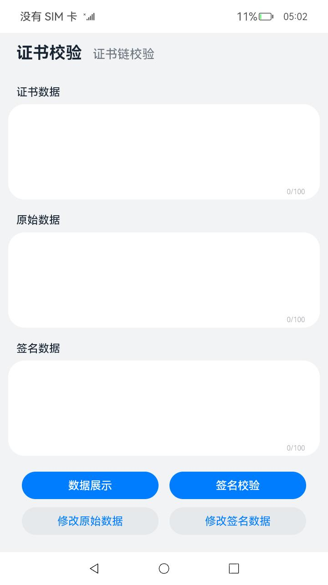
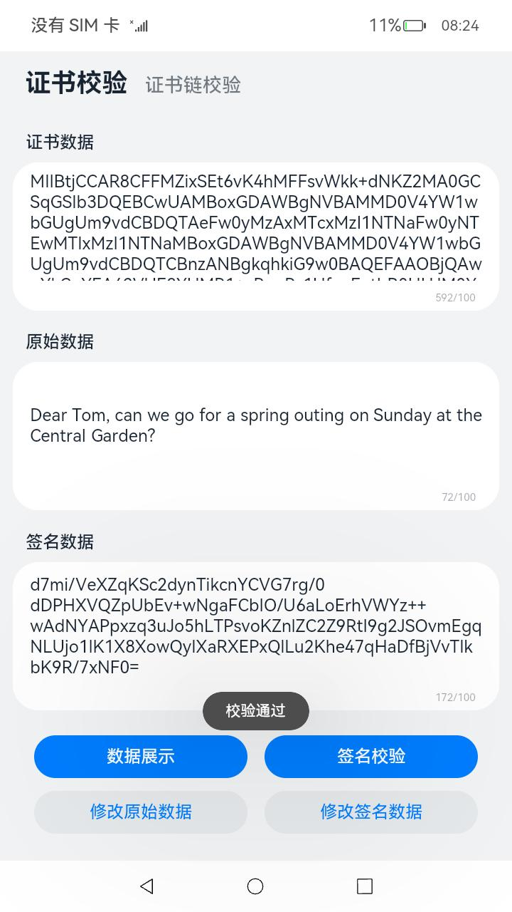
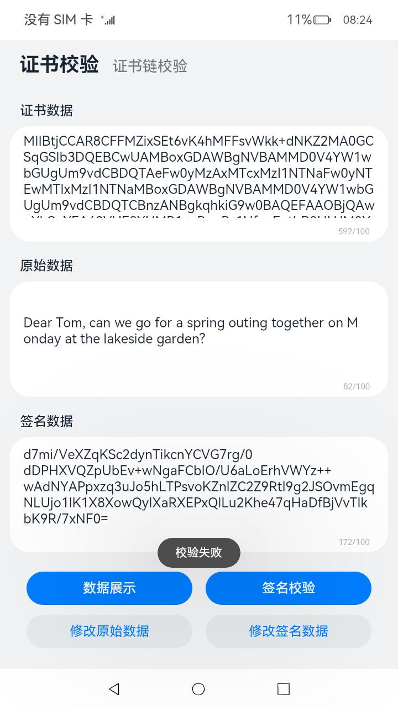
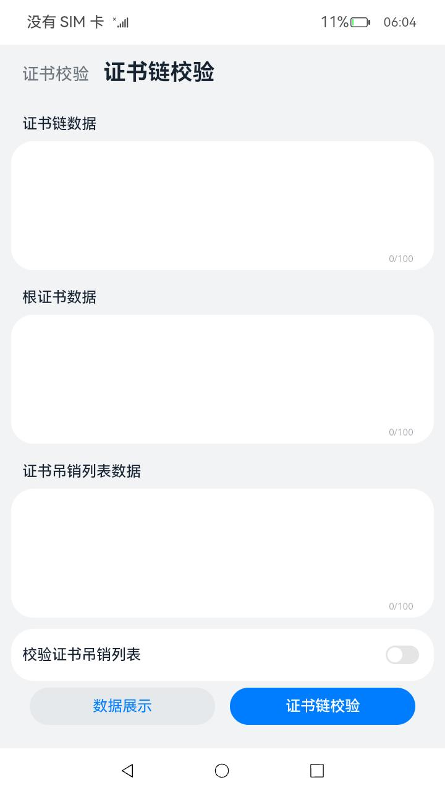
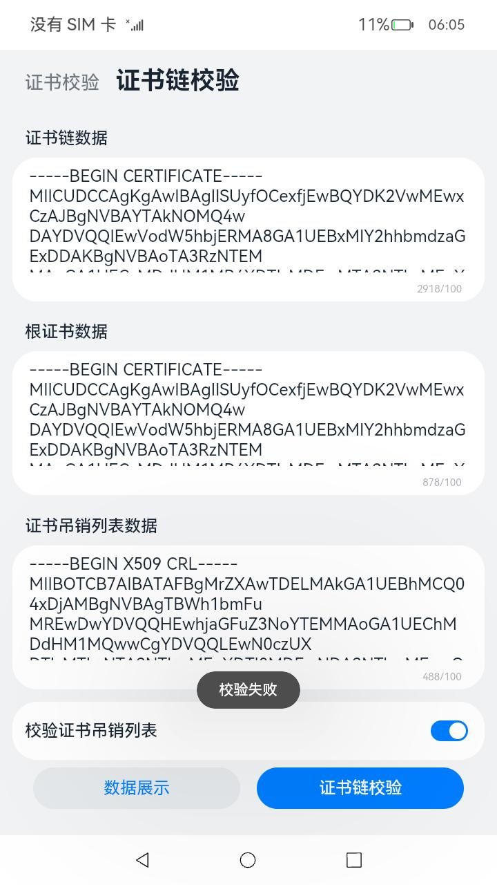

# 证书算法库框架

### 介绍

本示例使用了[@ohos.security.cert](https://gitee.com/openharmony/docs/blob/master/zh-cn/application-dev/reference/apis/js-apis-cert.md)相关接口实现了对签名数据进行校验的功能。

实现场景（一）如下：

1）使用**正确**的原始数据和签名数据进行签名校验场景：模拟服务端通过客户端证书获取公钥，利用公钥对签名数据进行校验，验证客户端身份和原始数据完整性。

2）使用**错误**的原始数据或签名数据进行签名校验场景：模拟攻击者修改原始数据或签名数据，服务端在利用公钥进行签名校验时，攻击者身份不可信或原始数据不完整，验证失败。

### 效果预览

|   主页    |                   校验通过                   |             校验失败             |
|:-------:|:------------------------------------------:|:---------------------------------------:|
|  |  |  |

使用说明

1、点击**数据展示**按钮，页面文本框中分别显示正确的证书、原始和签名数据内容。

2、点击**签名校验**按钮，页面弹出弹窗，提示**校验通过**。

3、点击**修改原始数据**按钮，页面显示修改后的原始数据和正确的证书、签名数据；点击签名校验按钮，页面弹出弹窗，提示**校验失败**。

4、点击**修改签名数据**按钮，页面显示修改后的签名数据和正确的证书、原始数据；点击签名校验按钮，页面弹出弹窗，提示**校验失败**。

5、点击**数据展示**按钮，页面恢复正确证书、原始和签名数据的展示；点击**签名校验**按钮，页面弹出弹窗，提示**校验通过**。

实现场景（二）如下：

1）使用**证书链数据**和**根证书数据**进行证书链校验场景：验证证书链的根证书是否在可信任列表中。

2）使用**证书链数据**和**证书吊销列表**：验证证书链中的证书是否被吊销。

### 效果预览

|                    主页                    |                    校验通过                    |                校验失败                |
|:----------------------------------------:|:------------------------------------------:|:----------------------------------:|
|  |  |  |

使用说明

1、点击**数据展示**按钮，页面文本框中分别显示正确的证书链、根证书和CRL数据内容。

2、点击**证书链校验**按钮，页面弹出弹窗，提示**校验通过**。

3、开启**校验证书吊销列表**，点击**证书链校验**按钮，页面弹出弹窗，提示**校验失败**。


### 工程目录

```
entry/src/main/ets/
|---entryability
|   |---EntryAbility.ts       
|---model
|   |---Data.ts                                               // 证书数据
|   |---CertChainModel.ts                                     // 证书链校验模型文件
|   |---CertFrameworkModel.ts                                 // 证书算法库框架模型文件
|   |---Logger.ts                                             // 日志文件
|---pages
|   |---Index.ets                                             // 主界面
```

### 具体实现

场景（一）
* 使用证书公钥实现签名校验的功能接口Verify封装在CertFrameworkModel中
    * 获取证书公钥：首先调用[cert.createX509Cert](https://gitee.com/openharmony/docs/blob/master/zh-cn/application-dev/reference/apis/js-apis-cert.md#cryptocertcreatex509cert)接口生成证书对象certObject，使用certObject对象的[getPublicKey](https://gitee.com/openharmony/docs/blob/master/zh-cn/application-dev/reference/apis/js-apis-cert.md#getpublickey)能力获取公钥pubKey；然后调用[cryptoFramework.createAsyKeyGenerator](https://gitee.com/openharmony/docs/blob/master/zh-cn/application-dev/reference/apis/js-apis-cryptoFramework.md#cryptoframeworkcreateasykeygenerator)接口创建密钥生成器keyGenerator，使用keyGenerator的[convertKey](https://gitee.com/openharmony/docs/blob/master/zh-cn/application-dev/reference/apis/js-apis-cryptoFramework.md#convertkey-1)能力将公钥pubKey转换为正确的格式。
    * 使用公钥校验签名：首先调用[cryptoFramework.createVerify](https://gitee.com/openharmony/docs/blob/master/zh-cn/application-dev/reference/apis/js-apis-cryptoFramework.md#cryptoframeworkcreateverify)接口创建验签对象verifier，使用公钥pubKey对验签对象verifier进行初始化[verifier.init](https://gitee.com/openharmony/docs/blob/master/zh-cn/application-dev/reference/apis/js-apis-cryptoFramework.md#init-6)；然后使用验签对象verifier的[verify](https://gitee.com/openharmony/docs/blob/master/zh-cn/application-dev/reference/apis/js-apis-cryptoFramework.md#verify-1)能力对签名进行校验。

场景（二）
* 使用证书公钥实现签名校验的功能接口validate封装在CertChainModel中
  * 创建证书链： 调用[cert.createX509CertChain](https://gitee.com/openharmony/docs/blob/master/zh-cn/application-dev/reference/apis/js-apis-cert.md)接口生成证书链对象certChainObject。
  * 验证证书链： 从根证书中获取校验参数，然后使用certChainObject对象中的validate能力来对证书链进行验证。

### 相关权限

不涉及。

### 依赖

* 加解密算法库框架[@ohos.security.cryptoFramework](https://gitee.com/openharmony/docs/blob/master/zh-cn/application-dev/reference/apis/js-apis-cryptoFramework.md#ohossecuritycryptoframework-%E5%8A%A0%E8%A7%A3%E5%AF%86%E7%AE%97%E6%B3%95%E5%BA%93%E6%A1%86%E6%9E%B6)

### 约束与限制

1、本示例仅支持标准系统上运行。

2、本示例已适配API version 11版本SDK，适用版本号：2023年12月23日及之后的CI每日构建版本（4.1.5.3），或更新的Beta版本、Release版本。

3、本示例需要使用DevEco Studio 4.0 Release(Build Version: 4.0.0.600)及以上版本才可编译运行，由于hvigor的限制，本Sample工程在同步hvigor的方式存在一定的限制，需要通过如下步骤规避：

（1）将build-profile.json5中的compileSdkVersion、compatibleSdkVersion支持的版本从11修改为10，同步hvigor；

（2）成功同步hvigor后，再将build-profile.json5中的compileSdkVersion、compatibleSdkVersion支持的版本从10修改为11，即可执行编译。

### 下载

 如需单独下载本工程，执行如下命令： 

```
git init
git config core.sparsecheckout true
echo code/SystemFeature/Security/CertificateFramework > .git/info/sparse-checkout
git remote add origin https://gitee.com/openharmony/applications_app_samples.git
git pull origin master
```

