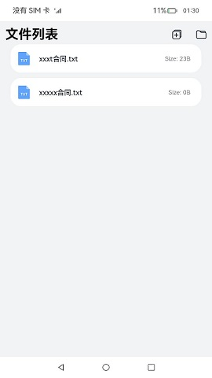
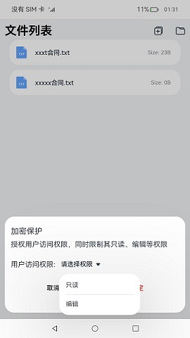
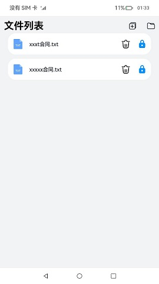
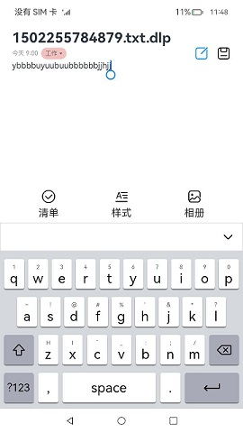

# DLP

### 介绍

本示例是一个安全类App，使用[@ohos.dlpPermission](https://gitee.com/openharmony/docs/blob/master/zh-cn/application-dev/reference/apis/js-apis-dlppermission.md) 接口展示了在eTS中普通文件加密受限的过程。

### 效果预览
| Index                                     | Encryption                                           | Encryptied                                       | FileEdit                                           |
|-----------------------------------------|-----------------------------------------------|---------------------------------------------|----------------------------------------------------|
|  |  |  |  |

使用说明:
1. 启动应用后点击“**+**”按钮可以添加一个普通文件;
2. 长按点击加密按钮，出现加密权限弹窗，选择需要设置的权限并点击确定;
3. 点击加密文件，跳转到文本编辑应用，如果设置的权限是只读权限，页面置灰，不可编辑。
4. 长按点击删除按钮，删除文件;

### 工程目录
```
entry/src/main/ets/
|---component
|   |---CustomDialog.ets                        // 权限弹窗
|---feature
|   |---DlpManager.ets                          // Dlp管理
|   |---FileManager.ets                         // 文件管理
|   |---PreferencesManager.ets                  // 持久化存储
|---pages
|   |---Index.ets                               // 首页
|---util
|   |---Logger.ts                               // 日志
|   |---ResourceUtils.ets                       // 资源转换
```
### 具体实现

+ 文件的添加和文件列表的获取分别在Index和MediaFileUri中，源码参考[Index.ets](entry/src/main/ets/pages/Index.ets) 和 [MediaFileUri.ets](entry/src/main/ets/feature/MediaFileUri.ets):
  + 文件的添加：首先通过[@ohos.file.picker](https://gitee.com/openharmony/docs/blob/master/zh-cn/application-dev/reference/apis/js-apis-file-picker.md)接口的DocumentSaveOptions()方法自定一个参数，然后通过new picker.DocumentViewPicker()方法拉起文件管理应用去新建一个普通文件。
  + 文件列表的获取：首先使用[@ohos.file.fileAccess](https://gitee.com/openharmony/docs/blob/master/zh-cn/application-dev/reference/apis/js-apis-fileAccess.md) 接口的createFileAccessHelper()方法来创建连接指定wants的helper对象，然后通过getRoots()方法来获取helper对象连接的文件管理服务类的设备根节点信息，并获取到目录url，最后通过getFileInfoFromUri()方法得到文件的信息。
+ 文件的加密操作在DlpManager中，源码参考[DlpManager.ets](entry/src/main/ets/feature/DlpManager.ets):
    + 加密操作：使用dlpPermission接口的generateDLPFile方法获得一个相关的操作型关系数据库RdbStore，将明文文件加密生成权限受控文件。

### 相关权限

允许应用读取用户外部存储中的媒体文件信息：[ohos.permission.READ_MEDIA](https://gitee.com/openharmony/docs/blob/master/zh-cn/application-dev/security/permission-list.md#ohospermissionread_media)

允许应用读写用户外部存储中的媒体文件信息：[ohos.permission.WRITE_MEDIA](https://gitee.com/openharmony/docs/blob/master/zh-cn/application-dev/security/permission-list.md#ohospermissionwrite_media)

允许文件管理类应用通过FAF框架访问公共数据文件：[ohos.permission.FILE_ACCESS_MANAGER](https://gitee.com/openharmony/docs/blob/master/zh-cn/application-dev/security/permission-list.md)

允许应用读取用户外部存储中的媒体文件信息：[ohos.permission.STORAGE_MANAGER](https://gitee.com/openharmony/docs/blob/master/zh-cn/application-dev/security/permission-list.md)

允许应用读取用户外部存储中的媒体文件信息：[ohos.permission.GET_BUNDLE_INFO_PRIVILEGED](https://gitee.com/openharmony/docs/blob/master/zh-cn/application-dev/security/permission-list.md)

允许应用读取用户外部存储中的媒体文件信息：[ohos.permission.ACCESS_DLP_FILE](https://gitee.com/openharmony/docs/blob/master/zh-cn/application-dev/security/permission-list.md)

允许应用读取用户外部存储中的媒体文件信息：[ohos.permission.MANAGE_DISTRIBUTED_ACCOUNTS](https://gitee.com/openharmony/docs/blob/master/zh-cn/application-dev/security/permission-list.md)

允许应用读取用户外部存储中的媒体文件信息：[ohos.permission.MANAGE_LOCAL_ACCOUNTS](https://gitee.com/openharmony/docs/blob/master/zh-cn/application-dev/security/permission-list.md)

允许应用读取用户外部存储中的媒体文件信息：[ohos.permission.GET_LOCAL_ACCOUNTS](https://gitee.com/openharmony/docs/blob/master/zh-cn/application-dev/security/permission-list.md)

允许应用读取用户外部存储中的媒体文件信息：[ohos.permission.MANAGE_DISTRIBUTED_ACCOUNTS](https://gitee.com/openharmony/docs/blob/master/zh-cn/application-dev/security/permission-list.md)

### 依赖

需要依赖三方应用文本编辑FileEdit的[hap](screenshots/haps)。

### 约束与限制

1. 本示例仅支持标准系统上运行;
2. 本示例仅支持API10版本SDK，SDK版本号(4.0.10.10), 镜像版本号(4.0 Release)。
3. 本示例需要使用DevEco Studio 4.0 Beta2 (Build Version: 4.0.0.400, built on August 2, 2023)才可编译运行;
4. 本示例需要使用@@ohos.dlpPermission系统权限的系统接口。使用Full SDK时需要手动从镜像站点获取，并在DevEco Studio中替换，具体操作可参考[替换指南](https://docs.openharmony.cn/pages/v3.2/zh-cn/application-dev/quick-start/full-sdk-switch-guide.md/)。

### 下载

如需单独下载本工程，执行如下命令：
```
git init
git config core.sparsecheckout true
echo code/ SystemFeature/Security/DLP/ > .git/info/sparse-checkout
git remote add origin https://gitee.com/openharmony/applications_app_samples.git
git pull origin master
```