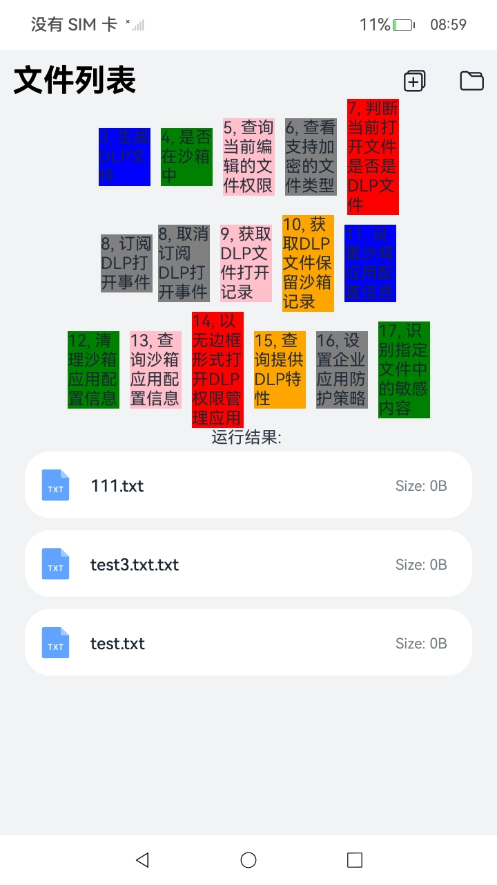
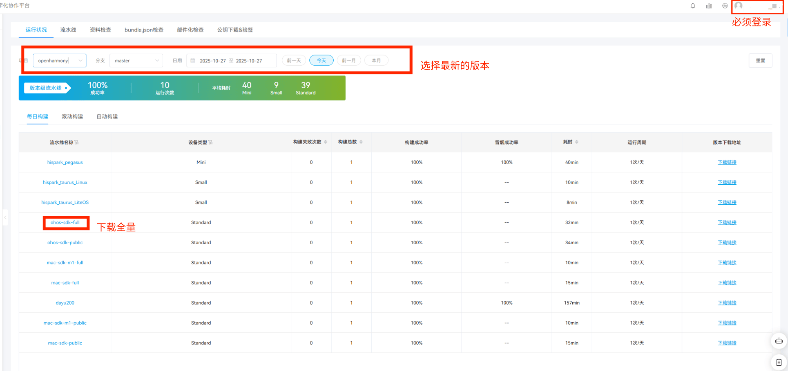
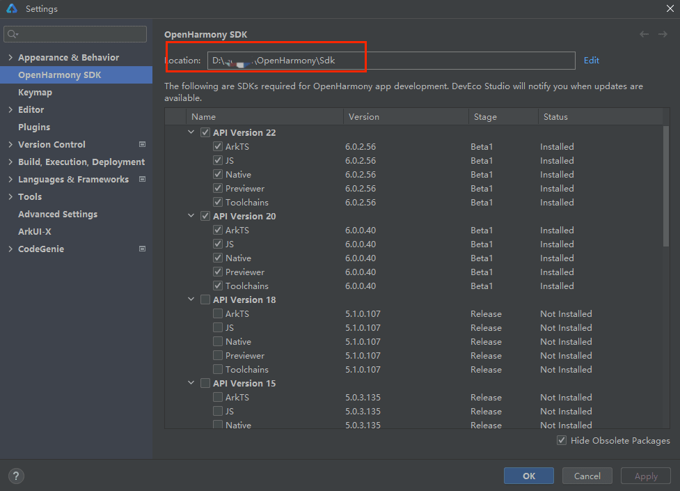
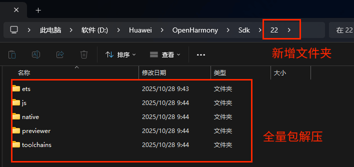
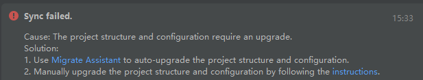
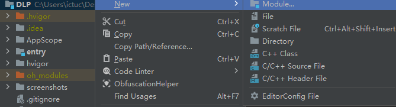
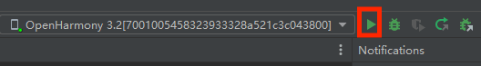
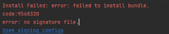

# DLP

### 介绍

本示例是一个安全类App，使用[@ohos.dlpPermission](https://gitcode.com/openharmony/docs/blob/master/zh-cn/application-dev/security/DataProtectionKit/dlp-guidelines.md) 接口展示了在eTS中常用接口的调用。

### 效果预览
| Index                                     | 
|-----------------------------------------|
|  | 

使用说明:
1.启动后点击文件图标，选择一个文件
2.点击对应文字按钮，完成对应的接口调用（具体接口说明可以参考https://gitcode.com/openharmony/docs/blob/master/zh-cn/application-dev/security/DataProtectionKit/dlp-guidelines.md）

### 工程目录
```
entry/src/main/ets/
|---component
|   |---CustomDialog.ets                        // 权限弹窗
|---feature
|   |---DlpManager.ets                          // Dlp管理
|   |---FileManager.ets                         // 文件管理
|   |---PreferencesManager.ets                  // 持久化存储
|---pages
|   |---Index.ets                               // 首页
|---util
|   |---Logger.ts                               // 日志
|   |---ResourceUtils.ets                       // 资源转换
```

### 相关权限

允许文件管理类应用通过FAF框架访问公共数据文件：[ohos.permission.FILE_ACCESS_MANAGER](https://gitcode.com/openharmony/docs/blob/master/zh-cn/application-dev/security/AccessToken/permissions-for-system-apps.md#ohospermissionfile_access_manager)

允许应用调用storage manager服务中对空间统计以及卷信息的查询接口：[ohos.permission.STORAGE_MANAGER](https://gitcode.com/openharmony/docs/blob/master/zh-cn/application-dev/security/AccessToken/permissions-for-system-apps.md#ohospermissionstorage_manager)

允许查询应用的基本信息和敏感信息：[ohos.permission.GET_BUNDLE_INFO_PRIVILEGED](https://gitcode.com/openharmony/docs/blob/master/zh-cn/application-dev/security/AccessToken/permissions-for-system-apps.md)

允许对DLP文件进行权限配置和管理：[ohos.permission.ACCESS_DLP_FILE](https://gitcode.com/openharmony/docs/blob/master/zh-cn/application-dev/security/AccessToken/permissions-for-system-apps.md#ohospermissionaccess_dlp_file)

允许应用管理系统分布式帐号信息：[ohos.permission.MANAGE_DISTRIBUTED_ACCOUNTS](https://gitcode.com/openharmony/docs/blob/master/zh-cn/application-dev/security/AccessToken/permissions-for-system-apps.md#ohospermissionmanage_distributed_accounts)

允许应用管理系统本地帐号：[ohos.permission.MANAGE_LOCAL_ACCOUNTS](https://gitcode.com/openharmony/docs/blob/master/zh-cn/application-dev/security/AccessToken/permissions-for-system-apps.md#ohospermissionmanage_local_accounts)

允许应用查询系统本地帐号信息：[ohos.permission.GET_LOCAL_ACCOUNTS](https://gitcode.com/openharmony/docs/blob/master/zh-cn/application-dev/security/AccessToken/permissions-for-system-apps.md#ohospermissionget_local_accounts)

允许MDM应用识别文件敏感内容：[ohos.permission.ENTERPRISE_DATA_IDENTIFY_FILE](https://gitcode.com/openharmony/docs/blob/master/zh-cn/application-dev/security/AccessToken/permissions-for-mdm-apps.md#ohospermissionenterprise_data_identify_file)

### 依赖

需要依赖三方应用文本编辑FileEdit的[hap](screenshots/haps)。

### 约束与限制

1. 本示例仅支持标准系统上运行。
2. 本示例仅支持API22版本SDK，且为full SDK。
3. 本示例需要使用@ohos.dlpPermission系统权限的系统接口。
4. 需要链接DLP凭据服务器。

## samples代码运行及其环境配置
1.[克隆samples代码到本地](https://gitcode.com/openharmony/applications_app_samples/tree/master/code/SystemFeature/Security/DLP)  
2.[开发板上需要烧入日构建版本（dayu200）](https://dcp.openharmony.cn/workbench/cicd/dailybuild/dailylist)  
&nbsp;&nbsp;&nbsp;&nbsp;具体操作为：https://blog.csdn.net/nanzhanfei/article/details/121951919<br>
3.[ 配置最新SDK  （ohos-sdk-full）](https://dcp.openharmony.cn/workbench/cicd/dailybuild/dailylist )  
  
    
    
4.在".\DLP\entry\src\main"下新增syscap.json文件，文件内容为：
```
{
  "devices": {
    "general": [
      "default",
      "tablet"
    ]
  },
  "development": {
    "addedSysCaps": [
      "SystemCapability.ArkUI.ArkUI.Circle"
    ]
  }
}
```
5.配置build-profile.json5 （.\DLP\build-profile.json5）
```
"products": [
   {
     "name": "default",
     "signingConfig": "default",
     "compileSdkVersion": 22,
     "compatibleSdkVersion": 22,
     "runtimeOS": "OpenHarmony",
     "targetSdkVersion": 22
   }
],
```
&nbsp;&nbsp;&nbsp;&nbsp;&nbsp;&nbsp;&nbsp;&nbsp;&nbsp;&nbsp;&nbsp;若出现sync failed,可以尝试点击Migrate Assistant <br>
<br>
6.执行Build Hap(s)，顺利编译后，产生entry-default-unsigned.hap；  
7.添加签名<br>
（1）装一个假应用  （在DLP目录下新建假应用，该应用的所有配置均默认）  
  
（2）点击运行，将假应用烧录到开发板中，删除假应用代码  
  
如果运行报错no signature file，请配置在线签名，然后再点击运行  
            
（3）在cmd中输入如下指令，获取DLP samples应用指纹<br>
&nbsp;&nbsp;&nbsp;&nbsp;&nbsp;&nbsp;&nbsp;&nbsp;&nbsp;&nbsp;&nbsp;hdc shell "bm dump -n com.samples.dlp | grep finger"<br>
（4）拉出配置文件install_list_capability.json(该文件在打开cmd的目录下)<br>
&nbsp;&nbsp;&nbsp;&nbsp;&nbsp;&nbsp;&nbsp;&nbsp;&nbsp;&nbsp;&nbsp;hdc file recv /system/etc/app/install_list_capability.json<br>
（5）打开install_list_capability.json文件，将DLP samples应用设置为系统应用,文件最下面添加（可以直接复制其它应用的配置，再改DLP samples应用指纹（app_signature）和包名（bundleName））
```
{
  {
	{
    	"bundleName": "com.sample.dlp",
        "app_signature": {
        	"XXXXXXXXXXXXXXXXXXXXXXXXXXXXXXXXXXXXXXXXXXXXXXXXXXXXXXX"
        },
        "allowAppUsePrivilageExtension": true,
        "allowAppDesktopIconHide":true
	}
  }
}
```
（6）推送配置文件（在install_list_capability.json所在目录打开cmd）<br>
&nbsp;&nbsp;&nbsp;&nbsp;&nbsp;&nbsp;&nbsp;&nbsp;&nbsp;&nbsp;&nbsp;hdc file send install_list_capability.json /system/etc/app/<br>
&nbsp;&nbsp;&nbsp;&nbsp;&nbsp;&nbsp;&nbsp;&nbsp;&nbsp;&nbsp;&nbsp;hdc shell reboot<br>
（7）下载签名工具（clone下来）
https://gitcode.com/openharmony/developtools_hapsigner<br>
（8）在下载好的文件夹中，修改文件  .\developtools_hapsigner-master\dist\UnsgnedReleasedProfileTemplate.json<br>
&nbsp;&nbsp;&nbsp;&nbsp;&nbsp;&nbsp;&nbsp;&nbsp;&nbsp;&nbsp;&nbsp;修改如下所示
```
{
    "version-name": "2.0.0",
    "version-code": 2,
    "app-distribution-type": "os_integration",
    "uuid": "5027b99e-5f9e-465d-9508-a9e0134ffe18",
    "validity": {
        "not-before": 1594865258,
        "not-after": 1689473258
    },
    "type": "release",
    "bundle-info": {
        "developer-id": "OpenHarmony",
        "distribution-certificate": "-----BEGIN CERTIFICATE-----\nMIICMzCCAbegAwIBAgIEaOC/zDAMBggqhkjOPQQDAwUAMGMxCzAJBgNVBAYTAkNO\nMRQwEgYDVQQKEwtPcGVuSGFybW9ueTEZMBcGA1UECxMQT3Blbkhhcm1vbnkgVGVh\nbTEjMCEGA1UEAxMaT3Blbkhhcm1vbnkgQXBwbGljYXRpb24gQ0EwHhcNMjEwMjAy\nMTIxOTMxWhcNNDkxMjMxMTIxOTMxWjBoMQswCQYDVQQGEwJDTjEUMBIGA1UEChML\nT3Blbkhhcm1vbnkxGTAXBgNVBAsTEE9wZW5IYXJtb255IFRlYW0xKDAmBgNVBAMT\nH09wZW5IYXJtb255IEFwcGxpY2F0aW9uIFJlbGVhc2UwWTATBgcqhkjOPQIBBggq\nhkjOPQMBBwNCAATbYOCQQpW5fdkYHN45v0X3AHax12jPBdEDosFRIZ1eXmxOYzSG\nJwMfsHhUU90E8lI0TXYZnNmgM1sovubeQqATo1IwUDAfBgNVHSMEGDAWgBTbhrci\nFtULoUu33SV7ufEFfaItRzAOBgNVHQ8BAf8EBAMCB4AwHQYDVR0OBBYEFPtxruhl\ncRBQsJdwcZqLu9oNUVgaMAwGCCqGSM49BAMDBQADaAAwZQIxAJta0PQ2p4DIu/ps\nLMdLCDgQ5UH1l0B4PGhBlMgdi2zf8nk9spazEQI/0XNwpft8QAIwHSuA2WelVi/o\nzAlF08DnbJrOOtOnQq5wHOPlDYB4OtUzOYJk9scotrEnJxJzGsh/\n-----END CERTIFICATE-----\n",
        "bundle-name": "com.samples.dlp",
        "apl": "normal",
        "app-feature": "hos_system_app"
    },
    "acls": {
        "allowed-acls": [
            "ohos.permission.FILE_ACCESS_MANAGER",
            "ohos.permission.STORAGE_MANAGER",
            "ohos.permission.GET_BUNDLE_INFO_PRIVILEGED",
            "ohos.permission.ACCESS_DLP_FILE",
            "ohos.permission.MANAGE_DISTRIBUTED_ACCOUNTS",
            "ohos.permission.MANAGE_LOCAL_ACCOUNTS",
            "ohos.permission.ENTERPRISE_DATA_IDENTIFY_FILE",
            "ohos.permission.GET_LOCAL_ACCOUNTS"
        ]
    },
    "permissions": {
        "restricted-permissions": []
    },
    "issuer": "pki_internal"
}
```
（9）签名应用（需要配置java环境）
hdc uninstall com.samples.dlp<br>
&nbsp;&nbsp;&nbsp;&nbsp;&nbsp;&nbsp;&nbsp;&nbsp;&nbsp;&nbsp;&nbsp;在.\developtools_hapsigner-master\dist下新建一个记事本文件，命名为签名证书.bat，bat内容为：
```
java -jar hap-sign-tool.jar sign-profile -keyAlias "openharmony application profile release" -signAlg "SHA256withECDSA" -mode "localSign" -profileCertFile "OpenHarmonyProfileRelease.pem" -inFile "UnsgnedReleasedProfileTemplate.json" -keystoreFile "OpenHarmony.p12" -outFile "app1-profile.p7b" -keyPwd "123456" -keystorePwd "123456"
```
&nbsp;&nbsp;&nbsp;&nbsp;&nbsp;&nbsp;&nbsp;&nbsp;&nbsp;&nbsp;&nbsp;在.\developtools_hapsigner-master\dist下新建一个记事本文件，命名为签名应用.bat，bat内容为：
```
java -jar hap-sign-tool.jar sign-app -keyAlias "openharmony application release" -signAlg "SHA256withECDSA" -mode "localSign" -appCertFile "OpenHarmonyApplication.pem" -profileFile "app1-profile.p7b" -inFile "entry-default-unsigned.hap" -keystoreFile "OpenHarmony.p12" -outFile "app1-signed.hap" -keyPwd "123456" -keystorePwd "123456"
```
（10）将entry-default-unsigned.hap移到目录 .\developtools_hapsigner-master\dist下<br>
（11）依次运行签名证书.bat和签名应用.bat，当前目录会产生一个文件app1.signed.hap<br>
（12）安装应用<br>
&nbsp;&nbsp;&nbsp;&nbsp;&nbsp;&nbsp;&nbsp;&nbsp;&nbsp;&nbsp;&nbsp;hdc install app1-signed.hap<br>
（13）如果之后更改了DLP samples项目，再次执行Build Hap(s)，然后将entry-default-unsigned.hap移到目录 .\developtools_hapsigner-master\dist下，运行签名应用.bat，执行hdc install app1-signed.hap