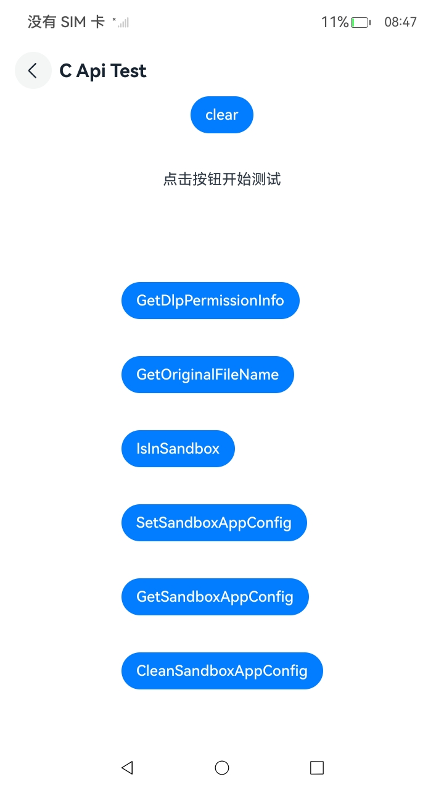
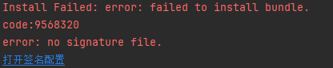
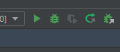

# DLP

## 介绍

本示例是一个安全类App，使用[dlp_permission_api.h](https://gitcode.com/openharmony/docs/blob/master/zh-cn/application-dev/security/DataProtectionKit) 接口展示了在eTS中常用接口的调用。

## 效果预览
| Index                                     | 
|-----------------------------------------|
|  | 

使用说明:
1. 启动后点击”c api test“按钮
2. [具体接口说明可以参考](https://gitcode.com/openharmony/docs/blob/master/zh-cn/application-dev/security/DataProtectionKit)

## 工程目录
```
entry/src/main/ets/
|---pages
|   |---index.ets                           // 主页面
|   |---CApiTest.ets                        // CAPI页面
entry/src/main/cpp/
|---types
|   |---libentry
|   |   |---index.d.ts                      // 导出接口
|---CMakeLists.txt                          // 编译C代码
|---napi_init.cpp                           // 定义接口
```

## 约束与限制

1. 本示例仅支持标准系统上运行。
2. 本示例可在API23及其以上版本的SDK上运行。

## samples代码运行及其环境配置
1. 在将项目克隆下来后，需要配置签名。点击如下图所示“打开签名配置”，完成签名配置。



2. 在完成签名配置后，需要点击运行（绿色小三角）。



## 测试用例

### 测试步骤

1. 点击“GetDlpPermissionInfo”查询当前DLP沙箱的权限信息。
2. 点击“GetOriginalFileName”获取指定DLP文件名的原始文件名。
3. 点击“IsInSandbox”查询当前应用是否运行在DLP沙箱环境。
4. 点击“SetSandboxAppConfig”设置沙箱应用配置信息。
5. 点击“GetSandboxAppConfig”获取沙箱应用配置信息。
6. 点击“CleanSandboxAppConfig”清理沙箱应用配置信息。

### 预期结果

1. 界面显示“19100006”。
2. 界面显示“test.txt”。
3. 界面显示“false”。
4. 界面显示“0”。
5. 界面显示“configinfo”。
6. 界面显示“0”。