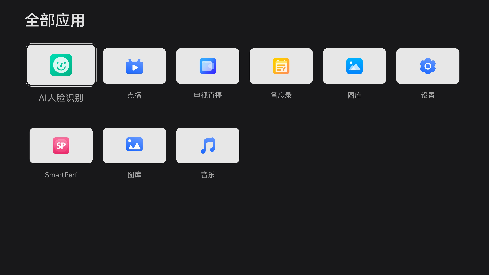
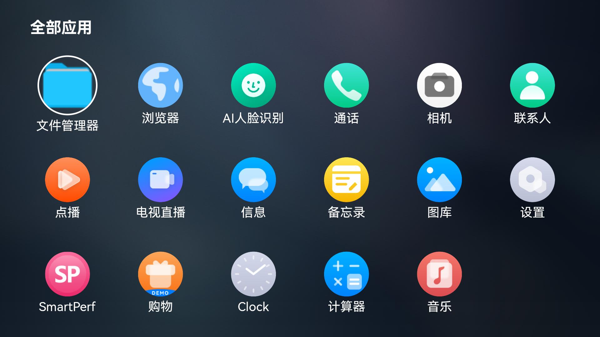

# TVApplicationManager

### 介绍

本示例主要展示了TV形态下应用管理相关的功能，使用[@ohos.bundle.launcherBundleManager](https://gitee.com/openharmony/docs/blob/master/zh-cn/application-dev/reference/apis-ability-kit/js-apis-launcherBundleManager-sys.md) 、[@ohos.bundle.installer](https://gitee.com/openharmony/docs/blob/master/zh-cn/application-dev/reference/apis-ability-kit/js-apis-bundle-installer-sys.md) 、[@ohos.multimodalInput.inputConsumer](https://gitee.com/openharmony/docs/blob/master/zh-cn/application-dev/reference/apis-input-kit/js-apis-inputconsumer-sys.md) 、[@ohos.events.emitter](https://gitee.com/openharmony/docs/blob/master/zh-cn/application-dev/reference/apis-basic-services-kit/js-apis-emitter.md) 、[@ohos.commonEventManager](https://gitee.com/openharmony/docs/blob/master/zh-cn/application-dev/reference/apis-basic-services-kit/js-apis-commonEventManager.md) 等接口，实现了获取设备中已安装应用列表、启动应用、卸载应用、移动应用位置、添加应用到桌面快捷方式等功能。

### 效果预览

| 主页 | 菜单弹窗 | 移动模式 |
|------|---------|---------|
|  |  |  |

使用说明：

1. 应用启动后，进入应用管理主界面，以6列网格布局显示设备中已安装的应用；
2. 使用遥控器或键盘方向键可以切换焦点到不同应用图标，被选中的应用会有高亮边框效果；
3. 点击应用图标或按确认键，可以启动对应的应用；
4. 长按应用图标或按Menu键，弹出操作菜单，可以选择"添加到桌面快捷方式"、"卸载"、"移动"等操作；
5. 选择"添加到桌面快捷方式"，可以将应用图标添加到系统桌面，已添加过快捷方式的应用不再显示该选项；
6. 选择"卸载"，可以卸载选中的应用，卸载成功后应用图标从列表中移除；
7. 选择"移动"，进入移动模式，使用方向键可以将应用移动到目标位置，按返回键退出移动模式；
8. 应用列表支持鼠标拖拽排序，拖拽应用图标到目标位置即可完成位置交换；
9. 页面从后台恢复到前台时，自动刷新应用列表。

### 工程目录

```
entry/src/main/ets/
|---Application
|   |---MyAbilityStage.ets                    // AbilityStage生命周期管理
|---MainAbility
|   |---MainAbility.ets                       // 主Ability
|---pages
|   |---Index.ets                             // 入口页面
product/tv/src/main/ets/
|---Application
|   |---MyAbilityStage.ets                    // AbilityStage生命周期管理
|---MainAbility
|   |---MainAbility.ets                       // 主Ability
|---common
|   |---constants
|   |   |---GloableParmas.ets                 // 全局参数常量
|   |   |---StyleConstants.ets                // 样式常量
|   |---utils
|   |   |---EventUtil.ets                     // 事件工具类
|   |   |---Storage.ets                       // 本地存储工具类（应用列表排序持久化）
|   |   |---Throttle.ets                      // 节流函数工具类
|---components
|   |---CustomDialog.ets                      // 操作菜单弹窗组件（卸载、移动、添加快捷方式）
|   |---ErrorCode.ets                         // 错误码处理
|   |---FilterApp.ets                         // 应用过滤组件（过滤系统保留应用）
|   |---TextBtn.ets                           // 文本按钮组件
|---view
|   |---CursorImage.ets                       // 光标方向图标组件
|   |---GridList.ets                          // 应用网格列表组件（核心布局和交互逻辑）
|   |---HeaderBar.ets                         // 顶部标题栏组件
|   |---components
|   |   |---ImageSet.ets                      // 图片集合组件
|---Utils
|   |---AppIconCacheManager.ets               // 应用图标缓存管理器
|   |---AppNameCacheManager.ets               // 应用名称缓存管理器
|   |---DiskCache.ets                         // 磁盘缓存
|   |---Logger.ets                            // 日志工具类
|   |---MemoryCache.ets                       // 内存缓存
|---pages
|   |---Index.ets                             // TV形态主页面（应用列表展示、交互逻辑）
```

### 具体实现

* 获取设备中已安装应用列表的功能封装在pages/Index.ets中，源码参考：[Index.ets](product/tv/src/main/ets/pages/Index.ets)
    * 使用launcherBundleManager.getAllLauncherAbilityInfo()获取所有LauncherAbilityInfo信息；
    * 通过FilterApp过滤系统保留应用（如com.ohos.adminprovisioning和com.samples.applicationmanager自身）；
    * 根据installTime对应用列表进行排序，并结合本地存储的排序信息进行最终排序；
    * 使用AppIconCacheManager和AppNameCacheManager缓存应用图标和名称，提升列表加载性能。

* 应用网格列表展示和交互逻辑实现在GridList.ets中，源码参考：[GridList.ets](product/tv/src/main/ets/view/GridList.ets)
    * 使用Grid组件实现6列网格布局展示应用列表；
    * 采用分批加载策略，先加载首屏可见的18个应用（3行6列），再分批加载剩余应用，优化启动性能；
    * 支持遥控器/键盘方向键（上下左右）切换焦点，通过focusControl.requestFocus()实现焦点管理；
    * 支持鼠标悬停（onHover）自动切换焦点到对应应用图标；
    * 支持长按（LongPressGesture）弹出操作菜单和拖拽（PanGesture）排序功能；
    * 使用Grid组件的editMode和onItemDragStart/onItemDrop实现应用拖拽排序。

* 应用卸载功能实现在CustomDialog.ets中，源码参考：[CustomDialog.ets](product/tv/src/main/ets/components/CustomDialog.ets)
    * 使用bundleInstall.getBundleInstaller()获取BundleInstaller对象；
    * 调用installer.uninstall()执行应用卸载；
    * 卸载成功后通过emitter事件通知列表刷新，并同步更新本地存储的排序信息；
    * 使用ErrorCodeHandler处理卸载失败的错误码并显示对应提示。

* 快捷方式管理功能：
    * 添加桌面快捷方式：通过emitter发送addShortcuts事件，由commonEventManager发布公共事件通知桌面添加快捷方式；
    * 移除桌面快捷方式：卸载应用时，如果该应用已添加到桌面快捷方式，通过emitter发送removeShotcuts事件通知桌面移除。

* 应用图标和名称的缓存机制实现在AppIconCacheManager和AppNameCacheManager中，源码参考：[AppIconCacheManager.ets](product/tv/src/main/ets/Utils/AppIconCacheManager.ets) 、[AppNameCacheManager.ets](product/tv/src/main/ets/Utils/AppNameCacheManager.ets)
    * 使用MemoryCache实现内存级缓存，减少重复获取应用图标和名称的开销；
    * 应用图标通过iconId获取PixelMap并缓存；
    * 应用名称通过labelId获取并缓存。

* 应用排序持久化功能实现在Storage.ets中，源码参考：[Storage.ets](product/tv/src/main/ets/common/utils/Storage.ets)
    * 使用preferences将应用列表排序信息持久化存储到本地；
    * 每次应用移动或卸载后更新本地存储的排序信息。

### 相关权限

[ohos.permission.GET_BUNDLE_INFO_PRIVILEGED](https://gitee.com/openharmony/docs/blob/master/zh-cn/application-dev/security/AccessToken/permissions-for-system-apps.md#ohospermissionget_bundle_info_privileged)

[ohos.permission.INSTALL_BUNDLE](https://gitee.com/openharmony/docs/blob/master/zh-cn/application-dev/security/AccessToken/permissions-for-system-apps.md#ohospermissioninstall_bundle)

### 依赖

本示例为TV形态系统应用，运行依赖桌面应用（Launcher）提供的快捷方式管理功能。

### 约束与限制

1. 本示例仅支持标准系统上运行，支持设备：RK3568；
2. 本示例为Stage模型，使用Full SDK（API Version 18），SDK版本号：4.1.5.5及以上；
3. 本示例需要使用DevEco Studio（版本号5.0.3.900及以上）才可编译运行；
4. 本示例涉及系统接口，需要配置系统应用签名，可以参考[特殊权限配置方法](https://gitee.com/openharmony/docs/blob/master/zh-cn/application-dev/security/hapsigntool-overview.md) ，把配置文件中的"app-feature"字段信息改为"hos_system_app"；
5. 本示例中卸载应用接口`bundleInstall.uninstall()`为系统接口，需要Full SDK才能编译通过，具体操作可参考[替换指南](https://gitee.com/openharmony/docs/blob/master/zh-cn/application-dev/faqs/full-sdk-switch-guide.md)。

### 下载

如需单独下载本工程，执行如下命令：

```
git init
git config core.sparsecheckout true
echo code/SystemFeature/TV/TVApplicationManager/ > .git/info/sparse-checkout
git remote add origin https://gitee.com/openharmony/applications_app_samples.git
git pull origin master
```
