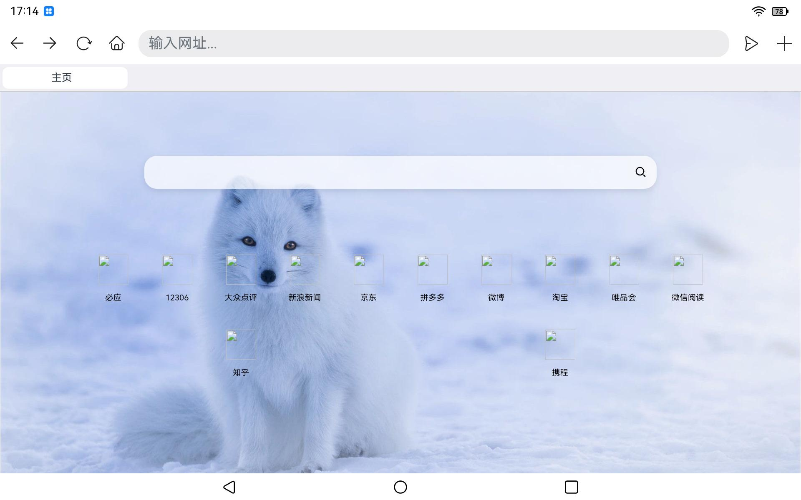
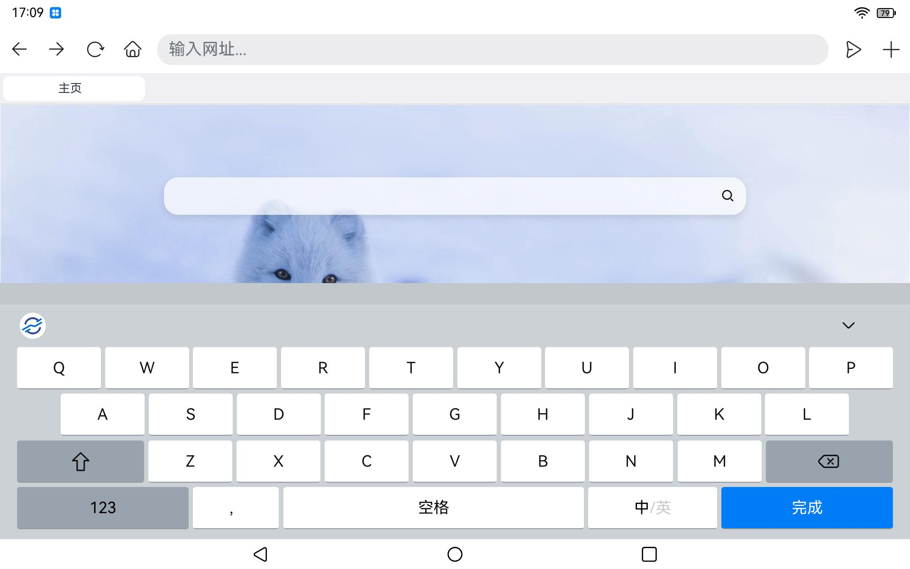

# TV Browser 项目

### 效果预览

| 首页界面 | 网页跳转 |
| :--- | :--- |
|  |  |

### 介绍

本示例为 OpenHarmony TV / 大屏场景下的浏览器应用（包名 `ohos.samples.browser1`），基于 **Stage 模型**与 **单模块 entry** 工程组织，通过 `Web` 组件提供网页浏览、多标签管理、加载进度与标题栏等能力；结合网络与 Wi-Fi 状态检测，在无网或异常场景下可跳转系统设置（如 Wi-Fi）。工程可作为 TV / 平板等设备上 **浏览器类应用** 的参考实现。

使用说明：

1. 应用以 `UIAbility`（`MainAbility`）作为主入口，启动后加载主页面 `pages/Index`，通过 `AppStorage` 传递外部拉起传入的 URI（如 `want.uri`）。
2. 主界面由自定义标题栏（`TabletTitle`、`BrowserTabs`、`WebTab`）、进度条与 `Web` 组件构成，支持多标签与 `WebviewController` 管理。
3. `Browser` 模型封装标签列表、首页资源（如 `pad.html` / `phone.html` 等 rawfile）、加载状态与用户代理等逻辑；可按设备类型区分展示与 UA。
4. 网络相关能力使用 `@ohos.net.connection`、`@ohos.wifi` / `@ohos.wifiManager` 等，在页面展示时检测连接状态；特定条件下可 `startAbility` 跳转 `com.ohos.settings` 的 Wi-Fi 相关页面（需系统存在对应应用与路由能力）。
5. `module.json5` 中声明了桌面/浏览器类 **skills**（如 `entity.system.home`、`ohos.want.action.viewData` 等），可按产品需求调整。

### 工程目录

```text
TVBrowser/
|---AppScope/app.json5                              // 应用级配置（包名、版本等）
|---build-profile.json5                             // 工程构建配置（SDK、签名、模块列表）
|---oh-package.json5                                // 工程依赖配置
|---signature/                                      // 签名材料（.p12 / .cer / .p7b 等）
|---entry/                                          // 主入口模块
|   |---src/main/module.json5                       // 模块配置（Ability、权限、skills）
|   |---src/main/ets/
|   |   |---Application/AbilityStage.ets           // AbilityStage，全局初始化
|   |   |---MainAbility/MainAbility.ets             // 主 UIAbility，窗口与页面加载
|   |   |---pages/Index.ets                         // 主页面：Web、标签栏、网络与进度
|   |   |---common/TitleBar.ets                     // 标题栏、标签栏与 Web 区域封装
|   |   |---model/                                  // Browser、Logger、ImageSrc 等模型与工具
|   |---src/main/resources/rawfile/                  // 内置 HTML 等资源
```

### 具体实现

- 应用级 `AbilityStage` 见 [AbilityStage.ets](entry/src/main/ets/Application/AbilityStage.ets)。
- 主 Ability 生命周期与 URI 传递见 [MainAbility.ets](entry/src/main/ets/MainAbility/MainAbility.ets)。
- 浏览主界面与 Web、网络检测、设置跳转等逻辑见 [Index.ets](entry/src/main/ets/pages/Index.ets)。
- 多标签与 Web 数据模型见 [model/Browser.ets](entry/src/main/ets/model/Browser.ets)；标题栏与标签 UI 见 [common/TitleBar.ets](entry/src/main/ets/common/TitleBar.ets)。

### 相关权限

以下权限声明于 [entry/src/main/module.json5](entry/src/main/module.json5)：

| 权限名 | 说明 |
|--------|------|
| ohos.permission.INTERNET | 访问网络（网页加载） |
| ohos.permission.GET_WIFI_INFO | 获取 Wi-Fi 相关信息 |
| ohos.permission.GET_NETWORK_INFO | 获取网络连接状态 |

权限与签名需按产品安全要求配置；本工程 `build-profile.json5` 中提供了示例签名路径。

### 依赖

- 开发依赖：`@ohos/hypium`（声明于工程根目录 [oh-package.json5](oh-package.json5)）。
- 运行期使用 `@ohos.web.webview`、`@kit.AbilityKit`、`@kit.ArkUI` 等系统 API，详见源码 import。

### 约束与限制

1. 本示例面向 TV / 大屏及 `module.json5` 中声明的设备类型（如 `default`、`tablet`），需在支持 Web 组件与网络能力的 OpenHarmony 设备或模拟环境上运行。
2. 当前工程配置 `compileSdkVersion`、`compatibleSdkVersion` 为 `18`，建议使用匹配版本 SDK 与 DevEco Studio 构建。
3. 跳转系统设置、Wi-Fi 页面等行为依赖系统预置应用与路由参数，在能力受限环境中可能不可用或表现不一致。
4. 建议使用本工程 `signature` 目录下签名材料进行调试与集成验证；开发语言为 ArkTS。

### 下载

如需单独下载本工程，可执行如下命令：

```bash
git init
git config core.sparsecheckout true
echo code\SystemFeature\TV\TVBrowser > .git/info/sparse-checkout
git remote add origin https://gitcode.com/openharmony/applications_app_samples.git
git pull origin master
```
