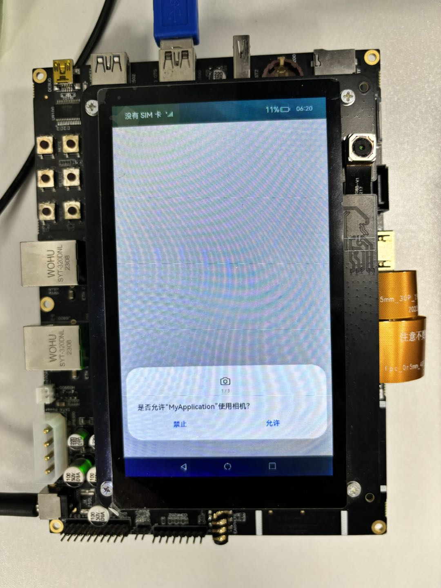
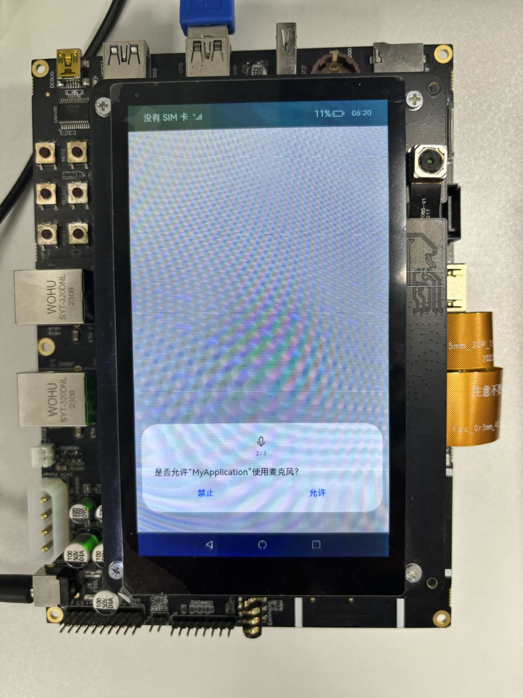
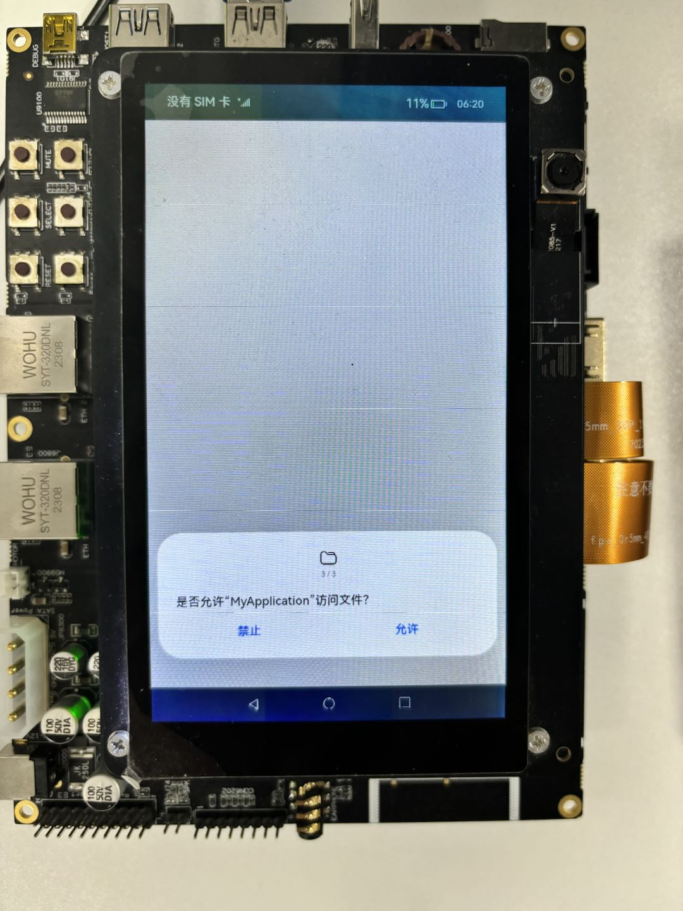
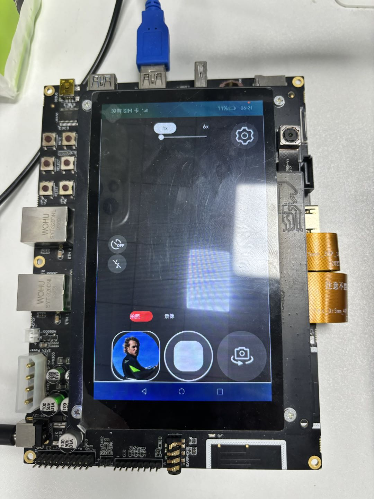

# Camera Project

### Introduction

The camera application is an OpenHarmony TV sample project with the following core capabilities:

- Camera preview, photo capture, and video recording;
- Local/distributed device scenarios (remote device discovery and switching);
- Camera switching, flash, resolution/watermark settings;
- Floating window support and smooth window movement (`FloatWindowManager` + `WindowMoverManager`).

The app entry is located at `entry/src/main/ets/entryability/EntryAbility.ets`, and the main page is
`entry/src/main/ets/pages/Index.ets`. Native camera-related capabilities are built from `entry/src/main/cpp`.

Usage:

1. Install and launch the app, then grant camera, microphone, and media-related permissions.
2. On the home page, you can preview, take photos, record videos, switch cameras, and adjust parameters.
3. On the settings page, you can switch watermark and resolution options (depending on device capability).
4. For floating-window scenarios, start the service through `FloatWindowAbility`.

### Screenshot Preview





### Project Structure
```text
entry/src/main/ets/
|---entryability/
|   |---EntryAbility.ets             // Main entry ability
|---entryability1/
|   |---EntryAbility1.ets            // Secondary entry ability
|---floatwindowability/
|   |---FloatWindowAbility.ets       // Floating-window service ability
|---common
|   |---Constants.ets                // Shared constants
|   |---DisplayCalculator.ets        // Display parameter calculator
|   |---PointerUtil.ets              // Pointer/coordinate utilities
|---model
|   |---CameraPermissionManager.ets  // Permission manager
|   |---CameraPreviewManager.ets     // Preview manager
|   |---CameraSettingsManager.ets    // Settings manager
|   |---CameraStateManager.ets       // State manager
|   |---MediaUtils.ets               // Media file utilities
|---models
|   |---CameraModel.ets              // Core camera model
|   |---RemoteDeviceModel.ets        // Remote device model
|---pages
|   |---Index.ets                    // Main camera page
|   |---CameraSettingsPage.ets       // Settings page
|   |---MultiCameraPreviewPage.ets   // Multi-device preview page
|---utils
|   |---FloatWindowManager.ets       // Floating-window manager
|   |---WindowMoverManager.ets       // Smooth window mover
|   |---PreferenceUtil.ets           // Preference storage utility
|---views
|   |---ModeSwitchPage.ets           // Mode switch view

entry/src/ohosTest/ets/test/
|---model/ models/ utils/ pages/...  // Hypium unit and scenario tests
```

### Implementation Details

- Main page capabilities are implemented in [Index.ets](entry/src/main/ets/pages/Index.ets), which drives camera preview and primary interactions.
- Core camera logic is implemented in [CameraModel.ets](entry/src/main/ets/models/CameraModel.ets):
    * Manages camera initialization, capture, and resource release;
    * Unifies local capture and remote capture branches;
    * Processes JPEG callback data and saves media files.
- Remote device capabilities are implemented in [RemoteDeviceModel.ets](entry/src/main/ets/models/RemoteDeviceModel.ets):
    * Maintains discovered-device and trusted-device lists;
    * Supports start/stop discovery and state synchronization.
- Floating-window and moving-window capabilities are implemented in [FloatWindowManager.ets](entry/src/main/ets/utils/FloatWindowManager.ets)
  and [WindowMoverManager.ets](entry/src/main/ets/utils/WindowMoverManager.ets):
    * Supports floating-window creation, display, and destruction;
    * Supports smooth animated movement and position persistence.
- Preference data management is implemented in [PreferenceUtil.ets](entry/src/main/ets/utils/PreferenceUtil.ets)
  and [PreferencesManager.ets](entry/src/main/ets/utils/PreferencesManager.ets).

### Required Permissions

| Permission Name                                   | Description                                         | Level |
|---------------------------------------------------|-----------------------------------------------------|-------|
| ohos.permission.CAMERA                            | Allows the app to access the camera                 | normal |
| ohos.permission.MICROPHONE                        | Allows the app to access the microphone             | normal |
| ohos.permission.WRITE_IMAGEVIDEO                  | Allows writing image/video files in shared storage  | system_basic |
| ohos.permission.READ_IMAGEVIDEO                   | Allows reading image/video files in shared storage  | system_basic |
| ohos.permission.MEDIA_LOCATION                    | Allows reading media location metadata              | normal |
| ohos.permission.WRITE_MEDIA                       | Allows writing media resources                      | normal |
| ohos.permission.READ_MEDIA                        | Allows reading media resources                      | normal |
| ohos.permission.SYSTEM_FLOAT_WINDOW               | Allows creating system floating windows             | system_basic |
| ohos.permission.START_ABILITIES_FROM_BACKGROUND   | Allows starting abilities from background           | system_basic |
| ohos.permission.DISTRIBUTED_DATASYNC              | Allows distributed data synchronization             | normal |
| ohos.permission.ACCESS_SERVICE_DM                 | Allows access to distributed device manager service | system_basic |
| ohos.permission.MANAGE_DISTRIBUTED_ACCOUNTS       | Allows distributed account management               | system_basic |
| ohos.permission.GET_BUNDLE_INFO_PRIVILEGED        | Allows privileged bundle info access                | system_basic |

### Dependencies

- OpenHarmony APIs (ArkUI/AbilityKit/CameraKit/ImageKit/CoreFileKit, etc.)
- Native build chain (`CMakeLists.txt` + `libentry.so`)
- Test framework: Hypium (`entry/src/ohosTest`)

### Constraints and Limitations

1. This sample runs on standard systems and supports RK3568 and V900 devices.

2. This sample uses the Stage model and targets API10 SDK, with SDK version (API Version 12 Release) and image version (5.0 Release).

3. This sample requires DevEco Studio 5.0 Release or above to compile and run.

4. Some interfaces require system-app signing configuration. Refer to [Special Permission Configuration Guide](https://gitcode.com/openharmony/docs/blob/master/zh-cn/device-dev/subsystems/subsys-app-privilege-config-guide.md),
and set the `apl` field in the configuration file to `system_core`.

### Download

To download this project only, run:

```bash
git init
git config core.sparsecheckout true
echo code/SystemFeature/TV/TVCamera > .git/info/sparse-checkout
git remote add origin https://gitcode.com/openharmony/applications_app_samples.git
git pull origin master
```
